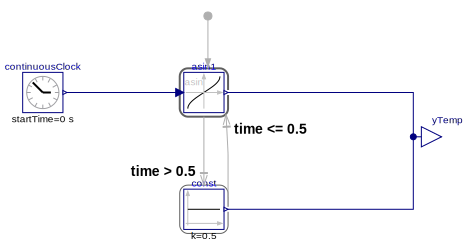
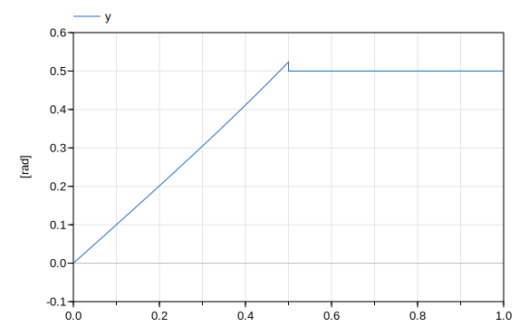

Modelica Change Proposal MCP-0012 Future possibilities

# Summary
This is separated out from the [Proposal](Proposal.MD) to contain items for the future to make the actual proposal easier to understand.

# Revisions
| Date | Description |
| --- | --- |
| May 5, 2021|Hans Olsson - created|

# Contributor License Agreement
All authors of this MCP or their organizations have signed the "Modelica Contributor License Agreement". 

# Generalized expressions
This generalizations are intended to aid the use of the blocks as functions.

## Expression selectors
The value of an expression can be further processed by an expression selector. Examples:
```
Real a[10], b[10];
Real c[2] = (a+b)[4:5]; // Selection of array elements

Real d[3] = fc(u).rec.y[5:7];
Real e[3] = (fc(u)).y[5:7]; // (...) selects first output of fc, so rec
```
The first case has been implemented in Dymola since at least Dymola 2015; see also [#2569](https://github.com/modelica/ModelicaSpecification/issues/2569).

# Calling a block as a function

## Calling a block as a function – Level 2
In this level, the restriction of Level 1, no conditional expression, is released: The block can still be 
only called in the declaration section of a model or block, but it **can** be used in a **conditional 
expression**.

### Example
The simple mapping rule cannot be applied, because then the block will be evaluated also if 
the corresponding if-branch is not active. This is both non-intuitive and can lead to 
unexpected/unwanted exceptions. Example:
```
Real y = if time<0.5 then Modelica.Blocks.Math.Asin(u=time).y else 0.5;
Using the mapping rule from section 2.2 results in:
 Modelica.Blocks.Math.Asin Asin1;
 Real y = if time < 0.5 then Asin1(u=time).y else 0.5;
equation
 Asin1.u = time;
```
Here the block Asin1 is evaluated all the time, also if time > 0.5. Around time = 1, this will give an 
exception, because Asin1 is no longer defined for this input argument. The simple mapping semantics is therefore both inefficient 
(because the block is evaluated, although the block ignores the result) and non-intuitive because an exception is generated, that should not occur.
Conceptually, an extended mapping rule is needed that is based on the continuous-time state 
machine proposed in "Modelica extensions for Multi-Mode DAE Systems" by H. Elmqvist, S.E. Mattsson, M. Otter. Graphically, this can be performed as:



Textually, the declaration can be mapped to (with possible changes see below):
```
  Modelica.Blocks.Math.Asin asin1;
  Modelica.Blocks.Sources.Constant const(k=0.5);
  Modelica.Blocks.Interfaces.RealOutput yTemp;
  Real y=yTemp;
  
  Modelica.Blocks.Sources.ContinuousClock continuousClock;
equation 
  initialState(asin1);
  connect(asin1.y, yTemp);
  connect(const.y, yTemp);
  transition(asin1, const,  time > 0.5,  reset=false);
  connect(continuousClock.y, asin1.u);
  transition(const, asin1,  time <= 0.5, reset=false);
```
Giving the result:



Notes:
* Instead of re-using the constant block and the clock block from MSL a simpler mapping would just generate blocks with similar contents.
* The transition back from const to asin1 is not needed in this case.

The needed changes are:
* Continuous-time state machine need to be introduced in Modelica
* Initialization of state machines becomes more important, [#2815](https://github.com/modelica/ModelicaSpecification/issues/2815)
* The initialState semantics as above becomes messy as the initial state is not known - the above with a temporary state is one possibility, but it seems wanting and an extension like [#2826](https://github.com/modelica/ModelicaSpecification/issues/2826) seems necessary.
* The mapping rule becomes also quite complicated, because the expressions in the then- and else-branches must be computed with temporary blocks, 
and all parameters and other variables used in these branches must be propagate to these blocks.

## Calling a block as a function – Level 3
In this final level, a block can also be called in an equation or algorithm section inside a model or 
block class (but not in a Modelica function). One has to analyze in more detail, which usages are still 
forbidden, and how to adapt the mapping rules. In all cases, one has to assume that a general block is 
called as function and this block contains initial equation sections, differential equations, for-loops, 
while-loops, when-clauses. Here is a first sketch:

Most likely it is not allowed to call a block as a function in
* initial equation or initial algorithm sections
(because a mapping to standard Modelica is not possible: Even with continuous-time state 
machines it is not possible to formulate a model where a block instance is only active during 
initialization, but not during continuous-time integration.)
* when clauses
Conceptually, calling a block as a function in a when clause means that a when-clause (in the 
block) is used inside another when-clause. This semantics is not defined in Modelica. 
Furthermore, some operators like the derivative operator are not allowed in a when-clause, 
and the semantics is undefined if a block is called as a function in a when-clause and this 
block has differential equations.
* for loops
The number of iterations of a for-loop need to be known at compile time. If a for-loop has n 
iterations, then n instances of the block (that is called as function in the for-loop) are needed, 
because in every iteration of the for-loop a different computation takes place (if the input 
arguments to the block are changing in the loop).

If the block has a memory, e.g. using the pre-operator on a Boolean variable, then the 
semantics is unclear: Intuitively, a user would expect that in every iteration of the for-loop 
the same block is used and then it might be no longer possible to have n blocks.

# Backwards Compatibility
It is fully backwards compatible with the existing specification; and also with level 1.

