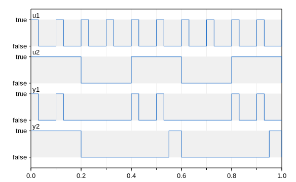

Modelica Change Proposal MCP-0012 
Calling Blocks as Functions
Hans Olsson, Martin Otter
In Development
--

# Summary
Allow calling blocks similarly functions in order to introduce function-calls with memory and events in Modelica.
While being consistent with subtyping.

This document contains the actual proposal, see also [Future extensions](Future.md).

# Revisions
| Date | Description |
| --- | --- |
| May 5, 2021 | Separated out future items (Hans Olsson)|
| April 30, 2021 | Updated to markdown and updated status (Hans Olsson) |
| April 21, 2016 | Adapted to MCP format |
| Dec. 17, 2014 | Major rewrite based on discussions at the 84th Modelica Design Meeting, 
discussions at the [#1512](https://github.com/modelica/ModelicaSpecification/issues/1512) ticket and a Web/phone meeting on Dec. 17 (rewritten 
by Martin Otter)|
|July 25, 2014|Martin Otter: Adapted to the prototype from Dymola (from Hans Olsson)|
|June 11, 2014|Martin Otter: Initial version. |

# Contributor License Agreement
All authors of this MCP or their organizations have signed the "Modelica Contributor License Agreement". 

# Rationale
The purpose of this MCP is to introduce functions with memory and events into Modelica. This is 
achieved by enhancing Modelica so that blocks can be called as functions (since memory and events 
are already supported in blocks). 

Since functions have a different type system as blocks (e.g. 
arguments in functions **can** be identified by position, whereas in blocks they **must** be identified by 
name), the calling mechanism of a block is naturally restricted to named arguments. 

Since functions 
have an optional mechanism for named input arguments, but not for named output arguments, 
functions are generalized for named output arguments first. As a consequence, the optional calling 
mechanism of functions and the required calling mechanism of blocks become identical.

# Generalized expressions
This generalizations are intended to aid the use of the blocks as functions.

## Named function output arguments

Assume that the following function definition is present:
```
record Rec
 Real y[10];
end Rec;
function fc
 input Real u;
 output Rec rec;
 output Real y;
algorithm
 …
end fc;
```
Then fc can be called in an expression to return only one of the output arguments, by explicitly 
defining the desired output argument in the function call:
```
Real z = fc(u).y;
Rec r = fc(u).rec;
```
The single return argument of the function is identified by a `.` and the output name after the 
function call. Prototypes for this feature were planned in January 2015 for Dymola (DS Lund) and for OpenModelica (PELAB).
They have been available in Dymola since about that time.

# Calling a block as a function

## Calling a block as a function – Level 1
Calling a block as a function is a difficult topic, because blocks may have memory and events. 
The level 1 provides useful functionality, but has restrictions that ensures it can be implemented with minimal effort.
Prototypes were planned in January 2015 for Dymola (DS Lund) and for OpenModelica (PELAB), and have been available in Dymola since about that time.

### Example
Take the following Modelica blocks
Modelica.Blocks.MathBoolean.OnDelay
Modelica.Blocks.Sources.BooleanPulse
that have both one input and one output Boolean signal. It shall be possible to use these block as:
```
import Modelica.Blocks.MathBoolean.*;
import Modelica.Blocks.Sources.*;
Boolean u1 = BooleanPulse(width=30, period=0.1).y;
Boolean u2 = BooleanPulse(width=50, period=0.4).y;
Boolean y1 = (u1 and u2) or OnDelay(u=u1, delayTime=0.3).y;
Boolean y2 = OnDelay(u=OnDelay(u=u2, delayTime=0.1).y, delayTime=0.05).y;
```
This is performed by defining a mapping of the above code fragment to the following Modelica 3.5
code:
```
 import Modelica.Blocks.MathBoolean.*;
 import Modelica.Blocks.Sources.*;
 BooleanPulse BooleanPulse_1(width=30, period=0.1);
 BooleanPulse BooleanPulse_2(width=50, period=0.4);
 Boolean u1 = BooleanPulse_1.y;
 Boolean u2 = BooleanPulse_2.y;
 OnDelay OnDelay_1(delayTime=0.3);
 OnDelay OnDelay_2(delayTime=0.1);
 OnDelay OnDelay_3(delayTime=0.05);
 
 Boolean y1 = (u1 and u2) or OnDelay_1.y;
 Boolean y2 = OnDelay_3.y;
equation
 OnDelay_1.u = u1;
 OnDelay_2.u = u2;
 OnDelay_3.u = OnDelay_2.y;
 ```
The mapping is performed by instantiating the blocks and utilizing the input and output variables of 
the blocks in the expressions. Simulation result of the above example:



### Mapping rule
In the declaration section of a Modelica model or block class it is possible to call a Modelica block 
with the syntax of a function call (with named input and output arguments), provided the following 
requirements are fulfilled:
1. The class name of the block is used as function name.
2. All input variables of the block that have no default values must be provided as named 
function input arguments. The inputs can be variables or variable connectors (so a variable 
that is also a connector, such as `Modelica.Blocks.Interfaces.BooleanInput`).
3. For all other public (non-output) variables, standard modifiers can be applied.
4. The desired output variable of the block must be used as named function output argument 
(so appended to the call together with a “dot”).
5. The expression in which the block is called is not conditional (conditional expressions are 
handled in Level 2).
6. The declaration in which the block is called is not allowed to have an element `inner` or 
`outer` and is not allowed to have one of the type-prefixes (`flow`, `stream`, `discrete`, 
`parameter`, `constant`, `input`, `output`).

Under these pre-requisites, a block “Block” with
* inputs “u1, u2, … ” that have no defaults,
* modifiers “m1, m2, …”
* outputs “y1, y2, … “
is called as 
```
Block(u1=.., u2=.., …, m1=.., m2=.., …).y2
```
in an expression when y2 of the Block shall be used in the expression. This part of the expression is 
replaced by <Block>.y2 and the following statements are introduced:
```
 Block <Block>(m1=.., m2=.., …);
equation
 <Block>.u1 = …;
 <Block>.u2 = …;
 ...
 <Block>.un = …;
```
where <Block> is a unique instance name introduced by the tool.
Note, the above mapping rule also holds if the input/output variables are connectors, as in the 
BooleanPulse and OnDelay example:
```
block OnDelay
 Modelica.Blocks.Interfaces.BooleanInput u;
 Modelica.Blocks.Interfaces.BooleanOutput y;
 …
end OnDelay;
Boolean y2 = OnDelay.y(u=u1, delayTime=0.3).y;
```
Note: The reasons for the restriction on declarations are that 
* The simple mapping mechanism would not give an intuitive result, 
* The type-prefixes do not make sense for blocks that have potentially initialization, when-clauses, differential 
equations (at least, it is not obvious what the result shall be). 
Note, the synchronous language Lucide Synchrone supports both functions with and without memory and Lucide Synchrone has a similar restriction (a function with memory cannot be 
called in a constant declaration)
   
# Backwards Compatibility
It is fully backwards compatible.

However, if a tool supported a **non-standard extension** of `foo(x).y` meaning accessing record element `y` in the record returned by `foo(x)` that 
will no longer work (it attempts to use the output `y` from the function) and would require a work-around such as `(foo(x)).y` as proposed in [#2659](https://github.com/modelica/ModelicaSpecification/issues/2659).
Tools that potentially had implemented that can likely detect most of these cases since it is rare that a function both return a record containing `y` and an output named `y`.

# Tool Implementation
Level 1 and named function outputs has been implemented in Dymola since around 2015, on a flag.

The proposal would be that that suffices for the time being.

## Experience with Prototype
The prototype for level 1 and named function outputs was done with a reasonable effort (likely less than a week).
The support for expression selectors might be more complicated, but is currently not useful in this MCP.

# Acknowledgement
This MCP idea was developed within the MODRIO ITEA2 project. Partial financial support of BMBF is highly appreciate

# Required Patents
None.

# References
