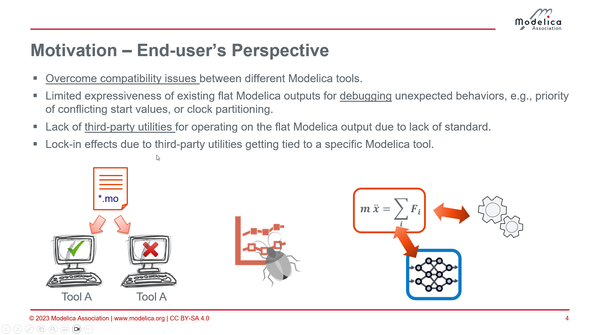
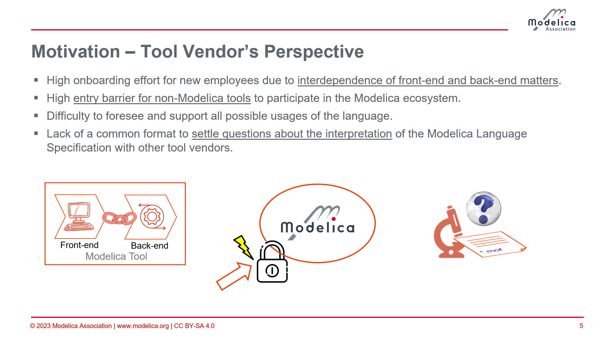
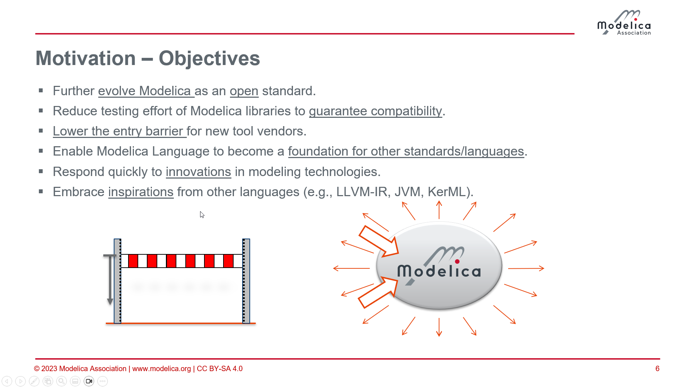

# BaseModelica Design Group web meeting Mar. 05, 2026

## Agenda

* Recap of the Base Modelica objective, benefits, design decisions
* Pros and cons of Base Modelica being a pure subset
* List the technical issues to be discussed in depth
* Base Modelica standardization go forward plan

## Participants

* [x] Oliver Lenord (Bosch)
* [x] Fabian Jarmolowitz (Bosch)
* [x] Christian Bertch (Bosch)
* [x] Hans Olsson (Dassault Systemes)
* [x] Christoff Bürger (Dassault Systemes) - later
* [x] Gerd Kurzbach (Keysight)
* [ ] Erik Danielsson (COMSOL)
* [ ] Jeff Hiller (COMSOL)
* [x] Francesco Casella (Politecnico di Milano, OSMC)
* [ ] Martin Sjölund (LiU, OSMC)
* [x] Henrik Tidefelt (Wolfram), not available
* [x] Hauke Neitzel (DIgSILENT)
* [ ] Ingo Czerwinski (DIgSILENT)
* [ ] Johannes Ruess (DIgSILENT)
* [ ] Chris Rackauckas (JuliaHub)
* [ ] Jadon Clugston (JuliaHub)
* [x] Joel Andersson (CasADi)
* [ ] Joris Gillis (CasADi)
* [ ] James Goppert (Purdue University)
* [ ] Micah Condie (Purdue University)
* [ ] Abigail Woodbury (Purdue University)
* [x] Dag Brück
* [x] Adrian Pop
* [x] Per Östlund

## Topics:

### Recap of the Base Modelica objective, benefits, design decisions

Oliver: Presented the slides 4-6 from the presentation of the paper [Design proposal of a standardized Base Modelica language](https://doi.org/10.3384/ecp204469) at the International Modelica Conference 2023.

Pointed out the benefits for tool vendors and improving the language.

Oliver: Which of the goals are obsolete or should be revised?

Hans: We as a Modelica community haven't learned anything to resolve incompatibilities.

Francesco: We are in an early stage of providing a first implementation.

Oliver: We are still in the situation of having a chicken and egg problem: Not yet having a standard and companies not willing to invest into it until there is a standard. Never-the-less, we made relevant steps to prove that Base Modelica is useful and applicable. We now need to send a signal that this will become standardized.

Francesco: My main motivation is to lower the barrier to implement a Modelica compiler.

Henrik: Increase the relevance of Modelica by lowering the entry barrier. The aspect to settle compatibility issues is a side effect we can benefit from once we have it. Currently it is only an MCP and not part of the Modelica specification.

Hans: We haven't seen inspirations coming from Base Modelica implementations. In contrast it is already diverging.

Henrik: At Wolfram we have worked on improving the initialization module. This inspired many ideas brought into the Modelica design group, though never phrased as inspired by Base Modelica.

Dag: OMC has implemented something close to Base Modelica, but is hasn't gained much traction due to the chicken and egg problem of a missing standardization. Shouldn't we standardize what became a success?

Francesco: Modelica 1.0 was not a big success either. With Base Modelica we have done a lot, in contrast to that there are few technical details we should be able to resolve quickly.

Hans: If one main objective is to engage with non-Modelica vendors, then it is even more important to be a pure subset, if they consider this as a first step towards full Modelica support.

Henrik: There are things in Modelica that make it extremely difficult to implement. It will not be possible to design a simpler language without introducing simplified constructs.

Joel: Most important is that it is standardized and supported by the major tools. Whether it is a subset or superset, causal or acausal, is not so relevant to us.

Francesco: To give an example: Priorities for start values are crucial. Obviously extra information is needed to express it. How to introduce it that's a matter of the preferred design but solvable?

Oliver: Do we agree on the strategic goal of introducing Base Modelica to secure and expand the relevance of Modelica?

Dag: The name implies that Base Modelica and Modelica are very closely related. I guess there is agreement that Base Modelica is a tool language for automatic processing, rather than a teaching language. In this sense the name raises wrong expectations.

Henrik: The name reflects the fact that you can handle Modelica by supporting Base Modelica.

Francesco: What we're doing is dumping a textual representation from the AST. That's all there is.

Gerd: From the very beginning we had the conflicting goals: Easy to parse machine-readable representation vs. human-readable simplified modeling language. To me the tool aspect is the main driver.

Oliver: Can we agree on the following key strategic objective as a justification to proceed towards a standardization:
- Lowering the threshold for vendors of equation-based tools to get access to DAE of Modelica models for further processing, e.g., autodiff, analysis, integration with machine learning,... .

Dag: Base Modelica has not been identified as a business goal by Dassault. It's more obvious how others benefit from it than we ourselves.

Gerd: Same applies to Keysight. We're customer-driven and haven't been approached with such requests.

Henrik: It should also be to the benefit of SimulationX, if there is a broader support of Modelica in general including other eco systems.

Francesco: We as Modelica Association members all invest into the Modelica eco system being fully aware that it always also others benefiting from our efforts.

Christoff: We are not payed by tools, but by customers. Who would pay for getting Base Modelica support as a feature?

Christian: The main benefit of our Modelica & FMI eco system is the openness.

Dag: At present have not identified a business value. It may arise, it is just that we haven't identified it yet.

Henrik: There is a substantial risk of loosing ground in the usage of Modelica.

Christian: There is a demand for Modelica as white-box representation for optimization, but users argue that it is not well-established and therefore prefer FMI despite of the disadvantages of this black-box representation.

Fabian: We're using CasADi for optimization and it would be really nice to have access to the equations. I see this as a way to connect to other eco systems, e.g., machine learning. If you want to do something with your model, beyond simulation, then something like Base Modelica is crucial, otherwise Modelica is at risk of vanishing. Look at Dyad, having a connection to vscode. I doubt that new users will opt for Modelica if they target python environments. Currently we reimplement Modelica models in python to do so.

Dag: There is a cost of maintaining the specifications and keeping them aligned.

Gerd: To me it would be fine to standardize Base Modelica as is, a version 1.0, knowing that it is not perfect, like we did for FMI 1.0.

Dag: Have there been any adopters?

Francesco: We have show cased solving of heavy optimization problems in pyomo using Base Modelica. A student was able to do this in weeks compared to other PhD how invested years trying to build a Modelica compiler ending up with support of fractions only.

Oliver: Who would be willing to continue working towards a v1.0 to be released in the near future?
- Francesco: OSMC is in.
- Henrik: We're in, unless we cut on the goal to simplify the language.
- Oliver: As Bosch we see value in leveraging Base Modelica in various applications. I'm confident to get backing to continue.
- Joel: There is already a Base Modelica import to CasADi available in the next release. We're very much interested that this will be standardized.
- Gerd: Would like to join, but have very hard time constraints. Cannot do much, but see the value to standardize also to convince management to do more.
- Dag: We're committed to Modelica. Our main concern is how it will affect the Modelica language. There is a cost but also an intrinsic value.
- Christoff: We will follow and give feedback, but not push it as we do in case of other standards.
- Hauke: We're still interested. If Base Modelica had been existing, this would have been our preferred approach. If there is a standard coming this will be a strong reason to consider Base Modelica for future work.
- Christian: I would recommend to continue and work towards a version 0.1. Experience from FMI is that having at least a alpha version out is crucial to get support to do more. Having a road map and an alpha version is a good signal.

Oliver: To summarize this feedback I see support for a future series of design meetings to work towards a first release. This should start with defining a milestone and roadmap and continue with considering technical proposals. I'll setup a poll for a first meeting.

Henrik: Maybe it would be a good idea to organize a meeting to discuss the attempts to implement a Modelica compiler and how Base Modelica could help to circumvent related issues.

Oliver: This sounds like a really good idea. I'll setup a separate poll to invite to a Base Modelica user meeting.

### Pros and cons of Base Modelica being a pure subset
Postponed to the first Base Modelica Design Meetings.

### List the technical issues to be discussed in depth
Postponed to the first Base Modelica Design Meetings.

### Base Modelica standardization go forward plan
Postponed to the first Base Modelica Design Meetings.

