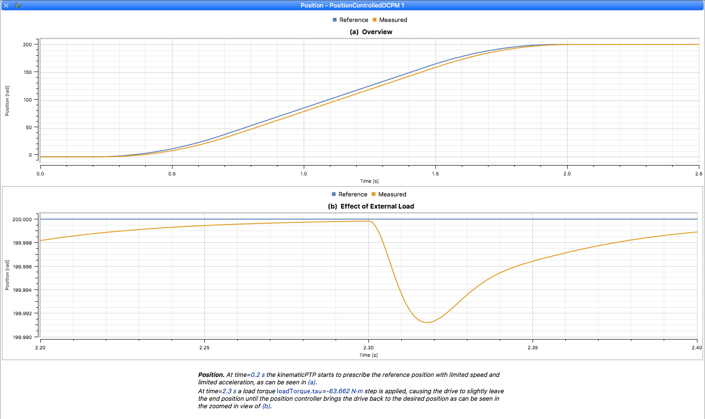

# Modelica Change Proposal MCP-0033 Annotations for Predefined Plots
Henrik Tidefelt, Otto Tronarp

**(In Development)**

## Summary
This is not about defining plotting functions to be used in scripting environments.  This is about declarative descriptions of predefined plots, stored in the model's class annotation.  It makes it completely agnostic to scripting environments, but scripting environments can still take advantage of the predefined plots.  For instance, the Wolfram SystemModeler environment allows users to request a predefined plot with a given title in the scripting environment, where it is then possible to apply further customization that is beyond the scope of what is reasonable to include in an MCP.

The use of predefined plots has been proven to greatly enhance the value of example models for users of a library, since they don't need to read documentation of the examples in one place, and then find the relevant things to plot in another place.  To be given a preferred plot immediately after simulation is generally a much faster way of getting an idea of what the example is all about, compared to reading the example's documentation.

The declarative style makes it straight-forward to extract the signals that are used in plots, so that these can be used as a default selection of comparison signals for regression testing (and this is what we at Wolfram MathCore use for our own libraries).

## Revisions
| Date | Description |
| --- | --- |
| 2019-03-27 | Henrik Tidefelt. Filling this document with initial content. |
| 2019-10-01 | Henrik Tidefelt. Updates after demonstration of prototype. |

## Contributor License Agreement
All authors of this MCP or their organizations have signed the "Modelica Contributor License Agreement".

## Rationale
The structure of the plot annotations is currently being developed in a [separate document](predefined-plots.md), for later incorporation as changesets for the Modelica Specification document.

## Backwards Compatibility
By only specifying new standard annotations, this MCP is fully backwards compatible.

## Tool Implementation
This MCP is based on an existing solution using vendor specific annoations in Wolfram SystemModeler, and Wolfram MathCore is maintaining a rich collection of predefined plots for the MSL.

Wolfram MathCore is willing to convert these vendor specific annotations to the form standardized by this MCP, and provide the plots for free to the MSL.

### Experience with Prototype
See Summary above.  The greatly enhanced user experience was observed even though the existing collection of predefined plots does not make use of captions.  The use of captions have been tested with very nice results on a smaller number of plots.  

## Required Patents
To the best of our knowledge, there are no patents that would conflict with the incorporation of this MCP.

## References
