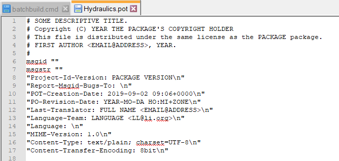

# Modelica Change Proposal MCP-0035
# Multilingual support of Modelica
## Authors: Anett Kloß, Gerd Kurzbach, Olaf Oelsner, Thomas Beutlich

--

# Summary
Modelica currently supports only one language for description texts. This is usually English. In order to better support users from other language areas and to make Modelica libraries more attractive and easier to understand for them, it should be possible to provide translations of the texts in any language in a standardized form, so that tools can find, read and display them to the user in his or her preferred language.
The definition of the interface to the translated texts is the subject of the MCP.

In the discussion in [#302](https://github.com/modelica/ModelicaSpecification/issues/302) it was decided to provide the translation externally of the Modelica files using the [GNU gettext](https://www.gnu.org/software/gettext/) format. The use of this format in the Modelica context is described in the MCP.

# Revisions
| Date         | Description |
| ------------ | --- |
| 2021-06-14   | Anett Kloß: Prepared document based on ticket #302 |
| 2022-01-07   | Gerd Kurzbach: add SpecificationText.md, some reformulations, discussion of design choices added |

# Contributor License Agreement
All authors of this MCP or their organizations have signed the "Modelica Contributor License Agreement". 

# Rationale
Why should this feature be included? 
* A better understanding of the libraries by users with different language background will make the libraries more attractive. 
* Support cases might occur less often, due to better understanding of the description. 
* A new translation is additionally a review of the current state and can result in a better quality of both language versions.
* Users can even write their own translation, when having a template *.pot-File for the library. 

The use case for the proposal is the MSL 4.0. 
* POT-File of current MSL 4.0 library --> this translation template is provided and filled for the Hydraulics Pump. 
(*add pictures*)

Proposed changes to the specification are described in SpecificationText.md. It consists of a new section **13.6 Multilingual Descriptions** which contains:
* Where the translation files to be stored
* How does a GNU gettext translation template for a library look like and which kind of descriptive texts shall be included?
* Which strings should be translated:

The precise updated text of the specification is part of this branch/pull-request: Yes.

# Backwards Compatibility
The proposal is backwards compatible. All multilingual text changes can be applied without effect at existing Modelica code. 
After the introduction of translation files for libraries, this files need to be adjusted with every library change which adds new commented parts or changes existing comments.

# Tool Implementation

## Experience with Prototype
### Implementation steps
#### 1. Read out a translation template file
Create at first a translation template file \*.pot for a Modelica library. Means a (tool dependent) readout of all needed text strings into a *LibraryName*.pot-File. It contains: 
- a header which concludes all necessary information


- for all original strings entries with following structure: 
```
    msgctxt "Hydraulics.Basics.TankOverflow"
    msgid "Volume Flow Port A"
    msgstr ""
```

Where *msgctxt* contains the name of the Modelica Class and *msgid* contains the textstring which is situated in this name space and shall be translated. Please regard that if a *msgid* string (in this example "Volume Flow Port A") is given more than once in a namespace, all occurrences are translated with the same translation!

It shall be mandatory to use for *msgctxt* the full name of a class:
- so a specific translation depending on the content in this namespace is possible, as every textstring may differ depending on the context,
- using the class makes it easier for the Modelica tool to copy and re-arrange models and packages without loosing the already existing language information.

The following Modelica constructs shall be read out / translated: 
* description strings
* strings in following annotations:
  * Text.string, Text.textString
  * missingInnerMessage, obsolete, unassignedMessage 
  * Dialog.[group|tab] 
  * Dialog.[load|save]Selector.[caption|filter] 
  * Documentation.[info|revisions]
  * Figure.title, Plot.title, Curve.legend

Having read out the file it just needs to be changed, if the library is changed (e.g. commented parts are added or changed or when having changed the Modelica name of the text strings containing element). 

#### 2. Translation of the template file into a language file
Starting from the template file create a \*.po file for each needed language (e.g. german: *LibraryName*.de.po-File).

Edit the *msgstr* with the translation in the wanted language (here for german: `` Hydraulics.de.po``) :
```
    msgctxt "Hydraulics.Basics.TankOverflow"
    msgid "Volume Flow Port A"
    msgstr "Volumenstrom an Anschluss A"
```

Hereby no error shall occur if there is one comment not having a translation. In this case the not translated text (the content of *msgid*) shall be used.
Again the file needs to be adjusted if there are changes at the library (e.g. commented parts are added or changed or when having changed the Modelica name of the text strings containing element).

---
**Note:** One may use the tool POedit for the translation, as it can be coupled with commercial translation tools for a faster translation. 

---
#### 3. File storage
Both files need to be situated in the language directory ``Resources\Language`` of the top-level library e.g.:
  ``C:\...\<ModelicaPath>\<LibraryName>\Resources\Language``
#### 4. Read in the translation
The tool dependent language setting enables the reading of the current needed *LibraryName*.*Language*.po-file.

### Tool implementation effort 
1. Readout of any comment / annotation without loosing content and with handling of exceptions, e.g. ``/"`` in comments. This can e.g. be created by the command:
``xgettext --language=EmacsLisp --sort-output --extract-all --from-code=UTF-8 --output=TranslationTest.pot TranslationTest.mo``
Certainly, the string extraction based on the EmacsLisp language can only be considered as proof of concept, since there is no Modelica language available in xgettext. It is recommended to create the POT file directly from the Modelica tool.

2. When reading in a library read corresponding the *LibraryName*.*Language*.po-file into an internal table and lookup the translated strings just before presenting them to the user.

## Discussion of the "One File per Library" design
There is a design choice how to structure the files for translation information either
* one file per library, or
* one file per class.

In this proposal the design "One file per library" is chosen, because it simplifies the handling of the translation data, the translation process and the generation of the template. The information of the header need to be stored only once. 

If after finishing a library one wants to translate them into another language, he can use the preferred tool and feed the file as a whole into it. After translating the strings, he can then save the file and the work is done.


One file per class, possibly stored in a directory structure that corresponds to the class hierarchy, result in a large number of files, with each file having to be translated separately. While this has the advantage of allowing parallel translations, it can also lead to undesirably different translations of the same texts, as different people translate things differently.

Also a Modelica tool only has to take care of one file per library. Normally, for performance reasons, the information from the files is stored internally in one big table anyway, so there is no need to split the information.

Multiple files have an advantage when renaming or moving classes, then the files only need to be renamed. The keyword msgctxt can then be omitted. In the case of only one file this can be realized by a search and replace of the msgctext information, which is not too complicated. The use case of moving classes in a finished library does not occur so often, because then also the models which use them must be adapted.


# Required Patents
None. 
# References
[GNU gettext](https://www.gnu.org/software/gettext/)

[Poedit](https://poedit.net/) - useful editor 
