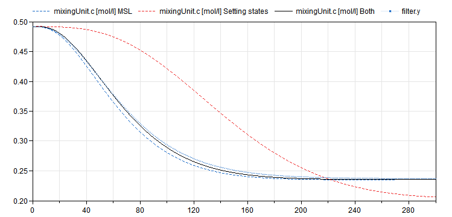

Modelica Change Proposal MCP-0036 
Setting states
Hans Olsson
--

# Summary
The main idea is that in many cases we use a model within a model (e.g. in Model-Predictive-Control and Feedback Linearization), 
and we need to update those states in the model within the model based on more accurate measurements of them during the simulation, 
and have the state-updating as part of the model (and not as some tool-specific solution).

# Revisions
| Date | Description |
| --- | --- |
| 2020-04-22 | Hans Olsson. Created. |
| 2020-07-08 | Hans Olsson. Updated with reinit. |
| 2020-09-25 | Hans Olsson. Updated with new semantics. |
| 2021-04-29 | Hans Olsson. Added test-cases and more complete proposal. |
| 2022-02-14 | Hans Olsson. More test-cases. |
| 2022-05-03 | Hans Olsson. Update specification text, clarified that ready |
| 2023-08-30 | Hans Olsson. Review comments |

# Contributor License Agreement
All authors of this MCP or their organizations have signed the "Modelica Contributor License Agreement". 

# Rationale
See previous discussion https://github.com/modelica/ModelicaSpecification/issues/2285
and paper https://2017.international.conference.modelica.org/proceedings/html/submissions/ecp17132517_OlssonMattssonOtterPfeifferBurgerHenriksson.pdf

A specific syntax is proposed.

# Alternatives
The alternatives considered are:
 - stateSelect.Measurement and binding equation
 - *special binding equation without stateSelect.Measurement*
 - possibly reinit within a Clock – check if possible
 - replace "reinit" by "measurement"-operator, or forceState(…)
 - the implemented annotation does not seem like a good idea

The proposal does allow us to hide this "turning a measurement into a state" in a block, and thus many of the details will be less important.

## Annotation variant
The annotation variant was proposed in the paper (not good since it influences the semantics) and is:

Real xs annotation(useAsInputForState=x);

This means that 'x' is first seen as a state, but after index reduction x is no longer a state and x=xs replaces the integration of der(x).
What might seem as odd is that the annotation is associated with the measurement variable, not with the state-variable.
The reason is that this allows setting of states deeply nested in existing models (which can otherwise be solved with an extra variable), but
instead requires work-arounds for complicated measurement expressions as in Kalman filters.

## Alternatives such as reinit(x, xnew)
As discussed in https://github.com/modelica/ModelicaSpecification/issues/2285#issuecomment-641275627 the conclusion of
https://github.com/modelica/ModelicaSpecification/issues/578 was that all reinits are done at the end of the event iteration using previously computed values.

Thus the current reinit(v, -v/2); does not lead to a loop with reinit, but first evaluates -v/2 (and other reinit-values) and then sets v (and other reinit-values).
One goal of "Clocked Discretized Continuous-Time Partition" is to preserve the behaviour of a restricted set of continuous-time models; having two different variants of reinit (with _the same syntax_ but different semantics) is counter to that.
In addition the current reinit might possibly in the future be replaced by some form of impulses, indicating that the changes are physical and influence other parts of the system, this does not seem consistent with how states are set in this MCP.
Finally having a conditional setting of states is more complicated, and reinit and other similar operators naturally suggest that - and we either need to determine what it means or forbid it.

## Proposed alternative
Use a special binding equation:

Real x=reinit(xs);

This new use of reinit can be separated from the existing use of reinit.
An alternative would be to introduce a new operator, measurement, only legal in a "Clocked Discretized Continuous-Time Partition" and only in this way and its meaning is discussed in the semantics part.

The name of the operator can be discussed. The current proposal re-uses "reinit" to avoid introducing new reserved words.

Key points:
- Associated with state, not measurement variable.
- Allows general expressions, not only variables.
- Unconditional.
- Only clocked.
- Few corner cases.
- Easy to recognize for humans and tools.
- Straightforward to implement. Adapting the existing prototype to the new syntax was straightforward.
- The special binding equation is ignored for equation counting.

Remaining:
- Decide if the way to go. Proposal: Yes
- Name of operator (measurement, reinit, ...). Proposal: reinit
- Must the partition have a discretization method? Proposal: No 
- Write specification text (a few paragraphs)

The reason the partition doesn't need a discretization method is that if we use reinit for all states there is nothing to integrate with the discretization method making it a meaingless choice.
Obviously it is possible to specify a discretization method even if not used.
However, if the intent is to require that all states are measured the proposed semantics allow a check for that.

# Semantics
The operator is only legal in a "Clocked Discretized Continuous-Time Partition", but the original semantics was unclear

Thus we present an alternative below, 

## Original semantics (only of historic interest)
The operator is only legal in a "Clocked Discretized Continuous-Time Partition", and means that 'x' is first seen as a state, but after index reduction x is no longer a state and x=xs replaces the integration of der(x)

The meaning is that
1. StateSelect.always is defined for variable x.
2. It is treated as a state during the usual index reduction and state selection.
3. Afterwards x is deselected as state and the equation x = xs is added. Its derivative is set as a dummy derivative.

This is not ideal as it uses words like "treated as", and variables are changed from being states to non-states.

## Discretization method semantics
The operator is only legal in a "Clocked Discretized Continuous-Time Partition", and only as the entire declaration equation for a variable.
The variable must be a scalar or array variable that is a subtype of Real.

The meaning of Real x=reinit(xs); is that
1. StateSelect.always is set for the variable x.
2. Therefore it is a state and thus participate in the usual index reduction and state selection.
3. During discretization the state is equal to the new value xs during the entire step, instead of using the discretization method
https://specification.modelica.org/master/synchronous-language-elements.html#solver-methods
4. This declaration equation is ignored for the equation count.

This makes it clear that the variable is an actual state, just integrated differently.
Note that even if the proposed syntax reuses the `reinit` keyword, it avoids the problems with the alternative `reinit(x, xs)` proposal.

Step (3) requires that it is a state (guaranteed by (1)), and that it is a continuous variable in a "Clocked Discretized Continuous-Time Partition", as stated at the start.

# Backwards Compatibility
Will depend on exact syntax. 
In the proposed alternative it will depend on the measurement keyword; using "reinit" it is fully backwards compatible.

# Tool Implementation
Both the preliminary variant with annotation and proposed alternative have been implemented in Dymola.

## Experience with Prototype
The implementation effort was small and it works; both variants give the same results.

However, as noted in the paper the procedure for using it is still slightly messy.
 - Attempt to translate the model
 - For each input add appropriate number of integrators and the state-update-component
 - Have parameters for those integrators etc.
That could be automated in tools.

(Note: The reinit-variant in Dymola 2022 and earlier requires that the argument to reinit must be declared before reinit, that was corrected in Dymola 2022x.)

## Test-cases
The package [TestSettingStates](TestSettingStates.mo) contain a trivial example showing how the model is supposed to be handled, with relevant details, and the previously constructed test-case.

# Required Patents
At best of my knowledge no patents would be required for implementation of this proposal.

# References
https://modelica.org/events/modelica2017/proceedings/html/submissions/ecp17132517_OlssonMattssonOtterPfeifferBurgerHenriksson.pdf
