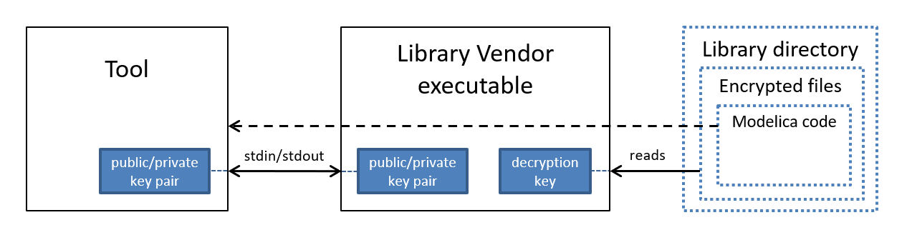
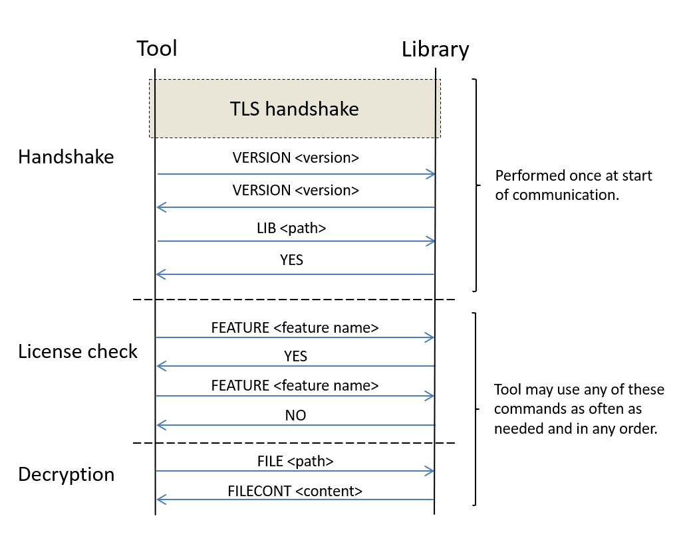

# Tool-independent Licensing and Code Encryption of Modelica Libraries

## Revision history

| Version | Changes/Comments                                                                             | Author/Date                                     |
|---------|----------------------------------------------------------------------------------------------|-------------------------------------------------|
| 0.1     | Initial version                                                                              | Jesper Mattsson, 2015                           |
| 0.2     | Restructuring to separate out requirements and examples as appendices, minor wording updates | Hubertus Tummescheit, April 9th 2021 |

This specification describes a container for distributing Modelica
libraries and a protocol for how a Modelica tool should communicate with
an executable for licensing and decryption of the library. The following
scenarios are supported:

-   Both code encryption and licensing are supplied by library vendor.

-   Licensing is handled through a Modelica tool’s licensing mechanism,
    and code encryption is supplied by library vendor.

-   Library is open-source, no encryption or licensing is used.

The executable for licensing and decryption of the library is supplied
by the library vendor and will hereafter be referred to as the “LVE”
(Library Vendor Executable). The LVE should handle decryption and may
optionally handle licensing. The LVE is packaged together with the
library in a container. Several LVE may be included in the container for
different platforms.

## Library Container

The container is a zip file, with a .mol file extension. It contains one
top-level directory for each contained top-level package (“library”),
named and structured according to section 13.2.2 of the Modelica
Language Specification version 3.2r2. In addition, each such top-level
directory should contain a directory “.library”. Each “.library”
directory should contain:

-   An XML file “manifest.xml”, containing meta-data about the library.

-   If the library is encrypted, an LVE.

-   Additional directories containing any extra files needed by the LVE
    or a Modelica tool. The names of each such directory should be the
    name of the vendor that introduces it.

### Manifest file

> An example for the manifest file (“manifest.xml”) can be found at the
> end of this document. *A DTD (Document Type Definition) or an XML
> schema will be specified*. Here is an overview of its structure, with
> filled bullets denoting XML elements and outlined bullets denoting
> attributes:

-   *archive*

    -   *manifest*

        -   *version* – version of the manifest format (this is version
            1.0)

    -   *library*

        -   *id* – name of the top-level package

        -   *enabled* – (optional) if the library should be loaded by
            default in the tool

        <!-- -->

        -   *title* – (optional) official title of the library

        -   *description* – (optional) description of the library

        -   *version*

            -   *number* – the version number

            -   *build* – (optional) the build number

            -   *date* – (optional) the release date

        -   *language*

            -   *version –* the version of the Modelica language that
                the library uses

        -   *copyright – (*optional) textual copyright information

        -   *license – (*optional) textual license information

        -   *encryption* – (optional) only for encrypted libraries

            -   *executable* – (multiple) one for each LVE

                -   *path* – relative path from the top-level directory
                    of this library to the executable

                -   *platform* – the platform that this executable
                    should be used for, the values are the same as in
                    the Modelica Language Specification, currently
                    “win32”, “win64”, “linux32”, “linux64”

                -   *licensing* – (optional, default is true) true if
                    this executable can handle licensing of the library

        <!-- -->

        -   *icon* – (optional) an icon to use for the library

            -   *file* – relative path from the top-level directory of
                this library to an image file containing the icon

        <!-- -->

        -   *compatibility* – (optional) a list of Modelica tools that
            this library is compatible with

            -   *tool* – (multiple)

                -   *name* – the name of the tool

                -   *minversion* – minimum version of the tool

        <!-- -->

        -   *dependencies* – (optional) libraries that this library
            depends on

            -   *dependency* – (multiple)

                -   *id* – name of the top-level package of the library
                    that is the target of the dependency

                -   *versions* – list of compatible versions

                    -   *version* – (multiple)

                        -   *number* – the version number

                        <!-- -->

                        -   *providers* – (optional) list of locations
                            that the target library can be downloaded
                            from

                            -   *provider* – (multiple)

                                -   *name* – human-readable name of
                                    provider

                                -   *uri* – direct-download URI to the
                                    target library

## Installing libraries

When installing a library archive, the tool must for each library it
installs from the archive extract either only the “.library” folder, or
the entire contents of the directory tree. When extracting the entire
contents of the directory tree, The directory structure and file names
of the content of the library directory must be the same as in the
archive, except that the top-level directory may be placed wherever and
named however the tool decides. It is recommended that the directory is
placed in a directory on the MODELICAPATH and named “*PACKAGENAME*” or
“*PACKAGENAME VERSION*”, as per the Modelica Language Specification.

## Reading open-source library

Reading a library without encryption is done in the same way as a
library stored on disk as described by the Modelica Language
Specification.

## Reading an encrypted library

1.  Read the XML file with metadata (“manifest.xml”) from the “.library”
    directory, specifically the path to the LVE suitable for the current
    platform.

2.  Start LVE.

3.  Communicate with LVE through its stdin & stdout, according to the
    protocol described below.

4.  Modelica files with a “.moc” file extension are read through the LVE
    instead of from disk. Other files in the library may also be read
    through the LVE, if desired.

## Communication Protocol

### Overview

This protocol is intended to be used for proprietary libraries.
Open-source libraries are stored as plain text within the library
archive. The communication protocol is through stdin and stdout of the
LVE and uses encryption of the communication channel to prevent
eavesdropping. For this encryption, both the tool and the LVE need a
public-private key pair.

The protocol has three phases. The first phase is a TLS (Transport Layer
Security, the successor of SSL) cryptographic handshake that sets up a
secure communication between the tool and the LVE. In the second phase,
what version of the protocol to use is established. The third phase is
decryption of Modelica code and/or licensing. Note that the encryption
used in the communication is entirely separate from the encryption used
for storing the library.

For authentication, the LVE contains a list of the public keys of the
tools that it trusts. The tool implicitly trusts that the LVE has
permission to license the library because it can decrypt the library.

The picture below shows the parties involved in the communication and
the keys used. The LVE reads the encrypted files in the library archive
file, decrypts them, and sends them through the encrypted communication
tunnel to the tool.

### Communication flow

The picture below details the flow of the communication between the tool
and the LVE.

### Handshake

1.  The tool initiates a cryptographic handshake according to TLS 1.2
    (see reference \[1\]).

2.  The tool gives the highest version of this protocol that it
    supports. The version is an integer, and this is version 1 of the
    protocol – “VERSION &lt;version&gt;”.

3.  The LVE gives the highest version of this protocol that it supports
    – “VERSION &lt;version&gt;”. If the version given by the tool is
    lower than the lowest supported version, it instead replies “NO
    &lt;reason&gt;”.

4.  The tool gives a path – “LIB &lt;path&gt;”. Depending on how the
    library was installed, it will be either a path to the archive
    containing the library or a path to the top-level directory of the
    library. If only the “.library” folder was extracted from the
    library archive, then the tool gives the path to the library
    archive. If the entire contents of the library was extracted, the
    tool gives the path to the top-level directory of the library (i.e.
    the one containing the “.library” directory).

5.  The LVE acknowledges – “YES”.

### License check

**Check for a feature:**

1.  Tool asks if the user is allowed to use a specific license feature –
    > “FEATURE &lt;feature name&gt;”

2.  LVE answers yes or no – “YES” or “NO &lt;reason&gt;”

**Simplified license check (optional):**

In the case where licensing is handled by the LVE, it may optionally
allow a simplified license check. In the simplified check, tool only
asks for permission for the user to use an entire top-level package,
including all contents.

1.  Tool asks if the user is allowed to use a specific top level package
    > – “LICENSE &lt;package name&gt;”

2.  LVE answers yes, no, or that it does not allow simplified license
    > check – “YES”, “NO &lt;reason&gt;”, or “NOTSIMPLE”

These steps are repeated as needed.

The &lt;reason&gt; part of the “NO &lt;reason&gt;” response is a message
suitable for displaying to the user that explains why the request was
denied.

### Authentication

For authentication, the LVE contains a list of the public keys of the
tools that it trusts. The public key of the tool is extracted by the LVE
during the TLS handshake and compared against the list of trusted keys
that it holds.

If the tool is not in the trusted list, it can still use all the
commands to communicate. The difference is that the FILE command will be
answered with an error.

### Return of licenses

**Return a feature**

1.  Tool returns a feature – “RETURNFEATURE &lt;feature name&gt;”

2.  LVE answers yes – “YES”.

**Return a simplified license**

1.  Tool returns a simplified license – “RETURNLICENSE &lt;package
    name &gt;”

2.  LVE answers yes – “YES”.

### Decryption

This part of the protocol lets the tool request decryption of encrypted
files in the library. The LVE can decide to refuse any FILE command,
irrespective of what paths it has previously allowed access to. All
paths used are interpreted as relative to the directory containing the
package.mo file of the top level package of the library, and use “/” as
the path element separator. The standard special path elements “.” and
“..” may not be used. When specifying the path of a directory, the path
may but does not have to end with “/”.

> **Getting the contents of a file:**

1.  Tool asks for the contents of a file – “FILE &lt;path&gt;”

2.  LVE sends the content of the file – “FILECONT &lt;content&gt;”

These steps are repeated as needed.

### Error handling

In addition to the responses specified above, the LVE may respond to any
command with “ERROR &lt;error code&gt; &lt;error message&gt;”, where
&lt;error message&gt; is an error message suitable for displaying to the
user, and &lt;error code&gt; is interpreted as:

1.  Command not understood

2.  Too low version of the protocol – only after VERSION

3.  The LVE doesn’t handle licensing – only after FEATURE or LICENSE

4.  File not found – only after FILE or LIB

5.  This tool is not allowed to decrypt that file – only after FILE

6.  File I/O error

7.  License error

8.  Other error

### General information

The tool may, after the cryptographic handshake, query the LVE for
general information about the LVE.

> **List of supported tools:**

1.  Tool asks for the list of supported tools – “TOOLS”

2.  LVE sends the list of supported Modelica tools, formatted as a
    string with one line for each tool (using the line feed character as
    the line terminator). Each line consists of the public key of the
    tool as a hexadecimal number string (without any prefix, e.g. “0x”),
    followed by a space character, and then the textual name of the tool
    – “TOOLLIST &lt;list&gt;”

### License information

For solving license configuration problems.

1.  Tool asks for license information – “LICENSEINFO”

2.  LVE sends information about the licensing solution and configuration
    as a string – “TEXT &lt;info&gt;”.

### Encoding

All messages in the protocol follow one of the following forms, where
“LN” is the line feed character. The messages are encoded using 8-bit
ASCII for all messages, except for the &lt;data&gt; part of the third
and fourth form below:

-   &lt;command&gt;LN

    -   A simple message with no arguments

    -   Above rendered as e.g. “YES”

    -   Commands using this form: “LICENSEINFO”, “NOTSIMPLE”, “TOOLS”,
        “YES”

    -   &lt;command&gt; = the command name, in all caps

-   &lt;command&gt; &lt;number&gt;LN

    -   A message with a decimal integer as data.

    -   Above rendered as e.g. “VERSION &lt;version&gt;”, where
        &lt;version&gt; is the &lt;number&gt; part

    -   Commands using this form: “VERSION”

    -   &lt;command&gt; = the command name, in all caps

    -   &lt;number&gt; = the data, as a decimal number – must fit in a
        32-bit signed integer

-   &lt;command&gt; &lt;length&gt;LN&lt;data&gt;

    -   A message with variable length data

    -   Above rendered as e.g. “PUBKEY &lt;key&gt;”, where &lt;key&gt;
        is the &lt;data&gt; part and &lt;length&gt; is the length of
        &lt;key&gt; in bytes

    -   Commands using this form: “FEATURE”, “FILE”, “FILECONT”, “LIB”,
        “LICENSE”, “NO”, “PUBKEY”, “RETURNFEATURE”, “RETURNLICENSE”,
        “TEXT”, “TOOLLIST”

    -   &lt;command&gt; = the command name, in all caps

    -   &lt;length&gt; = the length of the data in raw bytes, as a
        decimal number – must fit in a 32-bit signed integer

    -   &lt;data&gt; = the data, as raw bytes

-   &lt;command&gt; &lt;number&gt; &lt;length&gt;LN&lt;data&gt;

    -   A message with an integer number and variable length data.

    -   Above rendered as e.g. “ERROR &lt;error code&gt; &lt;error
        message&gt;”, where &lt;error code&gt; is the &lt;number&gt;
        part, &lt;error message&gt; is the &lt;data&gt; part and
        &lt;length&gt; is the length of &lt;error message&gt; in bytes

    -   Commands using this form: “ERROR”

    -   &lt;command&gt; = the command name, in all caps

    -   &lt;number&gt; = data, as a decimal number

    -   &lt;length&gt; = the length of the data part in raw bytes, as a
        decimal integer – must fit in a 32-bit signed integer

    -   &lt;data&gt; = the data, as raw bytes

# References

\[1\] TLS 1.2 official specification:
<https://tools.ietf.org/html/rfc5246>

# Appendix A: Example “manifest.xml” file

This is an example of what the “manifest.xml” file could look like for
an example encrypted library:

&lt;?xml version=*"1.0"* encoding=*"utf-8"*?&gt;

&lt;archive&gt;

&lt;!-- All paths in the file are interpreted as relative to the
directory of the top-level

package (e.g., the path to this file would be ".library/manifest.xml"),
and allows

only forward slashes as directory separators. --&gt;

&lt;manifest version=*"1.0"*/&gt;

&lt;!-- The id attribute is the actual Modelica identifier of the
library. The file attribute

from SMA is no longer needed, as it will always be "package.mo" or
"package.moc"

(and the tool will need the logic of checking for both .mo and .moc
anyway).

The enabled attribute (optional, default value is true) indicates
whether the library

should be enabled/loaded by default. --&gt;

&lt;library id=*"ExampleLib"* enabled=*"true"*&gt;

&lt;!-- Official title of the library (optional) --&gt;

&lt;title&gt;Example Encrypted Library&lt;/title&gt;

&lt;!-- Description (optional) --&gt;

&lt;description&gt;

Dummy library showing directory structure for an encrypted library (with
empty files)

&lt;/description&gt;

&lt;!-- The version of the library. Version information is formatted
according to the

Modelica language specification. The build and date attributes are
optional. --&gt;

&lt;version number=*"1.0"* build=*"1"* date=*"2013-08-04"*/&gt;

&lt;!-- Version of the Modelica language that is used in this library.
--&gt;

&lt;language version=*"3.2"* /&gt;

&lt;!-- Copyright notice (optional)--&gt;

&lt;copyright&gt;

Copyright © 2014, Modelon AB.

&lt;/copyright&gt;

&lt;!-- License information (optional) --&gt;

&lt;license&gt;

Some license information.

&lt;/license&gt;

&lt;!-- Encryption/license check information (only for proprietary
libraries).

If this is present, then the library is encrypted. --&gt;

&lt;encryption&gt;

&lt;!-- Library vendor executable. May be repeated - one for each
supported platform.

path: the path to the executable

platform: the OS/platform to use this executable on, must be unique
among

executable nodes

licensing: if this executable handles licensing (optional, default is
true)

The executable shall be placed under the vendor-specific directory

(i.e. .library/VENDORNAME/). The normal case is that licensing has the
same

value for each executable node, but it is allowed to have different
values

for different platforms. --&gt;

&lt;executable path=*".library/Modelon/vendor.exe"* platform=*"win32"*
licensing=*"true"* /&gt;

&lt;executable path=*".library/Modelon/vendor32"* platform=*"linux32"*
licensing=*"true"* /&gt;

&lt;executable path=*".library/Modelon/vendor64"* platform=*"linux64"*
licensing=*"true"* /&gt;

&lt;/encryption&gt;

&lt;!-- Icon for the library (PNG format) (optional) --&gt;

&lt;icon file=*"Resources/Images/el.png"* /&gt;

&lt;/library&gt;

&lt;!-- Leaving out optional compatibility and dependencies in this
example. --&gt;

&lt;/archive&gt;

# Appendix B: Discussion of Weaknesses

There are several cryptographic keys involved. If someone were to
extract a key from an executable or alter the executable to change the
key, then that would have different consequences depending on what key
it is:

-   The private key of the tool

    -   Finding this key would allow decryption of all libraries that
        trust that key. It would be possible to replace the key, but
        that would require new releases (or at least new distributable)
        of all libraries that trust that tool.

    -   Altering this key would not be useful for an attacker.

-   The private key of the LVE

    -   It might be possible to eavesdrop on the communication between
        tool and LVE with this key. Requires additional study of chosen
        crypto scheme to determine. With private key of tool as well, it
        is definitely possible (but uninteresting if you have that key).

-   The session key

    -   Generated for each communication session, but could be extracted
        for a specific communication by debugging the tool or LVE.

    -   Finding this would allow eavesdropping on the communication.

    -   Altering this key is not possible.

-   List of public keys that the LVE trusts

    -   Finding this list would not be useful for an attacker.

    -   Altering this list would allow adding your own and thus allow
        decryption of the library.

-   The key/keys used by the LVE to decrypt the library

    -   Finding this key would allow decrypting the library.

    -   Altering this key would not be useful for an attacker.

Note that both the public/private key pair in the LVE and the key used
to decrypt the library could be newly generated for each build of the
library distributable.

All of these keys should be protected with some sort of obfuscation of
the object code to make them harder to extract. It would, however, be
impossible to completely protect against such attacks.

In conclusion, the most serious breach would be if an attacker obtained
the private key of the tool, allowing decryption of any library released
for that tool. The current situation is that the same vulnerability
necessarily exists in any tool that supports encrypted libraries.

Since Modelica tools need access to the Modelica source code by the
nature of the language specification, theses weaknesses have been
considered acceptable by all commercial parties that so far have made
use of this feature. The weaknesses are identical to those of
tool-specific encryption schemes.

# Appendix C: Requirements considered for the design of SEMLA

The following requirements for commercial libraries were considered in
the design of this proposal:

## Library Vendor

-   Library vendor needs to be able to define which libraries that
    should be available on which tools, i.e. explicit encoding of
    supported tools. *Yes, through list of trusted keys.*

<!-- -->

-   Library vendor needs to be able to enable/disable parts (features)
    in any given library based on standardized annotations. *Not
    hindered, standard license annotations are used.*

-   Library vendor needs to be able to specify visibility of components
    based on the standardized annotations. *Not hindered, standard
    license annotations are used.*

-   The solution should offer a means to check the license for the
    library as a whole without parsing the Modelica code. *Yes, optional
    alternate licensing mechanism can be used for tools that do not
    understand license annotations.*

-   Library vendor needs to be able to license/protect external
    libraries written in e.g. C and Fortran 77 independently of the
    licensing mechanism for the library. *Not affected by this
    specification, such checks can be added to the external libraries
    themselves.*

-   Library vendor needs to be able to make new releases of existing
    libraries and release new libraries without any action from the tool
    vendor. *Yes, when licensing is supplied by library vendor.*

-   Encryption mechanism shall be possible to use with or without the
    licensing mechanism of the protocol. *Yes.*

-   Encryption mechanism shall ensure protection of library vendor IP.
    (In this case, this is defined only as Modelica source code.) *In
    part. It is not possible to fulfill this completely, since
    everything necessary to decrypt the code must be available to the
    client computer. Protection is also limited by what the tool does or
    does not expose to the user. Extracting any IP that is not shown by
    the tool requires using decompilation and/or debugging tools to
    extract cryptographic keys from either the tool or the LVE (see
    Weaknesses below). This is similar to the current situation.*

-   The solution shall be not be limited to a specific licensing
    mechanism. *Yes, license mechanism is not specified. It is required
    that feature names are used, but this is also assumed by the
    description of licensing annotations in the Modelica language
    specification.*

-   The protocol shall offer means to with reasonable effort replace
    encryption keys, or equivalent, in cases of security breaches. *All
    involved keys belonging to library vendors can be switched for any
    library release. Changing the key pair used by the tool could be
    done by adding a second key pair during a transition period. Library
    vendors could then replace the compromised key with the new one in
    their list of trusted tools. A tool may have more than one key pair.
    For tools that have more than one key pair, the LVE needs to be
    restarted in between trying different key pairs.*

## Tool Vendor

-   A tool may store all files except Modelica source code on disc in
    unencrypted form, e.g., in order to support linking with library
    files during compilation. *Yes.*

-   The solution shall support standardized mechanisms for
    enabling/disabling parts of a library, by means of annotations
    defined in the Modelica specification. *Not hindered, standard
    license annotations are used.*

-   Well documented low-level API for licensing and encryption for easy
    integration in applications. *Documented above.*

-   Solution shall enable customizations and tailored functionality on
    top of the low-level API. *API is fairly generic and uses
    file-system model, this enables customizations through special files
    or folders.*

-   Error messages must be supported by the API. *Yes, error messages
    can be passed back to tool.*

-   Alternative, tool specific, licensing mechanisms shall not be
    prevented by the API. *Yes, license checking is controlled by tool.*

-   It shall be possible to store/ship several libraries/top-level
    packages in a single file. *Yes.*

## User

-   The API shall enable convenient to installation procedures for
    libraries. *Possible with tool support, library is distributed as a
    single file with a well-defined file extension.*

-   Error messages should enable users and support personnel to isolate
    errors related to licensing and encryption. *Yes, error messages can
    be passed back to tool.*
