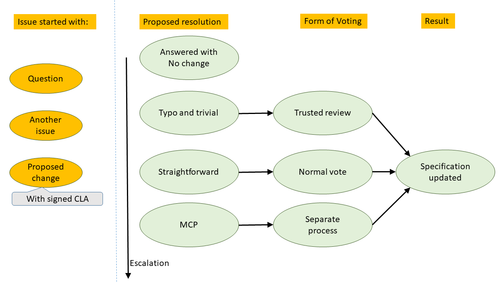
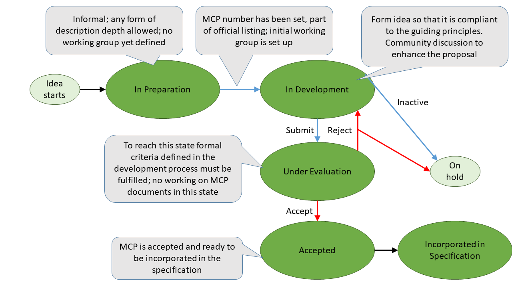

 # Development process for Modelica Language

The following describes the steps in the development process; who is involved and the expected decisions and results. 
The Modelica Association Project Modelica Language (MAP-Lang) decides on changing this process and in exceptional cases to deviate from it.
The guiding principles of the development are [guiding principles](GuidingPrinciples.MD).

This document document describes version 2.0.0 of the development process for the Modelica Language.

# Changes of the specification document

Anyone (not only MAP-Lang members) can create an issue for the Modelica Specification document, indicating that something is unclear, 
can be improved, or propose some extension.

Based on the discussion that may lead to a proposed change of the specification document or the issue may be closed without any changes. 

It is also possible to directly propose the change (as a Pull Request) – unless the change is so major that it will require an MCP. 
Proposed changes will only be considered if the Contributor License Agreement is signed 
(existing Contributors that are MAP-Lang members are grandfathered in for the time being); 
by the proposer’s organization – or in some cases the proposer.

Any changes of the specification document needs to be approved; the changes are handled as reviewed Pull Request on GitHub. 

The details for handling them depend on the category of the changes as described below:
*	Typos and similarly trivial changes, or incorporation of already decided changes:
They should be documented and reviewed, by at least one trusted reviewer. 
If the change and/or the consequence of the change are considered by the reviewer to be non-trivial, 
the reviewer should escalate it to the next level.
The case “already decided changes” indicate that sometimes a decision has been made without having the 
proposed exact change of the document; that actual (possibly non-trivial) change of the document then only requires a single reviewer.
*	Straightforward but non-trivial changes: 
These require a normal vote among MAP-Lang; either at a meeting or electronically during at least one working week. 
If the change is not straightforward, it should be escalated to the next level.
*	Larger changes (in terms of impact):
Require a Modelica Change Proposal (MCP) with voting at various stages, as given below.

# MCP

## What is an MCP?

An MCP is a Modelica Change Proposal. 

The final MCP is comprised of a proposed change of the specification text and an additional rationale-document, 
which needs to be ready for the MCP to enter the “Under Evaluation” stage as described below. 
"MCP" can refer both to the final MCP and the work on this proposal including drafts.

The rationale-document should provide the following information:
*	Business case: why should this feature be included? 
What problems can be solved (in a better way) that cannot be solved (as easily) now? 
*	A prototype implementation, simple test cases to profoundly illustrate the solution of the problem 
and to show that the language element scales well. 
*	At least one description of an industry-relevant example to show that this MCP is able to solve a problem from industry, 
if relevant for the MCP. 

When an MCP is not yet part of a released version of the Modelica Language (regardless of the stage), 
then it must be clearly marked with something like: "This proposal is waiting for approval of the 'Modelica Association Project Modelica Language' and might not be included in any future Modelica Language release."

## MCP Process
The stages of the MCP process are:
1.	In Preparation. 
In this stage, an initial idea is described in an informal way to interested potential collaborators (tool vendors and end-users) and to identify potential technical issues and their solutions.
1.	In Development. 
Entering this stage requires a normal vote by MAP-Lang to assign a number and an initial working group, 
and the working group then works out the details in a correspondingly named branch of the specification.
1.	Under Evaluation. 
The working group decides when to enter this stage. The MAP-leader will announce the date for the actual vote 
when entering this stage and it must start no sooner than 2 weeks after entering this stage, 
and the voting must last at least 4 weeks. No actual development on the MCP during this stage.
Typos and similar trivial changes can still be corrected during this stage – other issues can 
be noted and handled after the MCP is potentially accepted. At least 3 reviewers should go through the entire proposal.
1.	Accepted. 
If the vote accepts the MCP, the MCP can then be merged into the main document. 
The MCP is normally included in the specification as soon as possible, 
but if an MCP is evaluated close to a release of the specification document, the vote can be to include the MCP after that release.
1. The MCP has been fully incorporated into the specification and the MCP process itself terminated. 

If the MCP is not accepted by the vote or has been inactive for at least one year; it can be put on hold.

# Defining a new Modelica Language Release

## Ongoing development

The current development of the Modelica Language specification is available online 
and tool vendors are encouraged to implement features when they are added to the development version of the language specification; 
it is recommended that tool vendors do not wait until the beta release but incorporate changes as early as possible. 
Tool vendors and others are also encouraged to report issues at the earliest possible time, noting
that the development version is not yet released.

## Decision on scheduling a release

A Modelica Language Specification release needs to be announced in advance, after a normal vote. That should include:
*	A version number.
*	A preliminary release schedule.
*	A preliminary list of features; possibly including MCPs that are not yet accepted. 
Only the version number and preliminary list of features is publicly announced.

## Release schedule

The release schedule should include:
*	Time for beta release/feature-freeze; i.e. the last date for adding features (including MCPs). 
There might still be planned changes, but limited to clarifications and corrections. 
The vote for the beta-release will require a normal vote.
*	Time for publicly available release candidate(s). 
There should be no planned changes after this point, but if any flaws are found, they should ideally be corrected. 
The vote for accepting the release candidate will be a vote with a qualified majority.
*	Release date (assuming no major issue with release candidates).
It may also include deadlines when issues must be reported to be considered for the release; such can be different for different changes.

## Release procedure

The release procedure should ideally follow the schedule. 
All features have to be ready in time for beta-release, and all issues must be corrected before the release candidate is released.
If an MCP is not accepted in accordance with the release schedule 
(because it is not completed in time or the vote for proposal “Under Evaluation” results in rejection), 
then the feature list or possibly the release schedule is updated.
If not all known flaws are corrected before the planned release candidate then the release schedule should be updated. 
In exceptional cases, it may be necessary to plan to release a version with a known flaw 
(in case correcting that flaw turns out to be too complicated).

## Maintenance of released versions. 

After a version is released development will continue on the next version (possibly not yet named). 
The issue tracking system will include a list of found issues – 
and MAP-Lang may decide to release a maintenance version to correct these in the previous version; 
according to the same procedure – except that the beta release should be absent (as no features should be added).

## Version numbering
Minor versions should (ideally) be backwards compatible (in the sense that previously legal models keep their behavior), 
and any cases of non-backward compatible changes listed. 

Historically in most cases, non-backwards compatibility have been due to new keywords and functions – but in some cases, 
the specified behavior changed to correct flaws.

Maintenance releases (i.e., revised versions like 3.3r1, 3.2r1, 3.2r2) should only be for correcting flaws 
and clarifying behavior, and should thus neither contain MCPs nor introduce other non-backwards compatible changes except bugfixes.

There are proposals for a stricter numbering of language specification versions giving a semantic meaning 
to "major", "minor", and "revisions" (and possibly changing the numbering systems and including pre-release versions as well); 
if accepted such proposals should be followed for future releases. 
Note that there are also proposals for stricter version numbering of libraries.

### Use of unreleased versions

Pre-release and development versions are not formally released, 
and should in general not be used even if they follow some released version. 

However, if the trunk version of the Modelica Language Specification has accepted changes that clarify behavior 
or correct flaws, a tool may use the updated semantics. 

In general, tools should not use versions of the Modelica Language Specification that are not yet accepted by MAP-Lang; 
except when using them for clearly marked prototypes.

# Forms of voting

* Trusted review: Currently any member of MAP-Lang on GitHub, may review a change. 
We might restrict this to project leader and some specified persons in the future. The proposer must not self-review.
* Normal vote: A vote at a meeting, where the issue is listed on the agenda; 
or an online vote announced and held during at least one week where members can e.g. use thumbs up/down to vote on GitHub. 
These require a simple majority of the votes (i.e. more than 50%), abstaining votes are not considered.
* MCP acceptance vote: A special kind of normal online vote, that must be announced at least 2 weeks in advance 
and be open for at least 4 weeks.
* Vote with qualified majority: A vote at a meeting or electronically as described in the project bylaws; 
that has a stricter requirement for the number of votes in favor as described in the project bylaws.
* Poll: Any voting – in particular informal votes to indicate interest in different topics.

