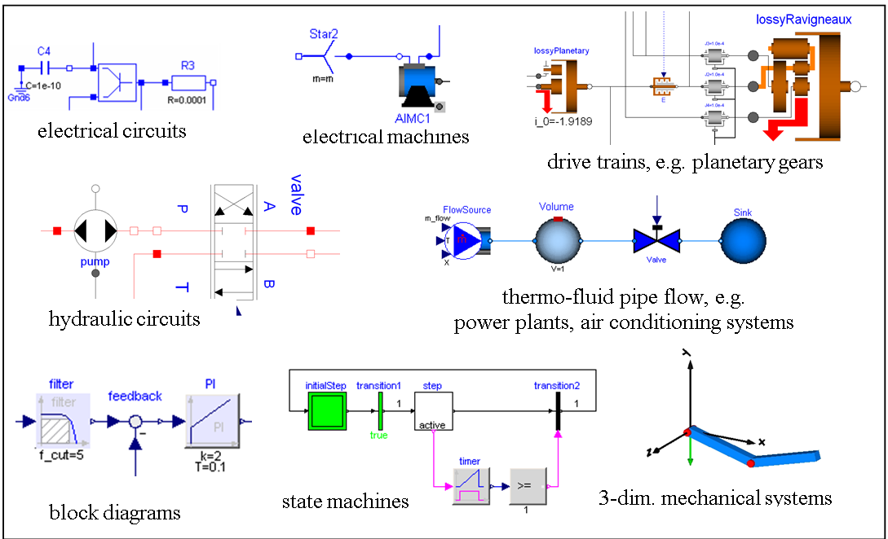

*Abstract*

This document defines the Modelica{empty}footnote:[Modelica is a registered trademark of the Modelica Association.]
language, version {revnumber}, which is developed by the Modelica Association, a non-profit organization with seat in Linköping, Sweden.
Modelica is a freely available, object-oriented language for modeling of large, complex, and heterogeneous systems.
It is suited for multi-domain modeling, for example, mechatronic models in robotics, automotive and aerospace applications involving mechanical, electrical, hydraulic control and state machine subsystems, process oriented applications and generation and distribution of electric power.
Models in Modelica are mathematically described by differential, algebraic and discrete equations.
No particular variable needs to be solved for manually.
A Modelica tool will have enough information to decide that automatically.
Modelica is designed such that available, specialized algorithms can be utilized to enable efficient handling of large models having more than one hundred thousand equations.
Modelica is suited and used for hardware-in-the-loop simulations and for embedded control systems.
More information is available at https://modelica.org[].

Copyright © 1998-2023, Modelica Association (https://modelica.org[])

All rights reserved.
Reproduction or use of editorial or pictorial content is permitted, i.e., this document can be freely distributed especially electronically, provided the copyright notice and these conditions are retained.
No patent liability is assumed with respect to the use of information contained herein.
While every precaution has been taken in the preparation of this document no responsibility for errors or omissions is assumed.

The contributors to this and to previous versions of this document are listed in <<modelica-revision-history>>.

[preface]
== Preface

Modelica is a freely available, object-oriented language for modeling of large, complex, and heterogeneous physical systems.
From a user's point of view, models are described by schematics, also called object diagrams.
Examples are shown below:

[.text-center]

A schematic consists of connected components, like a resistor, or a hydraulic cylinder.
A component has _connectors_ (often also called _ports_) that describe the interaction possibilities, e.g., an electrical pin, a mechanical flange, or an input signal.
By drawing connection lines between connectors a physical system or block diagram model is constructed.
Internally a component is defined by another schematic, or on "bottom" level, by an equation-based description of the model in Modelica syntax.

The Modelica language is a textual description to define all parts of a model and to structure model components in libraries, called packages.
An appropriate Modelica simulation environment is needed to graphically edit and browse a Modelica model (by interpreting the information defining a Modelica model) and to perform model simulations and other analysis.
Information about such environments is available at https://modelica.org/tools[].
Basically, all Modelica language elements are mapped to differential, algebraic and discrete equations.
There are no language elements to describe directly partial differential equations, although some types of discretized partial differential equations can be reasonably defined, e.g., based on the finite volume method and there are Modelica libraries to import results of finite-element programs.

This document defines the details of the Modelica language.
It is not intended to learn the Modelica language with this text.
There are better alternatives, such as the Modelica books referenced at https://modelica.org/publications[].
This specification is used by computer scientists to implement a Modelica translator and by modelers who want to understand the exact details of a particular language element.

The text directly under the chapter headings are non-normative introductions to the chapters.

The Modelica language has been developed since 1996.
This document describes version {revnumber} of the Modelica language.
The revision history is available in <<modelica-revision-history>>.