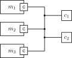

== Stream Connectors
:id: stream-connectors

The two basic variable types in a connector -- _potential_ (or _across_) variable and _flow_ (or _through_) variable -- are not sufficient to describe in a numerically sound way the bi-directional flow of matter with convective transport of specific quantities, such as specific enthalpy and chemical composition.
The values of these specific quantities are determined from the upstream side of the flow, i.e., they depend on the flow direction.
When using across and through variables, the corresponding models would include nonlinear systems of equations with `Boolean` unknowns for the flow directions and singularities around zero flow.
Such equation systems cannot be solved reliably in general.
The model formulations can be simplified when formulating two different balance equations for the two possible flow directions.
This is not possible with across and through variables though.

This fundamental problem is addressed in Modelica by introducing a third type of connector variable, called a _stream variable_, declared with the prefix `stream`.
A stream variable describes a quantity that is carried by a flow variable, i.e., a purely convective transport phenomenon.
The value of the stream variable is the specific property inside the component close to the boundary, assuming that matter flows out of the component into the connection point.
In other words, it is the value the carried quantity would have if the fluid was flowing out of the connector, irrespective of the actual flow direction.

The rationale of the definition and typical use cases are described in <<derivation-of-stream-equations>>.

=== Definition of Stream Connectors

If at least one variable in a connector has the `stream` prefix, the connector is called a _stream connector_ and the corresponding variable is called a _stream variable_.
The following definitions hold:

* The `stream` prefix can only be used in a connector declaration.

* A stream connector must have exactly one variable with the `flow` prefix. That variable shall be a scalar that is a subtype of `Real`.
+
[NOTE]
The idea is that all stream variables of a connector are associated with this flow variable.

* For every outside connector (see <<inside-and-outside-connectors>>), one equation is generated for every variable with the `stream` prefix (to describe the propagation of the stream variable along a model hierarchy). For the exact definition, see the end of <<instream-and-connection-equations>>.

* For inside connectors (see <<inside-and-outside-connectors>>), variables with the `stream` prefix do not lead to connection equations.

* Connection equations with stream variables are generated in a model when using `inStream` or `actualStream`, see <<instream-and-connection-equations>> and <<actualstream>>.

The variable with `flow` prefix must exist at the same level of the connector as the variable with `stream` prefix; i.e., they can each be directly declared in the connector or be inherited, while a stream variable in a sub-connector would result in a separate stream sub-connector.

[example]
====
Example:

[source,modelica]
----
connector FluidPort
  replaceable package Medium =
    Modelica.Media.Interfaces.PartialMedium;
  Medium.AbsolutePressure p "Pressure in connection point";
  flow Medium.MassFlowRate m_flow "> 0, if flow into component";
  stream Medium.SpecificEnthalpy h_outflow "h close to port if m_flow < 0";
  stream Medium.MassFraction X_outflow[Medium.nX] "X close to port if m_flow < 0";
end FluidPort;
----

`FluidPort` is a stream connector, because some connector variables have the `stream` prefix.
The Medium definition and the stream variables are associated with the only flow variable (`m_flow`) that defines a fluid stream.
The Medium and the stream variables are transported with this flow variable.
The stream variables `h_outflow` and `X_outflow` are the stream properties inside the component close to the boundary, when fluid flows out of the component into the connection point.
The stream properties for the other flow direction can be inquired with the built-in `inStream`.
The value of the stream variable corresponding to the actual flow direction can be inquired through the built-in `actualStream`, see <<actualstream>>.
====

=== inStream and Connection Equations
:id: stream-operator-instream-and-connection-equations

In combination with the stream variables of a connector, `inStream` is designed to describe in a numerically reliable way the bi-directional transport of specific quantities carried by a flow of matter.

`inStream(v)` is only allowed on stream variables `v` and is informally the value the stream variable has, assuming that the flow is from the connection point into the component.
This value is computed from the _stream connection equations_ of the flow variables and of the stream variables.

For the following definition it is assumed that `N` inside connectors `m~j~.c(j = 1, 2, ..., N)` and `M` outside connectors `c~k~(k = 1, 2, ..., M)` belonging to the same connection set (see definition in <<inside-and-outside-connectors>>) are connected together and a stream variable `h_outflow` is associated with a flow variable `m_flow` in connector `c`.

[source,modelica]
----
connector FluidPort
  ...
  flow Real m_flow "Flow of matter; m_flow > 0 if flow into component";
  stream Real h_outflow "Specific variable in component if m_flow < 0"
end FluidPort

model FluidSystem
  ...
  FluidComponent m_1, m_2, ..., m_N;
  FluidPort c_1, c_2, ..., c_M;
equation
  connect(m_1.c, m_2.c);
  connect(m_1.c, m_3.c);
  ...
  connect(m_1.c, m_N.c);
  connect(m_1.c, c_1);
  connect(m_1.c, c_2);
  ...
  connect(m_1.c, c_M);
  ...
end FluidSystem;
----

.Examplary `FluidSystem` with 𝑁 = 3 and 𝑀 = 2.

[NOTE]
The connection set represents an infinitesimally small control volume, for which the stream connection equations are equivalent to the conservation equations for mass and energy.

With these prerequisites, the semantics of the expression `inStream(m_i.c.h_outflow)` is given implicitly by defining an additional variable `h_mix_in_i`, and by adding to the model the conservation equations for mass and energy corresponding to the infinitesimally small volume spanning the connection set.
The connection equation for the flow variables has already been added to the system according to the connection semantics of flow variables defined in <<generation-of-connection-equations>>.

[source,modelica]
----
// Standard connection equation for flow variables
0 = sum(m_j.c.m_flow for j in 1:N) + sum(-c_k.m_flow for k in 1:M);
----

Whenever `inStream` is applied to a stream variable of an inside connector, the balance equation of the transported property must be added under the assumption of flow going into the connector

[source,modelica]
----
// Implicit definition of inStream applied to inside connector i
0 =
  sum(m_j.c.m_flow *
      (if m_j.c.m_flow > 0 or j==i then h_mix_in_i else m_j.c.h_outflow)
    for j in 1:N) +
  sum(-c_k.m_flow *
      (if -c_k.m_flow > 0 then h_mix_in_i else inStream(c_k.h_outflow)
    for k in 1:M);
inStream(m_i.c.h_outflow) = h_mix_in_i;
----

Note that the result of `inStream(m_i.c.h_outflow)` is different for each port i, because the assumption of flow entering the port is different for each of them.

Additional equations need to be generated for the stream variables of outside connectors.

[source,modelica]
----
// Additional connection equations for outside connectors
for q in 1:M loop
  0 =
    sum(m_j.c.m_flow *
        (if m_j.c.m_flow > 0 then h_mix_out_q else m_j.c.h_outflow)
      for j in 1:N) +
    sum(-c_k.m_flow *
        (if -c_k.m_flow > 0 or k==q then h_mix_out_q else inStream(c_k.h_outflow))
      for k in 1:M);
  c_q.h_outflow = h_mix_out_q;
end for;
----

Neglecting zero flow conditions, the solution of the above-defined stream connection equations for `inStream` values of inside connectors and outflow stream variables of outside connectors is (for a derivation, see <<derivation-of-stream-equations>>):

[source,modelica]
----
inStream(m_i.c.h_outflow) :=
  (sum(max(-m_j.c.m_flow,0)*m_j.c.h_outflow for j in cat(1, 1:i-1, i+1:N) +
   sum(max( c_k.m_flow,0)*inStream(c_k.h_outflow) for k in 1:M))
  /
  (sum(max(-m_j.c.m_flow,0) for j in cat(1, 1:i-1, i+1:N) +
   sum(max( c_k.m_flow ,0) for k in 1:M));

// Additional equations to be generated for outside connectors q
for q in 1:M loop
  c_q.h_outflow :=
    (sum(max(-m_j.c.m_flow,0)*m_j.c.h_outflow for j in 1:N) +
     sum(max( c_k.m_flow,0)*inStream(c_k.h_outflow) for k in cat(1, 1:q-1, q+1:M))
    /
    (sum(max(-m_j.c.m_flow,0) for j in 1:N) +
     sum(max( c_k.m_flow ,0) for k in cat(1, 1:q-1, q+1:M)));
end for;
----

[NOTE]
Note, that `inStream(c_k.h_outflow)` is computed from the connection set that is present one hierarchical level above.
At this higher level `c_k.h_outflow` is no longer an outside connector, but an inside connector and then the formula from above for inside connectors can be used to compute it.

If the argument of `inStream` is an array, the implicit equation system holds elementwise, i.e., `inStream` is vectorizable.

The stream connection equations have singularities and/or multiple solutions if one or more of the flow variables become zero.
When all the flows are zero, a singularity is always present, so it is necessary to approximate the solution in an open neighbourhood of that point.

[NOTE]
For example, assume that `m_j.c.m_flow = c_k.m_flow = 0`, then all equations above are identically fulfilled and `inStream` can have any value.

However, specific optimizations may be applied to avoid the regularization if the flow through one port is zero or non-negative, see <<derivation-of-stream-equations>>.
It is required that `inStream` is appropriately approximated when regularization is needed and the approximation must fulfill the following requirements:

. `inStream(m_i.c.h_outflow)` and `inStream(c_k.h_outflow)` must be unique with respect to all values of the flow and stream variables in the connection set, and must have a continuous dependency on them.
. Every solution of the implicit equation system above must fulfill the equation system identically (up to the usual numerical accuracy), provided the absolute value of every flow variable in the connection set is greater than a small value (`abs(m_i.c.m_flow) > eps` for `1 ≤ i ≤ N` and `abs(c_i.m_flow) > eps` for `1 ≤ i ≤ M`).

[NOTE]
--
Based on the above requirements, the following implementation is recommended:

* N = 1, M = 0:
[source,modelica]
----
inStream(m_1.c.h_outflow) = m_1.c.h_outflow;
----

* N = 2, M = 0:
[source,modelica]
----
inStream(m_1.c.h_outflow) = m_2.c.h_outflow;
inStream(m_2.c.h_outflow) = m_1.c.h_outflow;
----

* N = 1, M = 1:
[source,modelica]
----
inStream(m_1.c.h_outflow) = inStream(c_1.h_outflow);
// Additional equation to be generated
c_1.h_outflow = m_1.c.h_outflow;
----

* N = 0, M = 2:
[source,modelica]
----
// Additional equation to be generated
c_1.h_outflow = inStream(c_2.h_outflow);
c_2.h_outflow = inStream(c_1.h_outflow);
----

* All other cases:
[source,modelica]
----
if m_j.c.m_flow.min >= 0  for all j = 1:N with j <> i  and
   c_k.m_flow.max <= 0 for all k = 1:M
then
  inStream(m_i.c.h_outflow) = m_i.c.h_outflow;
else
  si = sum (max(-m_j.c.m_flow,0) for j in cat(1,1:i-1, i+1:N) +
       sum(max( c_k.m_flow ,0) for k  in 1:M);
  inStream(m_i.c.h_outflow) =
     (sum(positiveMax(-m_j.c.m_flow,si)*m_j.c.h_outflow)
    +  sum(positiveMax(c_k.m_flow,si)*inStream(c_k.h_outflow)))/ 
   (sum(positiveMax(-m_j.c.m_flow,si))
      +  sum(positiveMax(c_k.m_flow,si)))
                for j in 1:N and i <> j and m_j.c.m_flow.min < 0,
                for k in 1:M and c_k.m_flow.max > 0
// Additional equations to be generated
for q in 1:M loop
  if m_j.c.m_flow.min >= 0 for all j = 1:N and
    c_k.m_flow.max <= 0 for all k = 1:M and k <> q
  then
    c_q.h_outflow = 0;
  else
    s_q = (sum(max(-m_j.c.m_flow,0) for j in  1:N) +
                  sum(max( c_k.m_flow ,0) for k in cat(1,1:q-1, q+1:M)));
    c_q.h_outflow = (sum(positiveMax(-m_j.c.m_flow,s_q)*m_j.c.h_outflow) +
               sum(positiveMax(c_k.m_flow,s_q)* inStream(c_k.h_outflow)))/ 
              (sum(positiveMax(-m_j.c.m_flow,s_q)) +
               sum(positiveMax(c_k.m_flow,s_q)))
    for j in 1:N and m_j.c.m_flow.min < 0,
                for k in 1:M and k <> q and c_k.m_flow.max > 0
end for;
----

The operator `positiveMax(-m_j.c.m_flow, si)` should be such that:

* `positiveMax(-m_j.c.m_flow, si) = -m_j.c.m_flow` if `-m_j.c.m_flow > eps1_j ≥ 0`, where `eps1_j` are small flows, compared to typical problem-specific values,

* all denominators should be greater than `eps2 > 0`, where `eps2` is also a small flow, compared to typical problem-specific values.

Trivial implementation of `positiveMax` guarantees continuity of `inStream`:

[source,modelica]
----
positiveMax(-m_j.c.m_flow, si) = max(-m_j.c.m_flow, eps1); // so si is not needed
----
More sophisticated implementation, with smooth approximation, applied only when all flows are small:
[source,modelica]
----
// Define a "small number" eps (nominal(v) is the nominal value of v)
eps := relativeTolerance*min(nominal(m_j.c.m_flow));

// Define a smooth curve, such that  alpha(si>=eps)=1 and alpha(si<0)=0
alpha := smooth(1, if si > eps then 1
                   else if si > 0 then (si/eps)^2*(3-2* si/eps)
                   else 0);

// Define function positiveMax(v,si) as a linear combination of max (v,0)
// and of eps along alpha
positiveMax(-m_j.c.m_flow,si) := alpha*max(-m_j.c.m_flow,0) + (1-alpha)*eps;
----

The derivation of this implementation is discussed in <<derivation-of-stream-equations>>.
Note that in the cases N = 1, M = 0 (unconnected port, physically corresponding to a plugged-up flange), and N = 2, M = 0 (one-to-one connection), the result of `inStream` is trivial and no non-linear equations are left in the model, despite the fact that the original definition equations are nonlinear.

The following properties hold for this implementation:

* `inStream` is continuous (and differentiable), provided that `m_j.c.h_outflow`, `m_j.c.m_flow`, `c_k.h_outflow`, and `c_k.m_flow` are continuous and differentiable.

* A division by zero can no longer occur (since `sum(positiveMax(-m_j.c.m_flow, si)) ≥ eps2 > 0`), so the result is always well-defined.

* The balance equations are exactly fulfilled if the denominator is not close to zero (since the exact formula is used, if `sum(positiveMax(-m_j.c.m_flow, si)) > eps`).

* If all flows are zero, `inStream(m_i.c.h_outflow) = sum(m_j.c.h_outflow for j ≠ i and m_j.c.m_flow.min < 0) / N_p`, i.e., it is the mean value of all the N_p variables `m_j.c.h_outflow`, such that j ≠ i and `m_j.c.m_flow.min < 0`.
  This is a meaningful approximation, considering the physical diffusion effects that are relevant at small flow rates in a small connection volume (thermal conduction for enthalpy, mass diffusion for mass fractions).

The value of `relativeTolerance` should be larger than the relative tolerance of the nonlinear solver used to solve the implicit algebraic equations.

As a final remark, further symbolic simplifications could be carried out by taking into account equations that affect the flows in the connection set (i.e., equivalent to `m_j.c.m_flow = 0`, which then implies `m_j.c.m_flow.min ≥ 0`).
This is interesting, e.g., in the case of a valve when the stem position is set identically to closed by its controller.
--

=== actualStream
:id: stream-operator-actualstream

`actualStream` is provided for convenience, in order to return the actual value of the stream variable, depending on the actual flow direction.
The only argument of this built-in operator needs to be a reference to a stream variable.
The operator is vectorizable, in the case of vector arguments.
For the following definition it is assumed that an (inside or outside) connector `c` contains a stream variable `h_outflow` which is associated with a flow variable `m_flow` in the same connector `c`:

[source,modelica]
----
actualStream(c.h_outflow) =
  if c.m_flow > 0 then inStream(c.h_outflow) else c.h_outflow;
----

[NOTE]
--
`actualStream` is typically used in two contexts:

[source,modelica]
----
der(U) = c.m_flow * actualStream(c.h_outflow);  // (1) energy balance equation
h_c = actualStream(c.h);                        // (2) monitoring the enthalpy at port c
----

In the case of equation (1), although `actualStream` is discontinuous, the product with the flow variable is not, because `actualStream` is discontinuous when the flow is zero by construction.
Therefore, a tool might infer that the expression is `smooth(0, ...)` automatically, and decide whether or not to generate an event.
If a user wants to avoid events entirely, he/she may enclose the right-hand side of (1) with `noEvent`.

Equations like (2) might be used for monitoring purposes (e.g., plots), in order to inspect what the actual enthalpy of the fluid flowing through a port is.
In this case, the user will probably want to see the change due to flow reversal at the exact instant, so an event should be generated.
If the user doesn't bother, then he/she should enclose the right-hand side of (2) with `noEvent`.
Since the output of `actualStream` will be discontinuous, it should not be used by itself to model physical behaviour (e.g., to compute densities used in momentum balances) -- `inStream` should be used for this purpose.
`actualStream` should be used to model physical behaviour only when multiplied by the corresponding flow variable (like in the above energy balance equation), because this removes the discontinuity.
--