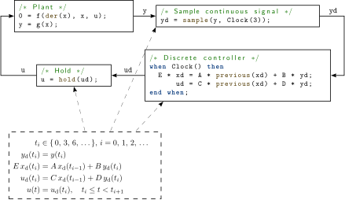
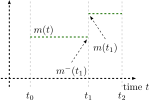
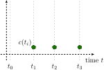
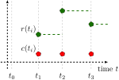

== Synchronous Language Elements
:id: synchronous-language-elements

This chapter defines synchronous behavior suited for implementation of control systems.
The synchronous behavior relies on an additional kind of discrete-time variables and equations, as well as an additional kind of `when`-clause.
The benefits of synchronous behavior is that it allows a model to define large sampled data systems in a safe way, so that the translator can provide good diagnostics in case of a modeling error.

The following small example shows the most important elements:

.A continuous plant and a sampled data controller connected together with sample and (zero-order) hold elements.

* A periodic clock is defined with `Clock(3)`.
The argument of `Clock` defines the sampling interval (for details see <<clock-constructors>>).

* Clocked variables (such as `yd`, `xd`, `ud`) are associated uniquely with a clock and can only be directly accessed when the associated clock is active.
Since all variables in a clocked equation must belong to the same clock, clocking errors can be detected at compile time.
If variables from different clocks shall be used in an equation, explicit cast operators must be used, such as `sample` to convert from continuous-time to clocked discrete-time or `hold` to convert from clocked discrete-time to continuous-time.

* A continuous-time variable is sampled at a clock tick with `sample`.
The operator returns the value of the continuous-time variable when the clock is active.

* When no argument is defined for `Clock`, the clock is deduced by clock inference.

* For a `when`-clause with an associated clock, all equations inside the `when`-clause are clocked with the given clock. All equations on an associated clock are treated together and in the same way regardless of whether they are inside a `when`-clause or not. This means that automatic sampling and hold of variables inside the `when`-clause does not apply (explicit sampling and hold is required) and that general equations can be used in such `when`-clauses (this is not allowed for `when`-clauses with `Boolean` conditions, that require a variable reference on the left-hand side of an equation).

* The `when`-clause in the controller could also be removed and the controller could just be defined by the equations:
+
[source,modelica]
----
/* Discrete controller */
E * xd = A * previous(xd) + B * yd;
    ud = C * previous(xd) + D * yd;
----

* `previous(xd)` returns the value of `xd` at the previous clock tick. At the first sample instant, the start value of `xd` is returned.

* A discrete-time signal (such as `ud`) is converted to a continuous-time signal with `hold`.

* If a variable belongs to a particular clock, then all other equations where this variable is used, with the exception of as argument to certain special operators, belong also to this clock, as well as all variables that are used in these equations.
This property is used for clock inference and allows defining an associated clock only at a few places (above only in the sampler, whereas in the discrete controller and the hold the sampling period is inferred).

* The approach in this chapter is based on the clock calculus and inference system proposed by <<ColacoPouzet2003ClocksFirstClass>> and implemented in Lucid Synchrone version 2 and 3 (<<Pouzet2006LucidSynchrone30>>).
However, the Modelica approach also uses multi-rate periodic clocks based on rational arithmetic introduced by <<ForgetEtAl2008MultiPeriodic>>, as an extension of the Lucid Synchrone semantics.
These approaches belong to the class of synchronous languages (<<BenvenisteEtAl2003SynchronousTwelveYearsLater>>).

=== Rationale for Clocked Semantics

[NOTE]
====
Periodically sampled control systems could also be defined with standard `when`-clauses, see <<when-equations>>, and the `sample` operator, see <<event-related-operators-with-function-syntax>>.
For example:

[source,modelica]
----
when sample(0, 3) then
  xd = A * pre(xd) + B * y;
  u  = C * pre(xd) + D * y;
end when;
----

Equations in a `when`-clause with a `Boolean` condition have the property that (a) variables on the left hand side of the equal sign are assigned a value when the when-condition becomes true and otherwise hold their value, (b) variables not assigned in the `when`-clause are directly accessed (= automatic `sample` semantics), and (c) the variables assigned in the `when`-clause can be directly accessed outside of the `when`-clause (= automatic `hold` semantics).

Using standard `when`-clauses works well for individual simple sampled blocks, but the synchronous approach using clocks and clocked equations provide the following benefits (especially for large sampled systems):

. Possibility to detect inconsistent sampling rate, since clock partitioning (see <<clock-partitioning>>), replaces the automatic sample and hold semantics.
  Examples:

.. If `when`-clauses in different blocks should belong to the same controller part, but by accident different when-conditions are given, then this is accepted (no error is detected).

.. If a sampled data library such as the Modelica_LinearSystems2.Contoller library is used, at every block the sampling of the block has to be defined as integer multiple of a base sampling rate.
   If several blocks should belong to the same controller part, and different integer multiples are given, then the translator has to accept this (no error is detected).

+
Note: Clocked systems can mix different sampling rates in well-defined ways when needed.

. Fewer initial conditions are needed, as only a subset of clocked variables need initial conditions -- the clocked state variables (see <<clocked-state-variables>>).
  For a standard `when`-clause all variables assigned in a `when`-clause must have an initial value because they might be used, before they are assigned a value the first time.
  As a result, all these variables are ``discrete-time states'' although in reality only a subset of them need an initial value.

. More general equations can be used, compared to standard `when`-clauses that require a restricted form of equations where the left hand side has to be a variable, in order to identify the variables that are assigned in the `when`-clause.
  This restriction can be circumvented for standard `when`-clauses, but is absent for clocked equations and make it more convenient to define nonlinear control algorithms.

. Clocked equations allow clock inference, meaning that the sampling need only be given once for a sub-system.
  For a standard `when`-clause the condition (sampling) must be explicitly propagated to all blocks, which is tedious and error prone for large systems.

. Possible to use general continuous-time models in synchronous models (e.g., some advanced controllers use an inverse model of a plant in the feedforward path of the controller, see <<ThummelEtAl2005InverseModels>>).
  This powerful feature of Modelica to use a nonlinear plant model in a controller would require to export the continuous-time model with an embedded integration method and then import it in an environment where the rest of the controller is defined.
  With clocked equations, clocked controllers with continuous-time models can be directly defined in Modelica.

. Clocked equations are straightforward to optimize because they are evaluated exactly once at each event instant.
  In contrast a standard `when`-clause with `sample` conceptually requires several evaluations of the model (in some cases tools can optimize this to avoid unneeded evaluations).
  The problem for the standard `when`-clause is that after `v` is changed, `pre(v)` shall be updated and the model re-evaluated, since the equations could depend on `pre(v)`.
  For clocked equations this iteration can be omitted since `previous(v)` can only occur in the clocked equations that are only run the first event iterations.

. Clocked subsystems using arithmetic blocks are straightforward to optimize.
  When a standard math-block (e.g., addition) is part of a clocked sub-system it is automatically clocked and only evaluated when the clocked equations trigger.
  For standard `when`-clauses one either needs a separate sampled math-block for each operation, or it will conceptually be evaluated all the time.
  However, tools may perform a similar optimization for standard `when`-clauses and it is only relevant in large sampled systems.
====

=== Definitions

In this section various terms are defined.

==== Clocks and Clocked Variables

In <<discrete-time-expressions>> the term _discrete-time_ Modelica expression and in <<continuous-time-and-non-discrete-time-expressions>> the term _continuous-time_ Modelica expression is defined.
In this chapter, two additional kinds of discrete-time expressions/variables are defined that are associated to clocks and are therefore called _clocked discrete-time_ expressions.
The different kinds of discrete-time variables in Modelica are defined below.

Definition Piecewise-constant variable::
(See <<discrete-time-expressions>>.)
Variables _m(t)_ of base type `Real`, `Integer`, `Boolean`, enumeration, and `String` that are _constant_ inside each interval _tᵢ_ ≤ _t_ < _tᵢ₊₁_ (i.e., piecewise constant continuous-time variables).
In other words, _m(t)_ changes value only at events: _m(t)_ = _m(tᵢ)_, for _tᵢ_ ≤ _t_ < _tᵢ₊₁_.
Such variables depend continuously on time and they are discrete-time variables.
See <<fig-piecewise-constant-variable>>.
+
[[fig-piecewise-constant-variable]]
.A piecewise-constant variable

Definition Clock variable::
Clock variables _c(tᵢ)_ are of base type `Clock`.
A clock is either defined by a constructor (such as `Clock(3)`) that defines when the clock ticks (is active) at a particular time instant, or it is defined with clock operators relatively to other clocks, see <<base-clock-conversion-operators>>.
See <<fig-clock-variable>>.
+
[example]
====
Example: Clock variables:

[source,modelica]
----
Clock c1 = Clock(...);
Clock c2 = c1;
Clock c3 = subSample(c2, 4);
----
====
+
[[fig-clock-variable]]
.A clock variable. The value of a clock variable is not defined -- the plot marks only indicate _when_ the clock is active.

[[def-clocked-variable,Definition Clocked variable]]
Definition Clocked variable::
The elements of clocked variables _r(tᵢ)_ are of base type `Real`, `Integer`, `Boolean`, enumeration, `String` that are associated uniquely with a clock _c(tᵢ)_.
A clocked variable can only be directly accessed at the event instant where the associated clock is active.
A constant and a parameter can always be used at a place where a clocked variable is required.
+
[NOTE]
Note that clock variables are not included in this list.
This implies that clock variables cannot be used where clocked variables are required.
+
At time instants where the associated clock is not active, the value of a clocked variable can be inquired by using an explicit cast operator, see below.
In such a case `hold` semantics is used, in other words the value of the clocked variable from the last event instant is used.
See <<fig-clocked-variable>>.
+
[[fig-clocked-variable]]
.A clocked variable. The `hold` extrapolation of the value at the last event instant is illustrated with dashed green lines.

==== Base- and Sub-Partitions

There are two kinds of _clock partitions_:

Definition Base-partition::
A base-partition identifies a set of equations and a set of variables which must be executed together in one task.
Different base-partitions can be associated to separate tasks for asynchronous execution.

Definition Sub-partition::
A sub-partition identifies a subset of equations and a subset of variables of a base-partition which are partially synchronized with other sub-partitions of the same base-partition, i.e., synchronized when the ticks of the respective clocks are simultaneous.
+
The terminology for the partitions is as follows:
+
* _Clocked base-partitions_.
+
** _Discrete-time sub-partitions_.
+
** _Discretized sub-partitions_.
+
* _Unclocked base-partition_.
+
[NOTE]
Note that the term _clock partition_ refers to these partitions in general, whereas _clocked base-partition_ is a specific kind of partition.
Previously the discrete-time sub-partitions were called _clocked discrete-time_ (_sub-clock_ partition).
Further, discretized sub-partitions were called _discretized continuous-time_ (_sub-clock_ partition).
When emphasizing that the partitions are clock partitions, sub-partitions can still be referred to as _sub-clock partitions_; and similarly for base-partition.

==== Argument Restrictions (Component Expression)

The built-in operators (with function syntax) defined in the following sections have partially restrictions on their input arguments that are not present for Modelica functions.
To define the restrictions, the following term is used.

[[def-component-expression,Definition Component expression]]
Definition Component expression::
A component expression is a `component-reference` which is a valid expression, i.e., not referring to models or blocks with equations.
In detail, it is an instance of a (a) base type, (b) derived type, (c) record, (d) an array of such an instance (a-c), (e) one or more elements of such an array (d) defined by index expressions which are evaluable (see below), or (f) an element of records.
+
[NOTE]
The essential features are that one or several values are associated with the instance, that start values can be defined on these values, and that no equations are associated with the instance.
A component expression can be constant or can vary with time.

In the following sections, when defining an operator with function calling syntax, there are some common restrictions being used for the input arguments (operands).
For example, an input argument to the operator may be required to be a component expression (<<def-component-expression>>) or evaluable expression (<<variability-of-expressions>>).
To emphasize that there are no such restrictions, an input argument may be said to be just an _expression_.

[NOTE]
--
The reason for restricting an input argument to be a component expression is that the start value of the input argument is returned before the first tick of the clock of the input argument and this is not possible for a general expression.

The reason for restricting an input argument to be an evaluable expression is to ensure that clock analysis can be performed during translation.
In cases when special handling of parameter expressions is specified, it is an indication that the values are not needed during translation.
--

[example]
====
Example: The input argument to `previous` is restricted to be a component expression.

[source,modelica]
----
Real u1;
Real u2[4];
Complex c;
Resistor R;
...
y1 = previous(u1);    // fine
y2 = previous(u2);    // fine
y3 = previous(u2[2]); // fine
y4 = previous(c.im);  // fine
y5 = previous(2 * u); // error (general expression, not component expression)
y6 = previous(R);     // error (component, not component expression)
----
====

[example]
====
Example: The named argument `factor` of `subSample` is restricted to be an evaluable expression.

[source,modelica]
----
Real u;
parameter Real p=3;
...
y1 = subSample(u, factor = 3);         // fine (literal)
y2 = subSample(u, factor = 2 * p - 3); // fine (evaluable expression)
y3 = subSample(u, factor = 3 * u);     // error (general expression)
----
====

None of the operators defined in this chapter vectorize, but some can operate directly on array variables (including clocked array variables, but not clock array variables).
They are not callable in functions.

=== Clock Constructors

The overloaded constructors listed below are available to generate clocks, and it is possible to call them with the specified named arguments, or with positional arguments (according to the order shown in the details after the table).

[cols="1,1,1"]
|===
|Expression |Description |Details

|`Clock()`
|Inferred clock
|<<operator:clock-inferred>>

|`Clock(intervalCounter, resolution)`
|Rational interval clock
|<<operator:clock-rational>>

|`Clock(interval)`
|Real interval clock
|<<operator:clock-interval>>

|`Clock(condition, startInterval)`
|Event clock
|<<operator:clock-event>>

|`Clock(c, solverMethod)`
|Solver clock
|<<operator:clock-solver>>
|===

[[operator:clock-inferred]]
Operator Clock::
+
[source,modelica]
----
Clock()
----
+
_Inferred clock_.
The operator returns a clock that is inferred.
+
[example]
====
[source,modelica]
----
when Clock() then // equations are on the same clock
  x = A * previous(x) + B * u;
  Modelica.Utilities.Streams.print
    ("clock ticks at = " + String(sample(time)));
end when;
----

Note, in most cases, the operator is not needed and equations could be written without a `when`-clause (but not in the example above, since the `print` statement is otherwise not associated to a clock).
This style is useful if a modeler would clearly like to mark the equations that must belong to one clock (although a tool could figure this out as well, if the `when`-clause is not present).
====

[[operator:clock-rational]]
Operator Clock::
+
[source,modelica]
----
Clock(intervalCounter=intervalCounter, resolution=resolution)
----
+
_Rational interval clock_.
The first input argument, _intervalCounter_, is a clocked component expression (<<def-component-expression>>) or an evaluable expression of type `Integer` with `min = 0`.
The optional second argument _resolution_ (defaults to 1) is an evaluable expression of type `Integer` with `min = 1` and `unit = "Hz"`.
If _intervalCounter_ is an evaluable expression with value zero, the period of the clock is derived by clock inference, see <<sub-clock-inferencing>>.
+
If _intervalCounter_ is an evaluable expression greater than zero, the clock defines a periodic clock.
If _intervalCounter_ is a clocked component expression it must be greater than zero.
The result is of base type `Clock` that ticks when `time` becomes _t~start~_, _t~start~_ + _interval~1~_, _t~start~_ + _interval~1~_ + _interval~2~_, ...
The clock starts at the start of the simulation _t~start~_ or when the controller is switched on.
At the start of the simulation, `previous(intervalCounter)` = `intervalCounter.start` and the clocks ticks the first time.
At the first clock tick _intervalCounter_ must be computed and the second clock tick is then triggered at _interval~1~_ = _intervalCounter_/_resolution_.
At the second clock tick at time _t~start~_ + _interval~1~_, a new value for _intervalCounter_ must be computed and the next clock tick is scheduled at _interval~2~_ = _intervalCounter_/_resolution_, and so on.
+
[NOTE]
The given interval and time shift can be modified by using the `subSample`, `superSample`, `shiftSample` and `backSample` operators on the returned clock, see <<sub-clock-conversion-operators>>.
+
[example]
====
Example:

[source,modelica]
----
  // first clock tick: previous(nextInterval) = 2
  Integer nextInterval(start = 2);
  Real y1(start = 0);
  Real y2(start = 0);
equation
  when Clock(2, 1000) then
    // periodic clock that ticks at 0, 0.002, 0.004, ...
    y1 = previous(y1) + 1;
  end when;

  when Clock(nextInterval, 1000) then
    // interval clock that ticks at 0, 0.003, 0.007, 0.012, ...
    nextInterval = previous(nextInterval) + 1;
    y2 = previous(y2) + 1;
  end when;
----
====
+
Note that operator `interval(c)` of `Clock c = Clock(nextInterval, resolution)` returns: +
`previous(intervalCounter) / resolution` (in seconds)

[[operator:clock-interval]]
Operator Clock::
+
[source,modelica]
----
Clock(interval=interval)
----
+
_Real interval clock_.
The input argument, _interval_, is a clocked component expression (<<def-component-expression>>) or a parameter expression.
The _interval_ must be strictly positive (_interval_ > 0) of type `Real` with `unit = "s"`.
The result is of base type `Clock` that ticks when `time` becomes _t~start~_, _t~start~_ + _interval~1~_, _t~start~_ + _interval~1~_ + _interval~2~_, ...
The clock starts at the start of the simulation _t~start~_ or when the controller is switched on.
Here the next clock tick is scheduled at _interval~1~_ = `previous(interval)` = `interval.start`.
At the second clock tick at time _t~start~_ + _interval~1~_, the next clock tick is scheduled at _interval~2~_ = `previous(interval)`, and so on.
If _interval_ is a parameter expression, the clock defines a periodic clock.
+
[NOTE]
Note, the clock is defined with `previous(interval)`.
Therefore, for sorting the input argument is treated as known.
The given interval and time shift can be modified by using the `subSample`, `superSample`, `shiftSample` and `backSample` operators on the returned clock, see <<sub-clock-conversion-operators>>.
There are restrictions where this operator can be used, see `Clock` expressions below.
Note that _interval_ does not have to an evaluable expression, since different real interval clocks are never compared.

[[operator:clock-event]]
Operator Clock::
+
[source,modelica]
----
Clock(condition=condition, startInterval=startInterval)
----
+
_Event clock_.
The first input argument, _condition_, is a continuous-time expression of type `Boolean`.
The optional _startInterval_ argument (defaults to 0) is the value returned by `interval()` at the first tick of the clock, see <<initialization-of-clocked-partitions>>.
The result is of base type `Clock` that ticks when `edge(pre(condition))` becomes `true`.
+
[NOTE]
This clock is used to trigger a clocked base-partition due to a state event (that is a zero-crossing of a `Real` variable) in an unclocked base-partition, or due to a hardware interrupt that is modeled as `Boolean` in the simulation model.
The additional `pre` delays the event clock one event iteration, but does not introduce any time-delay.
+
[example]
====
Example:

[source,modelica]
----
Clock c = Clock(angle > 0, 0.1); // before first tick of c:
                                 // interval(c) = 0.1
----
====
+
[example]
====
Example: Demonstrating the subtle effect of the additional `pre`:

[source,modelica]
----
  Boolean b = time >= 0.5;
  Clock c = Clock(b);
  Boolean b2 = sample(b, c);
----

The first tick of `c` (the clock of `b2`) is at `0.5` where `b2` is `true`.
This is because both the event clock and sample introduce a delay of one event iteration, keeping them synchronized.
====
+
[NOTE]
The implicitly given interval and time shift can be modified by using the `subSample`, `superSample`, `shiftSample` and `backSample` operators on the returned clock, see <<sub-clock-conversion-operators>>, provided the base interval is not smaller than the implicitly given interval.

[[operator:clock-solver]]
Opertor Clock::
+
[source,modelica]
----
Clock(c=c, solverMethod=solverMethod)
----
+
_Solver clock_.
The first input argument, _c_, is a clock and the operator returns this clock.
The returned clock is associated with the second input argument _solverMethod_ of type `String`.
The meaning of _solverMethod_ is defined in <<solver-methods>>.
If _solverMethod_ is the empty `String`, then this `Clock` construct does not associate an integrator with the returned clock.
+
[example]
====
Example:

[source,modelica]
----
Clock c1 = Clock(1, 10);                   // 100 ms, no solver
Clock c2 = Clock(c1, "ImplicitTrapezoid"); // 100 ms, ImplicitTrapezoid solver
Clock c3 = Clock(c2, "");                  // 100 ms, no solver
----
====

Besides inferred clocks and solver clocks, one of the following mutually exclusive associations of clocks are possible in one base-partition:

. One or more periodic rational interval clocks, provided they are consistent with each other, see <<sub-clock-inferencing>>.
+
[example]
====
Assume `y = subSample(u)`, and `Clock(1, 10)` is associated with `u` and `Clock(2, 10)` is associated with `y`, then this is correct, but it would be an error if `y` is associated with a `Clock(1, 3)`.
====

. Exactly one non-periodic rational interval clock.

. Exactly one real interval clock.
+
[example]
====
Assume `Clock c = Clock(2.5)`, then variables in the same base-partition can be associated multiple times with `c` but not multiple times with `Clock(2.5)`.
====

. Exactly one event clock.

. A default clock, if neither a real interval, nor a rational interval nor an event clock is associated with a base-partition.
  In this case the default clock is associated with the fastest sub-partition.
+
[NOTE]
Typically, a tool will use `Clock(1.0)` as a default clock and will raise a warning, that it selected a default clock.

Clock variables can be used in a restricted form of expressions.
Generally, every expression switching between clock variables must be an evaluable expression (in order that clock analysis can be performed when translating a model).
Thus subscripts on clock variables and conditions of if-then-else switching between clock variables must be evaluable expressions, and there are similar restrictions for sub-clock conversion operators <<sub-clock-conversion-operators>>.
Otherwise, the following expressions are allowed:

* Declaring arrays of clocks.
+
[example]
====
Example:

[source,modelica]
----
Clock c1[3] = {Clock(1), Clock(2), Clock(3)}
----
====

* Array constructors of clocks: `{}`, `[]`, `cat`.

* Array access of clocks.
+
[example]
====
Example:

[source,modelica]
----
sample(u, c1[2])
----
====

* Equality of clocks.
+
[example]
====
Example:

[source,modelica]
----
c1 = c2
----
====

* `if`-expressions of clocks in equations.
+
[example]
====
Example:

[source,modelica]
----
Clock c2 =
  if f > 0 then
    subSample(c1, f)
  elseif f < 0 then
    superSample(c1, f)
  else
    c1;
----
====

* Clock variables can be declared in models, blocks, connectors, and records.
  A clock variable can be declared with the prefixes `input`, `output`, `inner`, `outer`, but _not_ with the prefixes `flow`, `stream`, `discrete`, `parameter`, or `constant`.
+
[example]
====
Example:

[source,modelica]
----
connector ClockInput = input Clock;
----
====

=== Clocked State Variables

Definition Clocked state variable::
A component expression which is not a parameter, and to which `previous` has been applied.

The previous value of a clocked variable can be accessed with the `previous` operator, listed below.

[cols="1,1,1"]
|===
|Expression |Description |Details

|`previous(u)`
|Previous value of clocked variable
|<<modelica-previous>>
|===

[[modelica-previous]]
Operator previous::
+
[source,modelica]
----
previous(u)
----
+
The input argument _u_ is a component expression (<<def-component-expression>>).
If _u_ is a parameter, its value is returned.
+
Otherwise: Input and return arguments are on the same clock.
At the first tick of the clock of _u_ or after a reset transition (see <<reset-handling>>), the start value of _u_ is returned, see <<initialization-of-clocked-partitions>>.
At subsequent activations of the clock of _u_, the value of _u_ from the previous clock activation is returned.
+
[NOTE]
At a clock tick only the (previous) values of the clocked state variables are needed to compute the new values of all clocked variables on that clock.
This roughly corresponds to state variables in continuous time.

=== Partitioning Operators

A set of _clock conversion operators_ together act as boundaries between different clock partitions.

==== Base-Clock Conversion Operators

The operators listed below convert between a clocked and an unclocked representation and vice versa.

[cols="1,1,1"]
|===
|Expression |Description |Details

|`sample(u, clock)`
|Sample unclocked expression
|<<modelica-clocked-sample>>

|`hold(u)`
|Zeroth order hold of clocked-time variable
|<<modelica-hold>>
|===

[[modelica-clocked-sample,Operator sample]]
Operator sample::
+
[source,modelica]
----
sample(u, clock)
----
+
Input argument _u_ is in an unclocked base-partition, and there are no variability restrictions, i.e., it is continuous-time according to <<continuous-time-and-non-discrete-time-expressions>>.
The optional input argument _clock_ is of type `Clock`, and can in a call be given as a named argument (with the name _clock_), or as positional argument.
The operator returns a clocked variable that has _clock_ as associated clock and has the value of the left limit of _u_ when _clock_ is active (that is the value of _u_ just before the event of _clock_ is triggered).
If _clock_ is not provided, it is inferred, see <<sub-clock-inferencing>>.
+
[NOTE]
--
Since the operator returns the left limit of _u_, it introduces an infinitesimal small delay between the unclocked and the clocked partition.
This corresponds to the reality, where a sampled data system cannot act infinitely fast and even for a very idealized simulation, an infinitesimal small delay is present.
The consequences for the sorting are discussed below.

Input argument _u_ can be a general expression, because the argument is unclocked and therefore has always a value.
It can also be a constant, a parameter or a piecewise constant expression.

Note that `sample` is an overloaded function:
If `sample` has two positional input arguments and the second argument is of type `Real`, it is the operator from <<event-related-operators-with-function-syntax>>.
If `sample` has one input argument, or it has two input arguments and the second argument is of type `Clock`, it is the base-clock conversion operator from this section.
--

[[modelica-hold,Operator hold]]
Operator hold::
+
[source,modelica]
----
hold(u)
----
+
Input argument _u_ is a clocked (<<def-clocked-variable>>) component expression (<<def-component-expression>>) or a parameter expression.
The operator returns a piecewise constant signal of the same type as _u_.
When the clock of _u_ ticks, the operator returns _u_ and otherwise returns the value of _u_ from the last clock activation.
Before the first clock activation of _u_, the operator returns the start value of _u_, see <<initialization-of-clocked-partitions>>.
+
[NOTE]
Since the input argument is not defined before the first tick of the clock of _u_, the restriction is present, that it must be a component expression (or a parameter expression), in order that the initial value of _u_ can be used in such a case.

[example]
====
Example: Assume there is the following model:

[source,modelica]
----
  Real y(start = 1), yc;
equation
  der(y) + y = 2;
  yc = sample(y, Clock(0.1));
initial equation
  der(y) = 0;
----

The value of `yc` at the first clock tick is `yc` = 2 (and not `yc` = 1).
The reason is that the continuous-time model `der(y) + y = 2` is first initialized and after initialization `y` has the value 2.
At the first clock tick at `time` = 0, the left limit of `y` is 2 and therefore `yc` = 2.
====

===== Sorting of a Simulation Model

[NOTE]
--
Since `sample(u)` returns the left limit of `u`, and the left limit of `u` is a known value, all inputs to a base-partition are treated as known during sorting.
Since a periodic and interval clock can tick at most once at a time instant, and since the left limit of a variable does not change during event iteration (i.e., re-evaluating a base-partition associated with a condition clock always gives the same result because the `sample(u)` inputs do not change and therefore need not to be re-evaluated), all base-partitions, see <<base-partitioning>>, need not to be sorted with respect to each other.
Instead, at an event instant, active base-partitions can be evaluated first (and once) in any order.
Afterwards, the unclocked base-partition is evaluated.

Event iteration takes place only over the unclocked base-partition.
In such a scenario, accessing the left limit of `u` in `sample(u)` just means to pick the latest available value of `u` when the base-partition is entered, storing it in a local variable of the base-partition and only using this local copy during evaluation of the equations in this base-partition.
--

==== Sub-Clock Conversion Operators

The operators listed below convert between synchronous clocks.

[cols="1,1,1"]
|===
|Expression |Description |Details

|`subSample(u, factor)`
|Clock that is slower by a factor
|<<operator:subsample>>

|`superSample(u, factor)`
|Clock that is faster by a factor
|<<operator:supersample>>

|`shiftSample(u, shiftCounter, resolution)`
|Clock with time-shifted ticks
|<<operator:shiftsample>>

|`backSample(u, backCounter, resolution)`
|Inverse of `shiftSample`
|<<operator:backsample>>

|`noClock(u)`
|Clock that is always inferred
|<<operator:noclock>>
|===

These operators have the following properties:

* The input argument _u_ is a clocked expression or an expression of type `Clock`.
  (The operators can operate on all types of clocks.)
  If _u_ is a clocked expression, the operator returns a clocked variable that has the same type as the expression.
  If _u_ is an expression of type `Clock`, the operator returns a `Clock` -- except for `noClock` where it is an error.

* The optional input arguments `factor` (defaults to 0, with `min = 0`), and `resolution` (defaults to 1, with `min = 1`) are evaluable expressions of type `Integer`.

* Calls of the operators can use named arguments for the multi-letter arguments (i.e., not for _u_) with the given names, or positional arguments.
+
[NOTE]
--
Named arguments can make the calls easier to understand.
--

* The input arguments `shiftCounter` and `backCounter` are evaluable expressions of type `Integer` with `min = 0`.

[[operator:subsample,Operator subSample]]
Operator subSample::
+
[source,modelica]
----
subSample(u, factor=factor)
----
+
The clock of `y = subSample(u, factor)` is _factor_ times slower than the clock of _u_.
At every _factor_ ticks of the clock of _u_, the operator returns the value of _u_.
The first activation of the clock of `y` coincides with the first activation of the clock of _u_, and then every activation of the clock of `y` coincides with the every _factor_th activativation of the clock of _u_.
If _factor_ is not provided or is equal to zero, it is inferred, see <<sub-clock-inferencing>>.

[[operator:supersample,Operator superSample]]
Operator superSample::
+
[source,modelica]
----
superSample(u, factor=factor)
----
+
The clock of `y = superSample(u, factor)` is _factor_ times faster than the clock of _u_.
At every tick of the clock of `y`, the operator returns the value of _u_ from the last tick of the clock of _u_.
The first activation of the clock of `y` coincides with the first activation of the clock of _u_, and then the interval between activations of the clock of _u_ is split equidistantly into _factor_ activations, such that the activation 1 + _k_ · _factor_ of `y` coincides with the 1 + _k_ activation of _u_.
+
[NOTE]
Thus `subSample(superSample(u, factor), factor)` = _u_.
+
If _factor_ is not provided or is equal to zero, it is inferred, see <<sub-clock-inferencing>>.
If an event clock is associated to a base-partition, all its sub-partitions must have resulting clocks that are sub-sampled with an `Integer` factor with respect to this base-clock.
+
[example]
====
Example:

[source,modelica]
----
Clock u = Clock(x > 0);
Clock y1 = subSample(u, 4);
Clock y2 = superSample(y1, 2); // fine; y2 = subSample(u, 2)
Clock y3 = superSample(u, 2);  // error
Clock y4 = superSample(y1, 5); // error
----
====

[[operator:shiftsample,Operator shiftSample]]
Operator shiftSample::
+
[source,modelica]
----
shiftSample(u, shiftCounter=k, resolution=resolution)
----
+
The operator `c = shiftSample(u, k, resolution)` splits the interval between ticks of _u_ into _resolution_ equidistant intervals _i_.
The clock `c` then ticks _k_ intervals _i_ after each tick of _u_.
+
It leads to
+
[source,modelica]
----
shiftSample(u, k, resolution) =
  subSample(shiftSample(superSample(u, resolution), k), resolution)
----
+
[NOTE]
--
Note, due to the restriction of `superSample` on event clocks, `shiftSample` can only shift the number of ticks of the event clock, but cannot introduce new ticks.
Example:

[source,modelica]
----
// Rational interval clock
Clock u  = Clock(3, 10);            // ticks: 0, 3/10, 6/10, ...
Clock y1 = shiftSample(u, 1, 3);    // ticks: 1/10, 4/10, ...
// Event clock
Integer revolutions = integer(time);
Clock u = Clock(change(revolutions), startInterval = 0.0);
                                    // ticks: 0.0, 1.0, 2.0, 3.0, ...
Clock y1 = shiftSample(u, 2);       // ticks: 2.0, 3.0, ...
Clock y2 = shiftSample(u, 2, 3);    // error (resolution must be 1)
----

Additional example showing the full form:

[source,modelica]
----
  Integer intervalCnt(start=2);
  Integer cnt(start=0);
  Clock u = Clock(intervalCnt,1);
  Clock s1 = shiftSample(u, 3, 2);
equation
   when u then
     cnt = previous(cnt) + 1;
     intervalCnt = if (cnt>=2) then 1 else previous(intervalCnt);
   end when;
----

Here `u` ticks at 0, 2, 3, 4, 5, 6.
First you `superSample` to split each sampling interval in two equal parts leading to the ticks 0.0, 1.0, 2.0, 2.5, 3.0, 3.5, 4.0, 4.5, 5.0, 5.5, 6.0.
Then the simple `shiftSample` removes the first three ticks giving 2.5, 3.0, 3.5, 4.0, 4.5, 5.0, 5.5, 6.0.
And finally every other point is removed by `subSample`, and `s1` ticks at 2.5, 3.5, 4.5, 5.5.
--

[[operator:backsample,Operator backSample]]
Operator backSample::
+
[source,modelica]
----
backSample(u, backCounter=cnt, resolution=res)
----
+
The input argument _u_ is either a component expression (<<def-component-expression>>) or an expression of type `Clock`.
This is an inverse of `shiftSample` such that `Clock y = backSample(u, cnt, res)` implicitly defines a clock `y` such that `shiftSample(y, cnt, res)` activates at the same times as _u_.
It is an error if the clock of `y` starts before the base-clock of _u_.
+
At every tick of the clock of `y`, the operator returns the value of _u_ from the last tick of the clock of _u_.
If _u_ is a clocked component expression, the operator returns the start value of _u_, see <<initialization-of-clocked-partitions>>, before the first tick of the clock of _u_.
+
[example]
====
Example:

[source,modelica]
----
// Rational interval clock 1
Clock u  = Clock(3, 10);          // ticks: 0, 3/10, 6/10, ...
Clock y1 = shiftSample(u, 3);     // ticks: 9/10, 12/10, ...
Clock y2 = backSample(y1, 2);     // ticks: 3/10, 6/10, ...
Clock y3 = backSample(y1, 4);     // error (ticks before u)
Clock y4 = shiftSample(u, 2, 3);  // ticks: 2/10, 5/10, ...
Clock y5 = backSample(y4, 1, 3);  // ticks: 1/10, 4/10, ...
// Event clock
Integer revolutions = integer(time);
Clock u = Clock(change(revolutions), startInterval = xx)
                                  // ticks: 0, 1.0, 2.0, 3.0, ...
Clock y1 = shiftSample(u, 3);     // ticks: 3.0, 4.0, ...
Clock y2 = backSample(y1, 2);     // ticks: 1.0, 2.0, ...
----
====

[[operator:noclock,Operator noClock]]
Operator noClock::
+
[source,modelica]
----
noClock(u)
----
+
The clock of `y = noClock(u)` is always inferred, and _u_ must be part of the same base-clock as `y`.
At every tick of the clock of `y`, the operator returns the value of _u_ from the last tick of the clock of _u_.
If `noClock(u)` is called before the first tick of the clock of _u_, the start value of _u_ is returned.

[NOTE]
--
Clarification of `backSample`:

Let _a_ and _b_ be positive integers with _a_ < _b_, and

[source,modelica]
----
yb = backSample(u, a, b)
ys = shiftSample(u, b-a, b)
----

Then when `ys` exists, also `yb` exists and `ys = yb`.

The variable `yb` exists for the above parameterization with `a < b` one clock tick before `ys`.
Therefore, `backSample` is basically a `shiftSample` with a different parameterization and the clock of `backSample.y` ticks before the clock of `u`.
Before the clock of `u` ticks, `yb = u.start`.
--

[NOTE]
--
Clarification of `noClock` operator:

Note, that `noClock(u)` is not equivalent to `sample(hold(u))`.
Consider the following model:

[source,modelica]
----
model NoClockVsSampleHold
  Clock clk1 = Clock(0.1);
  Clock clk2 = subSample(clk1, 2);
  Real x(start = 0), y(start = 0), z(start = 0);
equation
  when clk1 then
    x = previous(x) + 0.1;
  end when;
  when clk2 then
    y = noClock(x);      // most recent value of x
    z = sample(hold(x)); // left limit of x (infinitesimally delayed)!
  end when;
end NoClockVsSampleHold;
----

Due to the infinitesimal delay of `sample`, `z` will not show the current value of `x` as `clk2` ticks, but will show its previous value (left limit).
However, `y` will show the current value, since it has no infinitesimal delay.
--

Note that it is not legal to compute the derivative of the `sample`, `subSample`, `superSample`, `backSample`,
`shiftSample`, and `noClock` operators.

=== Clocked When-Clause

In addition to the previously discussed `when`-equation (see <<when-equations>>), a _clocked_ `when`-clause is introduced:

[source,modelica]
----
when clockExpression then
  <clocked equations>
  ...
end when;
----

The clocked `when`-clause cannot be nested and does not have any `elsewhen` part.
It cannot be used inside an algorithm.
General equations are allowed in a clocked `when`-clause.

For a clocked `when`-clause, all equations inside the `when`-clause are clocked with the same clock given by the _clockExpression_.

=== Clock Partitioning

This section defines how clock-partitions and clocks associated with equations are inferred.

[NOTE]
====
Typically clock partitioning is performed before sorting the equations.
The benefit is that clocking and symbolic transformation errors are separated.
====

Every clocked variable is uniquely associated with exactly one clock.

After model flattening, every equation in an equation section, every expression and every algorithm section is either unclocked, or it is uniquely associated with exactly one clock.
In the latter case it is called a _clocked equation_, a _clocked expression_ or _clocked algorithm_ section respectively.
The associated clock is either explicitly defined by a `when`-clause, see <<sub-clock-conversion-operators>>, or it is implicitly defined by the requirement that a clocked equation, a clocked expression and a clocked algorithm section must have the same clock as the variables used in them with exception of the expressions used as first arguments in the conversion operators of <<partitioning-operators>>.
_Clock inference_ means to infer the clock of a variable, an equation, an expression or an algorithm section if the clock is not explicitly defined and is deduced from the required properties in the previous two paragraphs.

All variables in an expression without clock conversion operators must have the same clock to infer the clocks for each variable and expression.
The clock inference works both forward and backwards regarding the data flow and is also being able to handle algebraic loops.
The clock inference method uses the set of variable incidences of the equations, i.e., what variables that appear in each equation.

Note that incidences of the first argument of clock conversion operators of <<partitioning-operators>> are handled specially.

[NOTE]
====
As clock partitions are solely determined by the equations, two different clock partitions can have clocks defined by the same expressions.
It is a quality of implementation issue that such partitions are executed synchronously, e.g., by putting them in the same task in a real-time simulation context.
====

==== Flattening of Model

The clock partitioning is conceptually performed after model flattening, i.e., redeclarations have been elaborated, arrays of model components expanded into scalar model components, and overloading resolved.
Furthermore, function calls to inline functions have been inlined.

[NOTE]
====
This is called _conceptually_, because a tool might do this more efficiently in a different way, provided the result is the same as if everything is flattened.
For example, array and matrix equations and records don't not need to be expanded if they have the same clock.
====

Furthermore, each non-trivial expression (non-literal, non-constant, non-parameter, non-variable), _expr~i~_, appearing as first argument of a clock conversion operator (except `hold` and `backSample`) is recursively replaced by a unique variable, _v~i~_, and the equation _v~i~_ = _expr~i~_ is added to the equation set.

==== Connected Components of the Equations and Variables Graph

Consider the set _E_ of equations and the set _V_ of unknown variables (not constants and parameters) in a flattened model, i.e., _M_ = ⟨_E_, _V_⟩.
The partitioning is described in terms of an undirected graph ⟨_N_, _F_⟩ with the nodes _N_ being the set of equations and variables, _N_ = _E_ ∪ _V_.
The set incidence(_e_) for an equation _e_ in _E_ is a subset of _V_, in general, the unknowns which lexically appear in _e_.
There is an edge in _F_ of the graph between an equation, _e_, and a variable, _v_, if _v_ ∈ incidence(_e_):

[latexmath]
++++
F = \{(e, v) : e \in E, v \in \operatorname{incidence}(e)\}
++++

A set of clock partitions is the _connected components_ (Wikipedia, _Connected components_) of this graph with appropriate definition of the incidence operator.

A special case is the built-in variable `time` (see <<built-in-variable-time>>).
Each use of `time` is conceptually included as a separate variable in this analysis, _time~i~_ with `der(time~i~)` = 1.

[NOTE]
====
This means that `time` can be used in different partitions without any restrictions.
Additionally, it means that every sub-partition directly referencing `time` contains a call to `der`.
====

==== Base-Partitioning

The goal is to identify all clocked equations and variables that should be executed together in the same task, as well as to identify the unclocked base-partition.

The base-partitioning is performed with base-clock inference which uses the following incidence definition:

incidence(_e_) = the _unknown_ variables, as well as variables `x` in `der(x)`, `pre(x)`, and `previous(x)`, which lexically appear in _e_ except as first argument of base-clock conversion operators: `sample` and `hold` and `Clock(condition=..., startInterval=...)`.

The resulting set of connected components, is the partitioning of the equations and variables, _B~i~_ = ⟨_E~i~_, _V~i~_⟩, according to base-clocks and unclocked partitions.

The base partitions are identified as _clocked_ or as _unclocked partitions_ according to the following properties:

A variable `u` in `sample(u)`, a variable `y` in `y = hold(ud)`, and a variable `b` in `Clock(b, startInterval=...)` where the `Boolean` `b` is in an unclocked partition.

Correspondingly, variables `u` and `y` in
`y = sample(uc)`,
`y = subSample(u)`,
`y = superSample(u)`,
`y = shiftSample(u)`,
`y = backSample(u)`,
`y = previous(u)`,
are in a clocked base-partition.
Equations in a clocked `when`-clause are also in a clocked base-partition.
Other base-partitions, where none of the variables in the partition are associated with any of the operators above, have an unspecified partition kind and are considered to be unclocked base-partitions.

All unclocked base-partitions are collected together and form _the unclocked base-partition_.

[example]
====
Example:

[source,modelica]
----
// Controller 1
ud1 = sample(y,c1);
0 = f1(yd1, ud1, previous(yd1));

// Controller 2
ud2 = superSample(yd1,2);
0 = f2(yd2, ud2);

// Unclocked system
u = hold(yd2);
0 = f3(der(x1), x1, u);
0 = f4(der(x2), x2, x1);
0 = f5(der(x3), x3);
0 = f6(y, x1, u);
----

After base-partitioning, the following partitions are identified:

[source,modelica]
----
// Base partition 1 -- clocked partition
ud1 = sample(y, c1);             // incidence(e) = {ud1}
0 = f1(yd1, ud1, previous(ud1)); // incidence(e) = {yd1, ud1}
ud2 = superSample(yd1, 2);       // incidence(e) = {ud2, yd1}
0 = f2(yd2, ud2);                // incidence(e) = {yd2, ud2}

// Base partition 2 -- unclocked partition
u = hold(yd2);                   // incidence(e) = {u}
0 = f3(der(x1), x1, u);          // incidence(e) = {x1, u}
0 = f4(der(x2), x2, x1);         // incidence(e) = {x2, x1}
0 = f6(y, x1, u);                // incidence(e) = {y, x1, u}

// Identified as separate partition, but belonging to base-partition 2
0 = f5(der(x3), x3);             // incidence(e) = {x3}
----
====

==== Sub-Partitioning

For each clocked base-partition B~i~, identified in <<base-partitioning>>, the sub-partitioning is performed with sub-clock inference which uses the following incidence definition:

incidence(_e_) = the _unknown_ variables, as well as variables `x` in `der(x)`, `pre(x)`, and `previous(x)`, which lexically appear in _e_ except as first argument of sub-clock conversion operators: `subSample`, `superSample`, `shiftSample`, `backSample`, `noClock`, and `Clock` with first argument of `Boolean` type.

The resulting set of connected components, is the partitioning of the equations and variables, _S~ij~_ = ⟨_E~ij~_, _V~ij~_⟩, according to sub-clocks.

The connected components (corresponding to the sub-clocks) are then further split into strongly connected components corresponding to systems of equations.
The resulting sets of equations and variables shall be possible to solve separately, meaning that systems of equations cannot involve different sub-clocks.

It can be noted that:

[latexmath]
++++
\begin{aligned}
E_{ij} \bigcap E_{kl} &= \emptyset,\, \forall i\ne{}k, j\ne{}l \\
V_{ij} \bigcap V_{kl} &= \emptyset,\, \forall i\ne{}k, j\ne{}l \\
V &= \bigcup V_{ij} \\
E &= \bigcup E_{ij}
\end{aligned}
++++

[example]
====
Example: After sub-partitioning of the example from <<base-partitioning>>, the following partitions are identified:

[source,modelica]
----
// Base partition 1 (clocked partition)
// Sub-partition 1.1
ud1 = sample(y, c1);             // incidence(e) = {ud1}
0 = f1(yd1, ud1, previous(yd1)); // incidence(e) = {yd1,ud1}

// Sub-partition 1.2
ud2 = superSample(yd1, 2);       // incidence(e) = {ud2}
0 = f2(yd2, ud2);                // incidence(e) = {yd2,ud2}

// Base partition 2 (no sub-partitioning, since unclocked)
u = hold(yd2);
0 = f3(der(x1), x1, u);
0 = f4(der(x2), x2, x1);
0 = f5(der(x3), x3);
0 = f6(y, x1, u);
----
====

[example]
====
Example: Forbidding systems of equations involving different sub-clocks means that the following is forbidden:

[source,modelica]
----
  Real a;
  //Real x=a+z;
  Real y=superSample(a+z, 2);
  Real z;
equation
  a+z = sample(time, Clock(1,100));
  0 = subSample(y, 2)+a;
----

Here `a` and `z` are part of one sub-clock, and `y` of another, and the system of equations involve both of them.

The following legal example solves the issues in the previous example by replacing `a` by `x-z` (and simplifying the equations).
Additionally, it shows that it is not required that the sub-clocks can necessarily be sorted:

[source,modelica]
----
  Real x=sample(time, Clock(1,100));
  Real y=superSample(x, 2);
  Real z=subSample(y, 2)+x;
----

Here `x` and `z` are part of one sub-partition, and `y` of another.
The equations form three equation systems with one equation in each (hence trivially satisfying the requirement that only variables from one sub-partition are being solved).
The equation systems need to be solved in a strict order, but the first and last equation system belong to one sub-clock, while the second equation system belongs to another sub-clock.
This illustrates that there is no guarantee that the sub-partitions can be ordered in agreement with the equation systems.
Note that equation systems with more than one equation are also allowed in sub-partitions.
====

==== Sub-Clock Inferencing

For each base-partition, the base interval needs to be determined and for each sub-partition, the sub-sampling factors and shift need to be determined.
The sub-partition intervals are constrained by `subSample` and `superSample` factors which might be known (or evaluable expression) or unspecified, as well as by `shiftSample`, `shiftCounter` and `resolution`, or `backSample`, `backCounter` and `resolution`.
This constraint set is used to solve for all intervals and sub-sampling factors and shift of the sub-partitions.
The model is erroneous if no solution exist.

[NOTE]
====
It must be possible to determine that the constraint set is valid at compile time.
However, in certain cases, it could be possible to defer providing actual numbers until run-time.
====

It is required that accumulated sub- and supersampling factors in the range of 1 to 2^63^ can be handled.

[NOTE]
====
64 bit internal representation of numerator and denominator with sign can be used and gives minimum resolution 1.08×10^-19^ seconds and maximum range 9.22×10^18^ seconds = 2.92×10^11^ years.
====

=== Discretized Sub-Partition

[NOTE]
====
The goal is that every continuous-time Modelica model can be utilized in a sampled data control system.
This is achieved by solving the continuous-time equations with a defined integration method between clock ticks.
With this feature, it is for example possible to invert the nonlinear dynamic model of a plant, see <<ThummelEtAl2005InverseModels>>, and use it in a feedforward path of an advanced control system that is associated with a clock.

This feature also allows defining multi-rate systems: Different parts of the continuous-time model are associated to different clocks and are solved with different integration methods between clock ticks, e.g., a very fast sub-system with an implicit solver with a small step-size and a slow sub-system with an explicit solver with a large step-size.
====

With the language elements defined in this section, continuous-time equations can be used in clocked partitions.
Hereby, the continuous-time equations are solved with the defined integration method between clock ticks.

Such a sub-partition is called a _discretized_ sub-partition, and the clock ticks are not interpreted as events, but as step-sizes of the integrator that the integrator must hit exactly.
Hence, no event handling is triggered at clock ticks (provided an explicit event is not triggered from the model at this time instant).

[NOTE]
====
The interpretation of the clock ticks is the same assumption as for manually discretized controllers, such as the z-transform.
====

[NOTE]
====
It is not defined how to handle events that are triggered while solving a discretized sub-partition.
For example, a tool could handle events in the same way as for a usual simulation -- but only check them at the time associated with clock-ticks.

Alternatively, relations might be interpreted literally, so that events are no longer triggered (in order that the time for an integration step is always the same, as needed for hard real-time requirements).
However, even if relations do not generate events, when-clauses and operators `edge` and `change` should behave as normal.
====

From the viewpoint of other partitions, the discretized continuous-time variables only have values at clock ticks (internally it may be more complicated, see <<solver-methods>>).
Therefore, outside the discretized sub-partitions themselves, they are treated similarly to discrete-time sub-partitions.
Especially, operators such as `sample`, `hold`, `subSample` must be used to communicate signals of the discretized sub-partition with other partitions.

==== Discrete-time and Discretized Sub-Partitions

Additionally to the variability of expressions defined in <<variability-of-expressions>>, an orthogonal concept _clocked variability_ is defined in this section.
If not explicitly stated otherwise, an expression with a variability such as _continuous-time_ or _discrete-time_ means that the expression is inside a partition that is unclocked.
If an expression is present in a base-partition that is not an unclocked base-partition, it is a _clocked expression_ and has _clocked variability_.

After sub-clock inferencing, see <<sub-clock-inferencing>>, every sub-partition that is associated with a clock has to be categorized as _discrete-time_ or _discretized_.

[NOTE]
====
Previously, discrete-time sub-partition was refered to as _clocked discrete-time partition_, and discretized sub-partition as _clocked discretized continuous-time partition_.
====

If a clocked sub-partition contains any of the operators `der`, `delay`, `spatialDistribution`, or event related operators from <<event-related-operators-with-function-syntax>> (with exception of `noEvent` and `smooth`), or contains a `when`-clause with a `Boolean` condition, it is a _discretized_ sub-partition.
Otherwise, it is a _discrete-time_ sub-partition.

[NOTE]
====
That is, a discrete-time sub-partition is a standard sampled data system described by difference equations.
====

A discretized sub-partition has to be solved with a _solver method_ of <<solver-methods>>.
When `previous(x)` is used on a continuous-time state variable `x`, then `previous(x)` uses the start value of `x` as value for the first clock tick.

The use of the operator `sample` from <<event-related-operators-with-function-syntax>> in a discretized sub-partition is problematic.
A diagnostic is recommended, especially if the operator is intended to generate events faster than the clock ticks, and otherwise the sampling should ideally be adjusted to the clock ticks.

[NOTE]
====
The reason for not disallowing `sample` in a discretized sub-partition is to make it possible to include _any_ continuous-time Modelica model in a sampled data control system.
Note that even if the sampling is slower than the clock ticks (or even the same rate) it still introduces the problem of possibly uneven sampling.
====

In a discrete-time sub-partition none of the event generating mechanisms apply.
Especially neither relations, nor any of the built-in operators of <<event-triggering-mathematical-functions>> (event triggering mathematical functions) will trigger events.

==== Solver Methods

A sub-partition can have an integration method, directly associated (<<associating-a-solver-to-a-sub-partition>>) or inferred from other sub-partitions (<<inferencing-of-solvermethod>>).
A predefined type `ModelicaServices.Types.SolverMethod` defines the methods supported by the respective tool by using the `choices` annotation.

[NOTE]
====
The `ModelicaServices` package contains tool specific definitions.
A string is used instead of an enumeration, since different tools might have different values and then the integer mapping of an enumeration is misleading since the same value might characterize different integrators.
====

The following names of solver methods are standardized:

[source,modelica]
----
type SolverMethod = String annotation(choices(
  choice="External" "Solver specified externally",
  choice="ExplicitEuler" "Explicit Euler method (order 1)",
  choice="ExplicitMidPoint2" "Explicit mid point rule (order 2)",
  choice="ExplicitRungeKutta4" "Explicit Runge-Kutta method (order 4)",
  choice="ImplicitEuler" "Implicit Euler method (order 1)",
  choice="ImplicitTrapezoid" "Implicit trapezoid rule (order 2)"
)) "Type of integration method to solve differential equations in a " +
   "discretized sub-partition."
----

If a tool supports one of the integrators of `SolverMethod`, it must use the solver method name of above.

[NOTE]
====
A tool may also support other integrators.
Typically, a tool supports at least methods `"External"` and `"ExplicitEuler"`.
If a tool does not support the integration method defined in a model, typically a warning message is printed and the method is changed to `"External"`.
====

If the solver method is `"External"`, then the sub-partition associated with this method is integrated by the simulation environment for an interval of length of `interval()` using a solution method defined in the simulation environment.

[NOTE]
====
An example of such a solution method could be to have a table of the clocks that are associated with discretized sub-partitions and a method selection per clock.
In such a case, the solution method might be a variable step solver with step-size control that integrates between two clock ticks.
The simulation environment might also combine all partitions associated with method `"External"`, as well as all unclocked partitions, and integrate them together with the solver selected by the simulation environment.
====

If the solver method is _not_ `"External"`, then the sub-partition is integrated using the given method with the step-size `interval()`.

[NOTE]
====
For a periodic clock, the integration is thus performed with fixed step size.
====

The solvers are defined with respect to the underlying ordinary differential equation in state space form that corresponds to the sub-partition before it has been discretized, at least conceptually:

[latexmath]
++++
\begin{align*}
\dot{x} &= f(x, u, t)\\
y &= g(x, u, t)
\end{align*}
++++

where:

* _t_ is time
* _u~c~(t)_ is the continuous-time `Real` vector of input variables
* _u~d~(t)_ is the discrete-time `Real`/`Integer`/`Boolean`/`String` vector of input variables
* _x(t)_ is the continuous-time real vector of states
* _y(t)_ is the continuous-time or discrete-time `Real`/`Integer`/`Boolean`/`String` vector of algebraic and/or output variables

A solver method is applied to a discretized sub-partition.
Such a partition has explicit inputs _u_ marked by `sample(u)`, `subSample(u)`, `superSample(u)`, `shiftSample(u)` and/or `backSample(u)`.
Furthermore, the outputs _y_ of such a partition are marked by `hold(y)`, `subSample(y)`, `superSample(y)`, `shiftSample(y)`, and/or `backSample(y)`.
The arguments of these operators are to be used as input signals _u_ and output signals _y_ in the conceptual ordinary differential equation above, and in the discretization formulae below, respectively.

The solver methods (with exception of `"External"`) are defined by integrating from clock tick _t~i-1~_ to clock tick
_t~i~_ and computing the desired variables at _t~i~_, with _h_ = _t~i~_ - _t~i-1~_ = `interval`(_u_) and _x~i~_ = _x(t~i~)_ (for all methods: _y~i~_ = _g(x~i~,u~c,i~,u~d,i~,t~i~)_):

[cols="1a,<3a"]
|===
|SolverMethod |Solution method

|`"ExplicitEuler"`
|[latexmath]
++++
\begin{aligned}
x_{i} &:= x_{i-1}+h\cdot\dot{x}_{i-1}\\
\dot{x}_{i} &:= f(x_i,u_{c,i},u_{d,i},t_i)
\end{aligned}
++++

|`"ExplicitMidPoint2"`
|[latexmath]
++++
\begin{aligned}
x_{i} &:= x_{i-1}+h\cdot f(x_{i-1}+\frac{1}{2}\cdot h \cdot\dot{x}_{i-1},\frac{u_{c,i-1}+u_{c,i}}{2},u_{d,i-1},t_{i-1}+\tfrac{1}{2}\cdot h)\\
\dot{x}_{i} &:= f(x_i,u_{c,i},u_{d,i},t_i)
\end{aligned}
++++

|`"ExplicitRungeKutta4"`
|[latexmath]
++++
\begin{aligned}
k_1 &:= h\cdot \dot{x}_{i-1}\\
k_2 &:= h\cdot f(x_{i-1}+\tfrac{1}{2}k_1,\frac{u_{c,i-1}+u_{c,i}}{2},u_{d,i-1},t_{i-1}+\tfrac{1}{2}\cdot h)\\
k_3 &:= h\cdot f(x_{i-1}+\tfrac{1}{2}k_2,\frac{u_{c,i-1}+u_{c,i}}{2},u_{d,i-1},t_{i-1}+\tfrac{1}{2}\cdot h)\\
k_4 &:= h\cdot f(x_{i-1}+k_3,u_{c,i},u_{d,i},t_i)\\
x_{i} &:= x_{i-1}+\tfrac{1}{6}\cdot(k_1+2\cdot k_2+2\cdot k_3+k_4)\\
\dot{x}_{i} &:= f(x_i,u_{c,i},u_{d,i},t_i)
\end{aligned}
++++

|`"ImplicitEuler"`
|[latexmath]
++++
\text{Equation system with unknowns: }x_i, \dot{x}_i\\
\begin{aligned}
x_{i} &= x_{i-1}+h\cdot\dot{x}_i\\
\dot{x}_{i} &= f(x_i,u_{c,i},u_{d,i},t_i)
\end{aligned}
++++

|`"ImplicitTrapezoid"`
|[latexmath]
++++
\text{Equation system with unknowns: }x_i, \dot{x}_i\\
\begin{aligned}
x_{i} &= x_{i-1}+\tfrac{1}{2}h\cdot(\dot{x}_i+\dot{x}_{i-1})\\
\dot{x}_{i} &= f(x_i,u_{c,i},u_{d,i},t_i)
\end{aligned}
++++
|===

The initial conditions will be used at the first tick of the clock, and the first integration step will go from the first to the second tick of the clock.

[example]
====
Example: Assume the differential equation

[source,modelica]
----
  input Real u;
  Real x(start = 1, fixed = true);
equation
  der(x) = -x + u;
----

shall be transformed to a discretized sub-partition with the `"ExplicitEuler"` method.
The following model is a manual implementation:

[source,modelica]
----
  input Real u;
  parameter Real x_start = 1;
  Real x(start = x_start); // previous(x) = x_start at first clock tick
  Real der_x(start = 0);   // previous(der_x) = 0 at first clock tick
protected
  Boolean first(start = true);
equation
  when Clock() then
    first = false;
    if previous(first) then
      // first clock tick (initialize system)
      x = previous(x);
    else
      // second and further clock tick
      x = previous(x) + interval() * previous(der_x);
    end if;
    der_x = -x + u;
  end when;
----
====

[NOTE]
For the implicit integration methods the efficiency can be enhanced by utilizing the discretization formula during the symbolic transformation of the equations.
For example, linear differential equations are then mapped to linear and not non-linear algebraic equation systems, and also the structure of the equations can be utilized.
For details see <<ElmqvistOtterCellier1995InlineIntegration>>.
It might be necessary to associate additional data for an implicit integration method, e.g., the relative tolerance to solve the non-linear algebraic equation systems, or the maximum number of iterations in case of hard realtime requirements.
This data is tool specific and is typically either defined with a vendor annotation or is given in the simulation environment.

==== Associating a Solver to a Sub-Partition

A `SolverMethod` can be associated to a clock with the overloaded `Clock` constructor `Clock(c, solverMethod=...)`, see <<clock-constructors>>.
If a clock is associated with a sub-clock of a discretized sub-partition and a `SolverMethod` is associated with this clock, then the sub-partition is integrated with it.

[example]
====
Example:

[source,modelica]
----
// Continuous PI controller in a clocked partition
vd = sample(x2, Clock(Clock(1, 10), solverMethod="ImplicitEuler"));
e = ref - vd;
der(xd) = e / Ti;
u = k * (e + xd);

// Physical model
f = hold(u);
der(x1) = x2;
m * der(x2) = f;
----
====

==== Inferencing of solverMethod

If a `solverMethod` is not explicitly associated with a sub-partition, it is inferred with a similar mechanism as for sub-clock inferencing, see <<sub-clock-inferencing>>.

First, one set is constructed for each sub-partition, containing just this sub-partition.
These sets are then merged as follows:
For each set without a specified `solverMethod`, the set is merged with sets connected to it (these may contain a `solverMethod`), and this is repeated until it is not possible to merge more sets.
The sets connected in this way should be part of the same base-partition and connected through a sub-clock conversion operator (`subSample`, `superSample`, `shiftSample`, `backSample`, or `noClock`).

* It is an error if this set contains multiple different values for `solverMethod`.

* If the set contains continuous-time equations:

** It is an error if this set contains no `solverMethod`.

** Otherwise, the specified `solverMethod` is used.

* If the set does not contain continuous-time equations, there is no need for a `solverMethod`.
  However, inferencing between sub-partitions works the same regardless of whether there are continuous-time equations.

[example]
====
Example:

[source,modelica]
----
model InferenceTest
  Real x(start = 3) "Explicitly using ExplicitEuler";
  Real y "Explicitly using ImplicitEuler method";
  Real z "Inferred to use ExplicitEuler";
equation
  der(x) = -x + sample(1, Clock(Clock(1, 10), solverMethod="ExplicitEuler"));
  der(y) = subSample(x, 2) +
           sample(1, Clock(Clock(2, 10), solverMethod="ImplicitEuler"));
  der(z) = subSample(x, 2) + 1;
end InferenceTest;
----

Note that there is only one base-partition, but it has two different periodic rational clocks - consistent with <<sub-clock-inferencing>>.

[source,modelica]
----
model IllegalInference
  Real x(start = 3) "Explicitly using ExplicitEuler";
  Real y "Explicitly using ImplicitEuler method";
  Real z;
equation
  der(x) = -x + sample(1, Clock(Clock(1, 10), solverMethod="ExplicitEuler"));
  der(y) = subSample(x, 2) +
           sample(1, Clock(Clock(2, 10), solverMethod="ImplicitEuler"));
  der(z) = subSample(x, 4) + 1 + subSample(y);
end IllegalInference;
----

Here `z` is a continuous-time equation connected directly to both `x` and `y` sub-partitions that have different `solverMethod`.
====

=== Initialization of Clocked Partitions

The standard scheme for initialization of Modelica models does not apply for discrete-time sub-partitions.
Instead, initialization is performed in the following way:

* Variables in discrete-time sub-partitions cannot be used in initial equation or initial algorithm sections.
* Attribute `fixed` cannot be applied to variables in discrete-time sub-partitions.
  The attribute `fixed` is true for clocked states, otherwise false.

=== Other Operators

A few additional utility operators are listed below.

[cols="a,a,a",options="autowidth"]
|===
|Expression |Description |Details

|`firstTick(u)`
|Test for first clock tick
|<<modelica-firsttick>>

|`interval(u)`
|Interval between previous and present tick
|<<modelica-interval>>
|===

It is an error if these operators are called in the unclocked base-partition.

[[modelica-firsttick,Operator firstTick]]
Operator firstTick::
+
[source,modelica]
----
firstTick(u)
----
+
This operator returns true at the first tick of the clock of the expression, in which this operator is called.
The operator returns false at all subsequent ticks of the clock.
The optional argument _u_ is only used for clock inference, see <<clock-partitioning>>.

[[modelica-interval,Operator interval]]
Operator interval::
+
[source,modelica]
----
interval(u)
----
+
This operator returns the interval between the previous and present tick of the clock of the expression, in which this operator is called.
The optional argument _u_ is only used for clock inference, see <<clock-partitioning>>.
At the first tick of the clock the following is returned:
+
. If the specified clock interval is a parameter expression, this value is returned.
. Otherwise the start value of the variable specifying the interval is returned.
. For an event clock the additional `startInterval` argument to the event clock constructor is returned.

+
The return value of `interval` is a scalar `Real` number.

[example]
====
Example: A discrete PI controller is parameterized with the parameters of a continuous PI controller, in order that the discrete block is robust against changes in the sample period.
This is achieved by discretizing a continuous PI controller (here with an implicit Euler method):

[source,modelica]
----
block ClockedPI
  parameter Real T "Time constant of continuous PI controller";
  parameter Real k "Gain of continuous PI controller";
  input Real u;
  output Real y;
  Real x(start = 0);
  protected
  Real Ts = interval(u);
equation
  /* Continuous PI equations: der(x) = u / T; y = k * (x + u);
   * Discretization equation: der(x) = (x - previous(x)) / Ts;
   */
  when Clock() then
    x = previous(x) + Ts / T * u;
    y = k * (x + u);
  end when;
end ClockedPI;
----

A continuous-time model is inverted, discretized and used as feedforward controller for a PI controller (`der`, `previous`, `interval` are used in the same partition):

[source,modelica]
----
block MixedController
  parameter Real T "Time constant of continuous PI controller";
  parameter Real k "Gain of continuous PI controller";
  input Real y_ref, y_meas;
  Real y;
  output Real yc;
  Real z(start = 0);
  Real xc(start = 1, fixed = true);
  Clock c = Clock(Clock(0.1), solverMethod="ImplicitEuler");
protected
  Real uc;
  Real Ts = interval(uc);
equation
  /* Continuous-time, inverse model */
  uc = sample(y_ref, c);
  der(xc) = uc;
  /* PI controller */
  z = if  firstTick() then 0 else
  previous(z) + Ts / T * (uc - y_meas);
  y = xc + k * (xc + uc);
  yc = hold(y);
end MixedController;
----
====

=== Semantics

The execution of sub-partitions requires exact time management for proper synchronization.
The implication is that testing a `Real`-valued time variable to determine sampling instants is not possible.
One possible method is to use counters to handle sub-sampling scheduling,

[source,modelica]
----
Clock_i_j_ticks =
  if pre(Clock_i_j_ticks) < subSamplingFactor_i_j then
    1 + pre(Clock_i_j_ticks)
  else
    1;
----

and to test the counter to determine when the sub-clock is ticking:

[source,modelica]
----
Clock_i_j_activated =
  BaseClock_i_activated and Clock_i_j_ticks >= subSamplingFactor_i_j;
----

The `Clock_i_j_activated` flag is used as the guard for the sub partition equations.

[example]
====
Consider the following example:

[source,modelica]
----
model ClockTicks
  Integer second = sample(1, Clock(1));
  Integer seconds(start = -1) = mod(previous(seconds) + second, 60);
  Integer milliSeconds(start = -1) =
    mod(previous(milliSeconds) + superSample(second, 1000), 1000);
  Integer minutes(start = -1) =
    mod(previous(minutes) + subSample(second, 60), 60);
end ClockTicks;
----

A possible implementation model is shown below using Modelica 3.2 semantics.
The base-clock is determined to 0.001 seconds and the sub-sampling factors to 1000 and 60000.

[source,modelica]
----
model ClockTicksWithModelica32
   Integer second;
   Integer seconds(start = -1);
   Integer milliSeconds(start = -1);
   Integer minutes(start = -1);

   Boolean BaseClock_1_activated;
   Integer Clock_1_1_ticks(start = 59999);
   Integer Clock_1_2_ticks(start = 0);
   Integer Clock_1_3_ticks(start = 999);
   Boolean Clock_1_1_activated;
   Boolean Clock_1_2_activated;
   Boolean Clock_1_3_activated;
equation
  // Prepare clock tick
  BaseClock_1_activated =  sample(0, 0.001);
  when BaseClock_1_activated then
    Clock_1_1_ticks =
      if pre(Clock_1_1_ticks) < 60000 then 1 + pre(Clock_1_1_ticks) else 1;
    Clock_1_2_ticks =
      if pre(Clock_1_2_ticks) < 1 then 1 + pre(Clock_1_2_ticks) else 1;
    Clock_1_3_ticks =
      if pre(Clock_1_3_ticks) < 1000 then 1 + pre(Clock_1_3_ticks) else 1;
  end when;
  Clock_1_1_activated =  BaseClock_1_activated and Clock_1_1_ticks >= 60000;
  Clock_1_2_activated =  BaseClock_1_activated and Clock_1_2_ticks >= 1;
  Clock_1_3_activated =  BaseClock_1_activated and Clock_1_3_ticks >= 1000;

  // -----------------------------------------------------------------------
  // Sub partition execution
  when {Clock_1_3_activated} then
    second = 1;
  end when;
  when {Clock_1_1_activated} then
    minutes = mod(pre(minutes) + second, 60);
  end when;
  when {Clock_1_2_activated} then
    milliSeconds = mod(pre(milliSeconds) + second, 1000);
  end when;
  when {Clock_1_3_activated} then
    seconds = mod(pre(seconds) + second, 60);
  end when;
end ClockTicksWithModelica32;
----
====