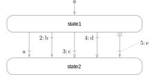
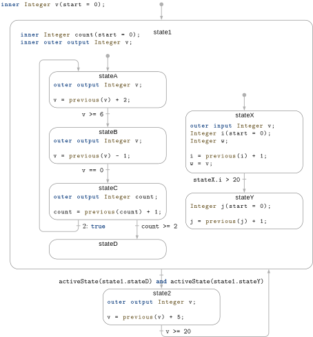
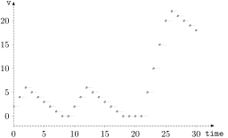

== State Machines
:id: state-machines

This chapter defines language elements to define clocked state machines.
These state machines have a similar modeling power as Statecharts (<<Harel1987Statecharts>>) and have the important feature that at one clock tick, there is only one assignment to every variable (for example, it is an error if state machines are executed in parallel and they assign to the same variable at the same clock tick; such errors are detected during translation).
Furthermore, it is possible to activate and deactivate clocked equations and blocks at a clock tick.
An efficient implementation will only evaluate the equations and blocks that are active at the current clock tick.
With other Modelica language elements, this important feature cannot be defined.

The semantics of the state machines defined in this chapter is inspired by mode automata and is basically the one from Lucid Synchrone 3.0 (<<Pouzet2006LucidSynchrone30>>).
Note, safety critical control software in aircrafts is often defined with such kind of state machines.
The following properties are different to Lucid Synchrone 3.0:

* Lucid Synchrone has two kinds of transitions: _strong_ and _weak_ transitions.
Strong transitions are executed before the actions of a state are evaluated and weak transitions are executed after the actions of a state are evaluated.
This can lead to surprising behavior, because the actions of a state are skipped if it is activated by a weak transition and exited by a true strong transition.
+
For this reason, the state machines in this chapter use _immediate_ (= the same as _strong_) and _delayed_ transitions.
Delayed transitions are _immediate_ transitions where the condition is automatically delayed with an implicit `previous`.

* Parallel state machines can be explicitly synchronized with a language element (similarly as parallel branches in Sequential Function Charts).
This often occurring operation can also be defined in Statecharts or in Lucid Synchrone state machines but only indirectly with appropriate conditions on transitions.

* Modelica blocks can be used as states.
They might contain clocked equations.
If the equations are discretized, they are integrated between the previous and the current clock tick, if the corresponding state is active.

=== Transitions

Any Modelica block instance without continuous-time equations or continuous-time algorithms can potentially be a state of a state machine.
A cluster of instances which are coupled by `transition` statements makes a state machine.
All parts of a state machine must have the same clock.
All transitions leaving one state must have different priorities.
One and only one instance in each state machine must be marked as initial by appearing in an `initialState` statement.

The special kinds of connect-like equations listed below are used to define a state machine.

[cols="a,a,a",options=autowidth]
|===
|Expression                             |Description                             |Details

|`transition(from, to, condition, ...)` |State machine transition between states |<<operator:transition>>
|`initialState(state)`                  |State machine initial state             |<<operator:initialState>>
|===

The `transition` and `initialState` equations can only be used in equations, and cannot be used inside `if`-equations with conditions that are not parameter expressions, or in `when`-equations.

The operators listed below are used to query the status of the state machine.

[cols="a,a,a",options=autowidth]
|===
|Expression           |Description                |Details

|`activeState(state)` |Predicate for active state |<<operator:activeState>>
|`ticksInState()`     |Ticks since activation     |<<operator:ticksInState>>
|`timeInState()`      |Time since activation      |<<operator:timeInState>>
|===

[[operator:transition,Operator transition]]
Operator transition::
+
[source,modelica]
----
transition(from, to, condition,
  immediate=imm, reset=reset, synchronize=synch, priority=prio)
----
+
Arguments `from` and `to` are block instances, and `condition` is a `Boolean` argument.
The optional arguments `immediate`, `reset`, and `synchronize` are of type `Boolean`, have parameter variability and default to `true`, `true`, and `false` respectively.
The optional argument `priority` is of type `Integer`, has parameter variability and a default of 1.
+
This operator defines a transition from instance `from` to instance `to`.
The `from` and `to` instances become states of a state machine.
The transition fires when `condition = true` if `imm = true` (this is called an _immediate transition_) or `previous(condition)` when `imm = false` (this is called a _delayed transition_).
Argument `priority` defines the priority of firing when several transitions could fire.
In this case the transition with the smallest value of `priority` fires.
It is required that `prio >= 1` and that for all transitions from the same state, the priorities are different.
If `reset = true`, the states of the target state are reinitialized, i.e., state machines are restarted in initial state and state variables are reset to their start values.
If `synch = true`, any transition is disabled until all state machines of the from-state have reached final states, i.e., states without outgoing transitions.
For the precise details about firing a transition, see <<state-machine-semantics>>.

[[operator:initialState,Operator initialState]]
Operator initialState::
+
[source,modelica]
----
initialState(state)
----
+
Argument `state` is the block instance that is defined to be the initial state of a state machine.
At the first clock tick of the state machine, this state becomes active.

[[operator:activeState,Operator activeState]]
Operator activeState::
+
[source,modelica]
----
activeState(state)
----
+
Argument `state` is a block instance.
The operator returns `true` if this instance is a state of a state machine and this state is active at the actual clock tick.
If it is not active, the operator returns `false`.
+
It is an error if the instance is not a state of a state machine.

[[operator:ticksInState,Operator ticksInState]]
Operator ticksInState::
+
[source,modelica]
----
ticksInState()
----
+
Returns the number of ticks of the clock of the state machine for which the currently active state has maintained its active state without interruption, i.e., without local or hierarchical transitions from this state.
In the case of a self-transition to the currently active state or to an active enclosing state, the number is reset to one.
+
This function can only be used in state machines.

[[operator:timeInState,Operator timeInState]]
Operator timeInState::
+
[source,modelica]
----
timeInState()
----
+
Returns the time duration as `Real` in [s] for which the currently active state has maintained its active state without interruption, i.e., without local or hierarchical transitions from this state.
In the case of a self-transition to the currently active state or to an active enclosing state, the time is reset to zero.
+
This function can only be used in state machines.

[example]
====
Example: If there is a transition with `immediate = false` from state `A1` to `A2` and the condition is `ticksInState() >= 5`, and `A1` became active at 10ms, and the clock period is 1ms, then `A1` will be active at 10ms, 11ms, 12ms, 13ms, 14ms, and will be not active at 15ms.

[source,modelica]
----
block State end State;
State A0;
State A1; // Becomes active at 10ms
State A2;
equation
  initialState(A0);
  transition(A0, A1, sample(time, Clock(1, 1000)) > 0.0095);
  transition(A1, A2, ticksInState() >= 5, immediate = false);
----
====

=== State Machine Graphics

[NOTE]
<<fig-state-machine-layout>> shows the recommended layout of a state machine.

.Recommended layout of a simple state machine. For the 5 transitions, the settings are as follows, from left to right: `immediate = true, false, true, false, true`; `reset = true, true, false, false, true`; `synchronize = false, false, false, false, true`; `priority = 1, 2, 3, 4, 5`.
[[fig-state-machine-layout]]

The annotation for graphics of `transition` has the following structure: `annotation(Line(...), Text(...))`; and for `initialState()`: `graphical-primitives(Line(...))`; with `Line` and `Text` annotations defined in <<annotations>>.

[example]
====
Example:

[source,modelica]
----
transition(state2, state1, x < 10,
           immediate = true, reset = true, synchronize = false, priority = 1)
  annotation(
    Line(
      points = {{-40,-16},{-36,-4},{-32,8},{-40,26},{-40,32},{-46,50}},
      color = {175, 175, 175},
      thickness = 0.25,
      smooth = Smooth.Bezier),
    Text(
      string = "%condition",
      extent = {{4, -4}, {4, -10}},
      fontSize = 10,
      textStyle = {TextStyle.Bold},
      textColor = {95, 95, 95},
      horizontalAlignment = TextAlignment.Left),
  );
----
====

The `Text` annotation representing the transition condition can use the notation `%condition` to refer to the condition expression.

The extent of the Text is interpreted relative to either the first point of the `Line`, in the case of `immediate = false`, or the last point (`immediate = true`).

In addition to the line defined by the points of the `Line` annotation, a perpendicular line is used to represent the transition.
This line is closer to the first point if `immediate = false` otherwise closer to the last point.

If the condition text is somewhat distant from the perpendicular line, a dimmed straight line joins the transition text and the perpendicular line.
(See the rightmost transition above.)

If `reset = true`, a filled arrow head is used otherwise an open arrow head.
For `synchronize = true`, an inverse "fork" symbol is used in the beginning of the arrow.
(See the rightmost transition above.)

The value of the `priority` attribute is prefixing the condition text followed by a colon if `priority > 1`.

The `initialState` line has a filled arrow head and a bullet at the opposite end of the initial state (as shown above).

=== State Machine Semantics

For the purpose of defining the semantics of state machines, assume that the data of all transitions are stored in an array of records:

[source,modelica]
----
record Transition
  Integer from;
  Integer to;
  Boolean immediate = true;
  Boolean reset = true;
  Boolean synchronize = false;
  Integer priority = 1;
end Transition;
----

The transitions are sorted with lowest priority number last in the array; and the priorities must be unique for each value of `from`.
The states are enumerated from 1 and up.
The transition conditions are stored in a separate array `c[:]` since they are time varying.

The semantics model is a discrete-time system with inputs `{c[:], active, reset}` with `t` being an array corresponding to the inputs to the transition operator, outputs `{activeState, activeReset, activeResetStates[:]}` and states `{nextState, nextReset, nextResetStates[:]}`.
For a top-level state machine, active is always true.
For sub-state machines, active is true only when the parent state is active.
For a top-level state machine, reset is true at the first activation only.
For sub-state machine, reset is propagated from the state machines higher up.

==== State Activation

The state update starts from `nextState`, i.e., what has been determined to be the next state at the previous time.
`selectedState` takes into account if a reset of the state machine is to be done.

[source,modelica]
----
output Integer selectedState = if reset then 1 else previous(nextState);
----

The integer `fired` is calculated as the index of the transition to be fired by checking that `selectedState` is the from-state and the condition is true for an immediate transition or `previous(condition)` is true for a delayed transition.
The max function returns the index of the transition with highest priority or 0.

[source,modelica]
----
Integer fired =
  max(
    if t[i].from == selectedState and
        (if t[i].immediate then c[i] else previous(c[i]))
      then i
      else 0
    for i in 1 : size(t, 1));
----

The start value of c is false.
This definition would require that the previous value is recorded for all transitions conditions.
Below is described an equivalent semantics which just require to record the value of one integer variable delayed.

The integer `immediate` is calculated as the index of the immediate transition to potentially be fired by checking that `selectedState` is the from-state and the condition is true.
The max function returns the index of the transition with true condition and highest priority or 0.

[source,modelica]
----
Integer immediate =
  max(
    if t[i].immediate and t[i].from == selectedState and c[i] then i else 0
    for i in 1 : size(t, 1));
----

In a similar way, the `Integer delayed` is calculated as the index for a potentially delayed transition, i.e., a transition taking place at the next clock tick.
In this case the from-state needs to be equal to `nextState`:

[source,modelica]
----
Integer delayed =
  max(
    if not t[i].immediate and t[i].from == nextState and c[i] then i else 0
    for i in 1 : size(t, 1));
----

The transition to be fired is determined as follows, taking into account that a delayed transition might have higher priority than an immediate:

[source,modelica]
----
Integer fired = max(previous(delayed), immediate);
----

`nextState` is set to the found transitions to-state:

[source,modelica]
----
Integer nextState =
  if active then
    (if fired > 0 then t[fired].to else selectedState)
  else
    previous(nextState);
----

In order to define synchronize transitions, each state machine must determine which are the final states, i.e., states without from-transitions and to determine if the state machine is in a final state currently:

[source,modelica]
----
Boolean finalStates[nStates] =
  {min(t[j].from <> i for j in 1 : size(t, 1)) for i in 1 : nStates};
Boolean stateMachineInFinalState = finalStates[activeState];
----

To enable a synchronize transition, all the `stateMachineInFinalState` conditions of all state machines within the meta state must be true.
An example is given below in the semantic example model.

==== Reset Handling

A state can be reset for two reasons:

* The whole state machine has been reset from its context.
  In this case, all states must be reset, and the initial state becomes active.
* A reset transition has been fired.
  Then, its target state is reset, but not other states.

The first reset mechanism is handled by the `activeResetStates` and `nextResetStates` vectors.

The state machine reset flag is propagated and maintained to each state individually:

[source,modelica]
----
output Boolean activeResetStates[nStates] =
  {reset or previous(nextResetStates[i]) for i in 1 : nStates};
----

until a state is eventually executed, then its corresponding reset condition is set to false:

[source,modelica]
----
Boolean nextResetStates[nStates] =
  if active then
    {activeState <> i and activeResetStates[i] for i in 1 : nStates}
  else
    previous(nextResetStates)
----

The second reset mechanism is implemented with the `selectedReset` and `nextReset` variables.
If no reset transition is fired, the `nextReset` is set to false for the next cycle.

==== Activation Handling

When a state is suspended, its equations should not be executed, and its variables keep their values -- including state-variables in discretized equations.

The execution of a sub-state machine has to be suspended when its enclosing state is not active.
This activation flag is given as a `Boolean` input `active`.
When this flag is true, the sub-state machine maintains its previous state, by guarding the equations of the state variables `nextState`, `nextReset` and `nextResetStates`.

==== Semantics Summary

The entire semantics model is given below:

[source,modelica]
----
model StateMachineSemantics "Semantics of state machines"
  parameter Integer nStates;
  parameter Transition t[:] "Array of transition data sorted in priority";
  input Boolean c[size(t, 1)] "Transition conditions sorted in priority";
  input Boolean active "true if the state machine is active";
  input Boolean reset "true when the state machine should be reset";
  Integer selectedState = if reset then 1 else previous(nextState);
  Boolean selectedReset = reset or previous(nextReset);
  // For strong (immediate) and weak (delayed) transitions
  Integer immediate =
    max(
      if (t[i].immediate and t[i].from == selectedState and c[i]) then i else 0
      for i in 1 : size(t, 1));
  Integer delayed =
    max(
      if (not t[i].immediate and t[i].from == nextState and c[i]) then i else 0
      for i in 1 : size(t, 1));
  Integer fired = max(previous(delayed), immediate);
  output Integer activeState =
    if reset then 1 elseif fired > 0 then t[fired].to else selectedState;
  output Boolean activeReset =
    reset or (if fired > 0 then t[fired].reset else selectedReset);

  // Update states
  Integer nextState = if active then activeState else previous(nextState);
  Boolean nextReset = not active and previous(nextReset);
  // Delayed resetting of individual states
  output Boolean activeResetStates[nStates] =
    {reset or previous(nextResetStates[i]) for i in 1 : nStates};
  Boolean nextResetStates[nStates] =
    if active then
      {activeState <> i and activeResetStates[i] for i in 1 : nStates}
    else
      previous(nextResetStates);
  Boolean finalStates[nStates] =
    {min(t[j].from <> i for j in 1 : size(t, 1)) for i in 1 : nStates};
  Boolean stateMachineInFinalState = finalStates[activeState];
end StateMachineSemantics;
----

==== Merging Variable Definitions

[NOTE]
When a state class uses an `outer output` declaration, the equations have access to the corresponding variable declared `inner`.
Special rules are then needed to maintain the single assignment rule since multiple definitions of such outer variables in different mutually exclusive states needs to be merged.

In each state, the outer output variables are solved for and for each such variable a single definition is formed:

[source,modelica]
----
v :=
  if activeState(state1) then
    expre1
  elseif activeState(state2) then
    expre2
  elseif ...
  else
    last(v)
----

`last` is a special internal semantic operator returning its input.
It is just used to mark for the sorting that the incidence of its argument should be ignored.
A start value must be given to the variable if not assigned in the initial state.

A new assignment equation is formed which might be merged on higher levels in nested state machines.

==== Merging Connections to Outputs

[NOTE]
The causal connection semantics of Modelica for non-state machines are generalized to states of state machines, using the fact that only one state is active at a time.

It is possible to connect outputs each coming from different states of state machines together -- and connect this with other causal connectors.
These outputs are combined seen as one source of the signal, and give the following constraint equations,

[source,modelica]
----
u1 = u2 = ... = y1 = y2 = ...
----

with `yi` being outputs from different states of the state-machine and `ui` being other causal variables.
The semantics is defined similarly to <<merging-variable-definitions>>:

[source,modelica]
----
v = if activeState(state1) then
      y1
    elseif activeState(state2) then
      y2
    elseif ...
    else
      last(v);
u1 = v
u2 = v
...
----

=== Example

.Example of a hierarchical state machine.
[[fig-hierarchical-statemachine]]

[example]
====
Example: Consider the hierarchical state machine in <<fig-hierarchical-statemachine>>.
The model demonstrates the following properties:

* `state1` is a meta state with two parallel state machines in it.
* `stateA` declares `v` as `outer output`.
  `state1` is on an intermediate level and declares `v` as `inner outer output`, i.e., matches lower level `outer v` by being `inner` and also matches higher level `inner v` by being `outer`.
  The top level declares `v` as `inner` and gives the start value.
* `count` is defined with a start value in `state1`.
  It is reset when a reset transition (`v >= 20`) is made to `state1`.
* `stateX` declares the local variable `w` to be equal to `v` declared as `inner input`.
* `stateY` declares a local counter `j`.
  It is reset at start and as a consequence of the reset transition (`v >= 20`) to `state1`: When the reset transition (`v >= 20`) fires, then the variables of the active states are reset immediately (so `count` from `state1`, and `i` from `stateX`).
  The variables of other states are only reset at the time instants when these states become active.
  So `j` in `StateY` is reset to 0, when the transition `stateX.i > 20` fires (after `state1` became active again, so after the reset transition `v >= 20`).
* Synchronizing the exit from the two parallel state machines of `state1` is done by checking that `stated` and `stateY` are active using the `activeState` function.

The Modelica code (without annotations) is:

[source,modelica]
----
block HierarchicalAndParallelStateMachine
  inner Integer v(start = 0);

  State1 state1;
  State2 state2;
equation
  initialState(state1);
  transition(state1, state2,
             activeState(state1.stateD) and activeState(state1.stateY),
             immediate = false);
  transition(state2, state1, v >= 20, immediate = false);

public
  block State1
    inner Integer count(start = 0);
    inner outer output Integer v;

    block StateA
      outer output Integer v;
    equation
      v = previous(v) + 2;
    end StateA;
    StateA stateA;

    block StateB
      outer output Integer v;
    equation
      v = previous(v) - 1;
    end StateB;
    StateB stateB;

    block StateC
      outer output Integer count;
    equation
      count = previous(count) + 1;
    end StateC;
    StateC stateC;

    block StateD
    end StateD;
    StateD stateD;

  equation
    initialState(stateA);
    transition(stateA, stateB, v >= 6, immediate = false);
    transition(stateB, stateC, v == 0, immediate = false);
    transition(stateC, stateA, true, immediate = false, priority = 2);
    transition(stateC, stateD, count >= 2, immediate = false);

  public
    block StateX
      outer input Integer v;
      Integer i(start = 0);
      Integer w; // = v;
    equation
      i = previous(i) + 1;
      w = v;
    end StateX;
    StateX stateX;

    block StateY
      Integer j(start = 0);
    equation
      j = previous(j) + 1;
    end StateY;
    StateY stateY;

  equation
    initialState(stateX);
    transition(stateX, stateY, stateX.i > 20,
               immediate = false, reset = false);
  end State1;

  block State2
    outer output Integer v;
  equation
    v = previous(v) + 5;
  end State2;
end HierarchicalAndParallelStateMachine;
----

.State machine behavior, as reflected by the variable v.

The transition from `state1` to `state2` could have been done with a `synchronize` transition with `condition=true` instead.
The semantically equivalent model is shown below:

[source,modelica]
----
block HierarchicalAndParallelStateMachine
  extends StateMachineSemantics(
    nStates = 2,
    t = {Transition(from = 1, to = 2, immediate = false, synchronize = true),
         Transition(from = 2, to = 1, immediate = false)},
    c = {true, v >= 20});
  Boolean init(start = true) = sample(false);

  block State1
    Boolean active;
    Boolean reset;
    outer input Integer v_previous;
    inner output Integer v;
    inner Integer count(start = 0);
    inner Integer count_previous = if reset then 0 else previous(count);

    block StateMachineOf_stateA
      extends StateMachineSemantics(
        nStates = 4,
        t = {Transition(from = 1, to = 2, immediate = false),
             Transition(from = 2, to = 3, immediate = false),
             Transition(from = 3, to = 1, immediate = false),
             Transition(from = 3, to = 4, immediate = false)},
        c = {v >= 6, v == 0, true, count >= 2});
      outer input Integer v_previous;
      outer output Integer v;
      outer input Integer count_previous;
      outer output Integer count;
    equation
      inFinalState = true; // no macro states
      if activeState == 1 then
        // equations for stateA
        v = v_previous + 2;
        count = count_previous;
      elseif activeState == 2 then
        // equations for stateB
        v = v_previous - 1;
        count = count_previous;
      elseif activeState == 3 then
        // equations for stateC
        v = v_previous;
        count = count_previous + 1;
      else // if activeState == 4 then
        // equations for stateD
        v = v_previous;
        count = count_previous;
      end if;
    end StateMachineOf_stateA;

    StateMachineOf_stateA stateMachineOf_stateA(
      active = active, reset = reset);

    block StateMachineOf_stateX
      extends StateMachineSemantics(
        nStates = 2,
        t = {Transition(from = 1, to = 2, immediate = false, reset = false)},
        c = {i > 25});
      outer input Integer v;
      Integer i(start = 0);
      Integer i_previous;
      Integer j(start = 0);
      Integer j_previous;
      Integer w;
    equation
      inFinalState = true; // no macro states
      if activeState == 1 then
        // equations for stateX
        i_previous =
          if activeReset or activeResetStates[1] then 0 else previous(i);
        j_previous = previous(j);
        i = i_previous + 1;
        w = v;
        j = j_previous;
      else // if activeState == 2 then
        // equations for stateY
        i_previous = previous(i);
        j_previous =
          if activeReset or activeResetStates[2] then 0 else previous(j);
        i = i_previous;
        w = previous(w);
        j = j_previous + 1;
      end if;
    end StateMachineOf_stateX;

    StateMachineOf_stateX stateMachineOf_stateX(
      active = active, reset = reset);
    Boolean inFinalState =
      stateMachineOf_stateA.stateMachineInFinalState and
      stateMachineOf_stateX.stateMachineInFinalState;
  end State1;

  State1 state1;
  Integer v(start = 0);
  inner Integer v_previous = if reset then 0 else previous(v);
equation
  active = true;
  reset = previous(init);
  if activeState == 1 then
    // equations for state1
    inFinalState = state1.inFinalState;
    state1.active = true;
    state1.reset = activeReset or activeResetStates[1];
    v = state1.v;
  else // if activeState == 2 then
    // equations for state2
    inFinalState = true; // not macro state
    state1.active = false;
    state1.reset = false;
    v = previous(v) + 5;
  end if;
end HierarchcialAndParallelStateMachine;
----
====