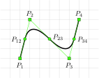
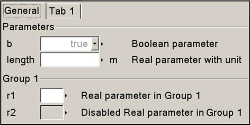
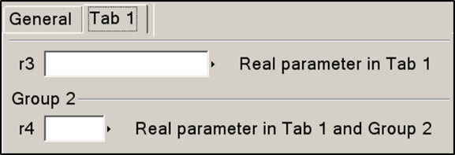

== Annotations

Annotations are intended for storing extra information about a model, such as graphics, documentation or versioning, etc.
The standard annotations (that is, all annotations except the vendor-specific ones, see <<vendor-specific-annotations>>) shall only be used where their semantics is defined.
A Modelica tool is free to define and use other annotations, in addition to those defined here, according to <<vendor-specific-annotations>>.

Annotations are optional in the Modelica grammar, and when present, indicated using the `annotation` keyword, see `annotation-clause` in the grammar (<<syntax-expressions>>).
The structure of the annotation content is the same as a class modification (`class-modification` in the grammar).
(For replaceable class declarations with a `constraining-clause` also refer to <<constraining-clause-annotations>>.)
The specification in this document defines the semantic meaning if a tool implements any of these annotations.

=== Notation for Annotation Definitions

Annotations are defined using the syntactic forms of Modelica component declarations and record definitions, with the following special semantics.
If the annotation is described by a component declaration, the annotation is used in the form of a value modifier for the same name.
If the annotation is described by a `record` _class_ the annotation is used in the form of a modifier for a `record` _component_ with the same name.

A declaration equation for a component or record member specifies a default to be used when no corresponding annotation is given.
An array record member without declaration equation and with size specified by colon (`:`) defaults to being empty.
Default behavior can also be specified in the text as an alternative to a declaration equation, or implicitly by saying _if specified_.
If the description states that the annotation only has an effect for specific values it implies that the default is a value that has no effect.
When there is no declaration equation and no other explanation of default behavior in the text for a record member, an annotation modifier for the record must contain a modifier for that member.

As all annotations are optional, component declaration annotations will always have default behavior.
The default behavior is either the implicit absence of any of the effects for defined values of the annotation, or explicitly defined as corresponding to one of the valid values.

When an annotation is defined with a component variability prefix (<<component-variability-prefixes>>), this restricts the allowed variability of corresponding annotation modifiers analogously to the rules in <<variability-of-expressions>>.
If the annotation is declared as an `+/*evaluable*/ parameter+` the corresponding modifier is further restricted to be evaluable.
If the annotation is declared as a `+/*literal*/ constant+` the corresponding modifier is further restricted to be a literal value.

[example]
====
Example: Since the semantics of an annotation comes from the interpretation as a modification, empty annotations have no impact at all.
For example, the following is allowed, but meaningless:

[source,modelica]
----
annotation(Dialog());
----

An annotation such as `annotation(Dialog)` is also meaningless, but deprecated according to <<semantic-restrictions-of-annotation-syntax>>.
====

=== Semantic Restrictions of Annotation Syntax

The syntactic form of annotations, `annotation-clause`, uses the generic `class-modification` in <<modification>>.
However, except where explicitly stated, the following constructs shall not be used in annotations:

* `final`. For instance, neither `final experiment(StopTime = 2.0)` nor `experiment(final StopTime = 2.0)` may be used to prevent that an extending model overrides the `StopTime` setting.

* `each`. When an annotation is given for an array component declaration, it applies to the array as a whole. Thus, neither should values be given in arrays matching the size of the declared component, nor should `each` be used express that a scalar value applies to each element of the array.

* `element-redeclaration` in the grammar. In particular, the keyword `redeclare` cannot be used.

* `element-replaceable` in the grammar. In particular the keywords `replaceable` and `constrainedby` cannot be used.

* An `element-modification` without `modification` is deprecated without exceptions. The meaning of such annotations has never been defined.

[example]
====
Example: The following annotations are not merely meaningless, but deprecated:

[source,modelica]
----
annotation(
  Dialog,
  Dialog(colorSelector)
);
----

In particular, the effect of `colorSelector` is not the same as `colorSelector = true`, even though the latter is the only meaningful use of `colorSelector`.
====

=== Expression Evaluation Inside Annotations

This section describes some differences to the evaluation of expressions inside of annotations compared to normal evaluation rules outside of annotations.

==== Enumerations for Use in Annotations

Several annotations make use of dedicated enumeration types.
These enumeration types do not have the full status of being built-in types as, e.g., `StateSelect` (<<stateselect>>).
Instead, they are only in scope where expressions inside annotations are evaluated, shadowing any user-defined definitions with the same names.

[example]
====
Example: The `smooth` attribute of a `Polygon` can be controlled through a model parameter, but the parameter cannot use the `Smooth` type directly:

[source,modelica]
----
model BezierParameter
  parameter Smooth smooth = Smooth.Bezier; // Error: Smooth is unknown here.
  parameter Boolean bezier = true;         // Fine.
  annotation(Icon(graphics = {
    Polygon(
      smooth = if bezier then Smooth.Bezier else Smooth.None,
      points = {{-50, -20}, {0, 30}, {50, -20}}
    )
  }));
end BezierParameter;
----
====

[NOTE]
====
When evaluating the expression _expr_ in the model `M`, one can imagine it being done as in

[source,modelica]
----
model M_annotation
  extends M;
  import AnnotationEnumerations.*;
  T result = expr;
end M_annotation;
----

where `AnnotationEnumerations` is a hidden package containing all enumeration types used in annotations, and _T_ is the expected type of the expression.
====

=== Vendor-Specific Annotations

A vendor may -- anywhere inside an annotation -- add specific, possibly undocumented, annotations which are not intended to be interpreted by other tools.
The semantic restrictions in <<semantic-restrictions-of-annotation-syntax>> are not enforced in vendor-specific annotations, giving vendors the full freedom of using the most general form of annotations.
The only requirement is that any tool shall save files with all vendor-specific annotations (and all annotations from this chapter) intact.
Two variants of vendor-specific annotations exist; one simple and one hierarchical.
Double underscore concatenated with a vendor name as initial characters of the identifier are used to identify vendor-specific annotations.

[example]
====
Example:

[source,modelica]
----
annotation(
  Icon(coordinateSystem(extent = {{-100, -100}, {100, 100}}),
       graphics = {__NameOfVendor(Circle(center = {0, 0}, radius = 10))}));
----

This introduces a new graphical primitive `Circle` using the hierarchical variant of vendor-specific annotations.

[source,modelica]
----
annotation(
  Icon(coordinateSystem(extent = {{-100, -100}, {100, 100}}),
       graphics = {Rectangle(extent = {{-5, -5}, {7, 7}},
                             __NameOfVendor_shadow = 2)}));
----

This introduces a new attribute `__NameOfVendor_shadow` for the `Rectangle` primitive using the simple variant of vendor-specific annotations.
====

=== Documentation

The `Documentation` annotation has the following contents, where the `info` and `revisions` annotations are described in <<class-description-and-revision-history>>, and the `figures` annotation is described in <<figures>>:
[source,modelica]
----
record Documentation
  /*literal*/ constant String info = "" "Description of the class";
  /*literal*/ constant String revisions = "" "Revision history";
  Figure[:] figures; "Simulation result figures";
  /*literal*/ constant String[:] styleSheets "Style sheets for documentation";
end Documentation;
----

The `styleSheets` may also be given as a single string, see <<style-sheets>>.

How the tool interprets the information in `Documentation` is unspecified.

==== Class Description and Revision History

Inside the `Documentation` annotation, the `info` annotation gives a textual description of the class, and the `revisions` annotation gives a revision history.

[NOTE]
====
The `revisions` documentation may be omitted in printed documentation.
====

If the string starts with the tag `<html>` or `<HTML>`, the entire string is HTML encoded (assumed to end with `</html>` or `</HTML>`, but to be rendered as HTML even if the end-tag is missing).
Otherwise, the entire string is rendered as is.
HTML encoded content may contain links.
Modelica URIs may be used to refer to external resources (see <<external-resources>>), as well as to refer to Modelica classes, e.g.,
[source,modelica]
----
<a href="modelica:/MultiBody.Tutorial">MultiBody.Tutorial</a>
----

Together with scheme `Modelica` the (URI) fragment specifiers `#diagram`, `#info`, `#text`, `#icon` may be used to reference different layers.
User-defined fragment specifiers (anchors) may also be used, and they may be renamed when generating HTML (in particular to avoid collisions).
Example:
[source,modelica]
----
<a href="modelica:/MultiBody.Joints.Revolute#info">Revolute</a>
----

===== Style Sheets

Inside the `Documentation` annotation, each element of the `styleSheets` annotation array specifies a cascading style sheet.
The style sheets are used when displaying the `info` and `revisions` annotations found in the `Documentation` annotations of the package.
The `styleSheets` annotation is only considered for top-level packages, and applies to the entire package.
The style sheets will be cascaded in the given order.
Specifying just a string for `styleSheets` has the same meaning as specifying a singleton array containing the string.

[NOTE]
====
It is recommended to use `class` and `id` selectors with a `NameOfLibrary-` prefix to avoid collisions when the content is included in a larger context.
====

The style sheet rules should not use type or universal selectors, due to possible interference with tool-specific styling.

Vendors should use a `NameOfVendor-` prefix to style vendor generated HTML content surrounding the user provided documentation.
If tools want to give users (of that tool) the possibility to override the tool-specific CSS they can document that.
The prefix is used to avoid this happening by accident.

==== Figures

Inside the `Documentation` annotation, each element of the `figures` annotation array has the following content:
[source,modelica]
----
record Figure
  /*literal*/ constant String title = "" "Title meant for display";
  /*literal*/ constant String identifier = "" "Identifier meant for programmatic access";
  /*literal*/ constant String group = "" "Name of figure group";
  /*literal*/ constant Boolean preferred = false "Automatically display figure after simulation";
  Plot[:] plots "Plots";
  /*literal*/ constant String caption = "" "Figure caption";
end Figure;
----

A `Figure` is a graphical container that can contain several `plots` described by `Plot` annotations:
[source,modelica]
----
record Plot
  /*literal*/ constant String title "Title meant for display";
  /*literal*/ constant String identifier = "" "Identifier meant for programmatic access";
  Curve[:] curves "Plot curves";
  /*literal*/ constant Axis x "X axis properties";
  /*literal*/ constant Axis y "Y axis properties";
end Plot;
----

A `Plot` can contain several `curves`, see <<plot-curves>>, that all share a common `x` and `y` axis with properties described in <<axis-properties>>.

Both `Figure` and `Plot` can have an optional title.
When the `Figure` `title` is the empty string (the default), the tool must produce a non-empty title based on the figure content.
On the other hand, the `Plot` `title` has a tool-dependent default, but the default may be the empty string.
When the `Plot` `title` is the empty string, no title should be shown.
The plot title is not to be confused with the plot _label_ which is never empty, see below.
Variable replacements, as described in <<variable-replacements>>, can be used in the `title` of `Figure` and `Plot`.

The `identifier` in `Figure` and `Plot` is a `String` identifier, and is intended to identify the `Figure` and `Plot` for programmatic access.
The `figures` annotation is inherited in the sense that each class has a collection of figures comprised by the contents of the `figures` annotation in the class itself, as well as the `figures` annotations from any base classes.
A `Figure` must be uniquely identified by its `identifier` and a class having it in its collection.
This means that a `Figure` `identifier` must be unique among all `Figure` annotations within the same `figures` annotation as well as among all `figures` annotations from inherited classes.
A `Plot` `identifier` on the other hand is only required to be unique among the `plots` in the the same `Figure` annotation.
If an `identifier` is an empty string it cannot be used for programmatic access and is exempt from the uniqueness requirements.

[NOTE]
====
For `Figure`, this makes it possible to reference the plot from a tool-specific scripting environment.
For `Plot`, this makes it possible to reference the plot in the figure caption, which becomes useful when the `Figure` contains more than one `Plot`.
====

// henrikt-ma 2020-06: Once there is Modelica URI support for referring to a figure in the collection of a class, it will be easier to explain
// the following statement.
Even though a `Figure` annotation can be shared through inheritance between classes in a class hierarchy, note that each simulated class provides its own data to be displayed in the figure.

Every `Plot` has an automatically generated _label_ which is required to be shown as soon as at least one `Plot` in the `Figure` has an `identifier`.
A tool is free to choose both labeling scheme (such as _a_, _b_, ..., or _i_, _ii_, ...), placement in the plot, and styling in the plot itself as well as in other contexts.

When a `Figure` defines a non-empty `group`, it is used to organize figures similar to how `group` is used in the `Dialog` annotation (see <<graphical-user-interface>>).
However, leaving `group` at the default of an empty string does not mean that a group will be created automatically, but that the figure resides outside of any group.
The `group` is both the key used for grouping, and the name of the group for display purposes.

The `preferred` attribute of `Figure` indicates whether the figure should be given preference when automatically determining which figures to show, and a class may define any number of `preferred` figures.
For example, a tool might choose to automatically show all preferred figures when the class is simulated.

The `caption` attribute of `Figure` can use the restricted form of text markup described in <<text-markup-in-captions>> as well as the variable replacements described in <<variable-replacements>>.

===== Axis Properties

Properties may be defined for each `Plot` axis (see also annotation index: Axis):

[source,modelica]
----
record Axis
  /*literal*/ constant Real min "Axis lower bound, in 'unit'";
  /*literal*/ constant Real max "Axis upper bound, in 'unit'";
  /*literal*/ constant String unit = "" "Unit of axis tick labels";
  /*literal*/ constant String label "Axis label";
  /*literal*/ constant AxisScale scale = Linear() "Mapping between axis values and position on axis"
end Axis;
----

When an axis bound is not provided, the tool computes one automatically.

A non-empty `unit` shall match `unit-expression` in <<unit-expressions>>.
An empty `unit` means that the axis is unitless, and each expression plotted against it may use its own unit determined by the tool.
The tool is responsible for conveying the information about choice of unit for the different variables, for instance by attaching this information to curve legends.

The Modelica tool is responsible for showing that values at the axis tick marks are expressed in `unit`, so the axis `label` shall not contain this information.

[NOTE]
When `unit` is empty, and axis bounds are to be determined automatically, a natural choice of unit could be the variable's `displayUnit`.
When axis bounds are specified by the user, on the other hand, a tool may choose a unit for the variable such that the range of the variable values (expressed in the chosen unit) fit nicely with the range of the unitless axis.

If a tool does not recognize the `unit`, it is recommended to issue a warning and treat the `unit` as if it was empty, as well as ignore any setting for `min` and `max`.

When `label` is not provided, the tool produces a default label.
Providing the empty string as `label` means that no label should be shown.
Variable replacements, as described in <<variable-replacements>>, can be used in `label`.
The Modelica tool is responsible for showing the unit used for values at the axis tick marks, so the axis `label` shall not contain the unit.

The type of `scale` is defined as an empty partial record:

[source,modelica]
----
partial record AxisScale
end AxisScale;
----

The standardized annotations extending from `AxisScale` are `Linear` and `Log`, but it is also allowed to use a vendor-specific annotation.

Use `Linear` for a linear mapping between axis values and position on axis:

[source,modelica]
----
record Linear
  extends AxisScale;
end Linear;
----

Use `Log` for a logarithmic mapping between axis values and position on axis:

[source,modelica]
----
record Log
  extends AxisScale;
  /*literal*/ constant Integer base(min = 2) = 10;
end Log;
----

The `base` of a `Log` scale determines preferred positions of major axis ticks.
It is not required that the presentation of axis tick labels reflect the `base` setting.
For example, when `base` is 10, major axis ticks should preferrably be placed at integer powers of 10, and natural alternatives that a tool may use for major axis tick labels could look like 0.001 or 10^-3^.
Under some circumstances, such as when the axis range does not span even a single order of magnitude, a tool may disregard the preference in order to get useful axis ticks.

[example]
====
A _symmetric log_ axis scale is sometimes used for axes spanning across several orders of magnitude of both positive and negative values.
Details vary, but the mapping from value to linear position along axis is some variation of latexmath:[y \mapsto \operatorname{sign}(y)\, \operatorname{log}(1 + \frac{\left| y \right|}{10^{\alpha}})].
A tool may implement this as a vendor-specific axis scale:

[source,modelica]
----
Axis(
  min = -1e5, max = 1e5,
  scale = __NameOfVendor_symlog(1),
)
----
====

===== Plot Curves

The actual data to plot is specified in the `curves` annotationindex:Curve of a `Plot`:
[source,modelica]
----
record Curve
  expression x = time "X coordinate values";
  expression y "Y coordinate values";
  /*literal*/ constant String legend "Legend";
  /*literal*/ constant Integer zOrder = 0 "Drawing order control";
end Curve;
----

The mandatory `x` and `y` expressions are restricted to be result references in the form of `result-reference` in the grammar (see <<syntax-expressions>>), referring to a scalar variable (or a derivative thereof) or `time`.
It is an error if `x` or `y` does not designate a scalar result.
If `x` or `y` is a derivative, `der(v, n)`, then n must not exceed the maximum amount of differentiation applied to `v` in the model.
A diagnostic is recommended in case the simulation result is missing a trajectory for a valid result reference.

[NOTE]
====
While the syntax for referring to a second order derivative is `der(v, 2)`, the appearance is left for tools to decide.
For example, a tool might choose to present this as `der(der(v))`.
====

When the `unit` of an `Axis` is non-empty, it is an error if the unit of the corresponding `x` or `y` expression (i.e., a variable's `unit`, or second for `time`) is incompatible with the axis unit.

When `legend` is not provided, the tool produces a default based on `x` and/or `y`.
Providing the empty string as `legend` means that the curve shall be omitted from the plot legend.
Variable replacements, as described in <<variable-replacements>>, can be used in `legend`.
The order of presentation within the plot legend corresponds to order of appearance in the `curves` of a `Plot`.

The `zOrder` gives control over drawing order, with higher values corresponding to closer to front.
Ties are resolved using order of appearance in the `curves` of a `Plot`, with later appearance corresponding to closer to front.

===== Escape Sequences

In an attribute inside a figure where the variable replacements of <<variable-replacements>> or the text markup of <<text-markup-in-captions>> can be used, the following use of text markup escape sequences applies.
These escape sequences are applied after the application of other markup, and are not applied at all inside some of the other markup, see details for the respective markup.

The percent character `%` shall be encoded `%%`.
The following are all the recognized escape sequences:

[cols="a,a,a",options=autowidth]
|===
|Sequence |Encoded character |Comment

|`%%`     |`%`               |Only way to encode character.
|`%]`     |`]`               |Prevents termination of markup delimited by `[...]`.
|===

[NOTE]
====
With the percent character being encoded as `%%`, the behavior of `%` appearing in any other way than the escape sequences above, for variable replacement (see <<variable-replacements>>), or for the text markup (see <<text-markup-in-captions>>) is undefined, and thus possible to define in the future without breaking backward compatibility.
====

===== Vendor-Specific Markup

Vendor-specific markup takes the form `__nameOfVendor~1~(data~1~)...__nameOfVendor~n~(data~n~)`, where _n_ ≥ 1.
It is only allowed as part of constructs described in <<variable-replacements>> and <<text-markup-in-captions>>, where it will be denoted by vendorSpecificMarkup.
The nameOfVendor consists of only digits and letters, and shall only convey the name of the vendor defining the meaning of the associated data.
Text markup escape sequences don't apply inside the data, implying that it cannot contain the closing parenthesis, `)`.
A tool which does not understand any of the vendor-specific meanings will always be able to safely ignore all vendor-specific markup.

===== Variable Replacements

In the places listed in <<attributes-with-variable-replacements>> where text for display is defined, the final value of a result variable can be embedded by referring to the variable as `%{inertia1.w}`.
This is similar to the `Text` graphical primitive in <<text>>.

[[attributes-with-variable-replacements]]
.Attributes that can use variable replacements.
[cols="a,a",options=autowidth]
|===
|Attribute |Annotation

|`title`   |`Figure` and `Plot`
|`caption` |`Figure`
|`legend`  |`Curve`
|`label`   |`Axis`
|===

In `%{variable}`, text markup escape sequences don't apply inside the variable, which has the form of `result-reference`.
This means that a complete `result-reference` shall be scanned before looking for the terminating closing brace.

[example]
====
Example: The variable replacement `%{'%%'}` references the variable `'%%'`, not the variable `'%'`.
====

[example]
====
Example: The variable replacement `%{foo . '}bar{'}` makes a valid reference to the variable `foo.'}bar{'`.
====

Note that expansion to the final value means that expansion is not restricted to parameters and constants, so that values to be shown in a caption can be determined during simulation.

[NOTE]
====
By design, neither `%class` nor `%name` is supported in this context, as this information is expected to already be easily accessible (when applicable) in tool-specific ways.
(Titles making use of `%class` or `%name` would then only lead to ugly duplication of this information.)
====

Vendor-specific markup can be added to a variable replacement in the form `%vendorSpecificMarkup{variable}`.
The vendor-specific markup must not fundamentally alter the meaning of the variable replacement, in order to ensure that a tool can safely ignore all vendor-specific markup and still obtain a result that fits the current context.

[example]
====
Example: One application of vendor-specific markup for variable replacement is to prototype a feature that can later be turned into standardized format control.
For example, the replaced variable may have an automatically inferred unit, but no `displayUnit`-attribute.
The tool vendor AVendor could then describe a selection of display unit with `%__AVendor(?displayUnit=mm){integrator1.y}`.
Later, if this would become supported by standard variable replacement, it might take the form of something like `%{integrator1.y?displayUnit=mm}` instead.
====

===== Text Markup in Captions

In addition to variable replacements, a very restricted form of text markup is used for the `caption`.
Note that the text markup escape sequences described in <<escape-sequences>> generally apply inside `caption`, with one exception given below for links.

Links take the form `%[text](link)`, where the `[text]` part is optional, and text markup escape sequences don't apply inside the link.
The link can be in either of the following forms, where the interpretation is given by the first matching form:

* A `variable:id`, where id is a component reference in the form of `result-reference` in the grammar, such as `inertia1.w`.

* A `plot:id`, where id is the identifier of a `Plot` in the current `Figure`.

* A URI. Well established schemes such as `+https://github.com/modelica+` or `modelica:/Modelica`, as well as lesser known schemes may be used.
  (A tool that has no special recognition of a scheme can try sending the URI to the operating system for interpretation.)

When `[text]` is omitted, a Modelica tool is free to derive a default based on the link.

[NOTE]
====
Note that for the character `]` to appear in text, it needs to be encoded as the escape sequence `%]`, or it would be interpreted as the terminating delimiter of the `[text]`.

Similarly, the closing parenthesis `)` must be handled with care in link in order to not be interpreted as the terminating delimiter of the `(link)`.

* For a `variable:`, no special treatment is needed, as the component reference syntax of the id allows parentheses to appear without risk of misinterpretation inside a quoted identifier.
  For example, `%(variable:'try)me!')` has a parenthesis in `'try)me!'` that must not be mistaken for the end of the `(link)`.

* For a `plot:`, there is currently no way to reference a plot with `)` in its `identifier`.

* For a URI, a closing parenthesis must be URL encoded in order to not be interpreted as the end of the `(link)`.
  For example, the URL in `+%(http://example.org/(tryme))+` is just `+http://example.org/(tryme+`, and the entire link is followed by a stray closing parenthesis.
  To make it work, one has to use URL encoding: `+%(http://example.org/%28tryme%29)+` (using URL encoding of the opening parenthesis just for symmetry, and note that the `%` of the percent-encoded sequences are not subject to text markup escape sequences).
====

The styling of the link text, as well as the link action, is left for each Modelica tool to decide.

[NOTE]
====
For example, `%(variable:inertia1.w)` could be displayed as the text `inertia1.w` formatted with upright monospaced font, and have a pop-up menu attached with menu items for plotting the variable, setting its start value, or investigating the equation system from which it is solved.
On the other hand, `%[angular velocity](variable:inertia1.w)` could be formatted in the same style as the surrounding text, except some non-intrusive visual clue about it being linked.
====

[NOTE]
====
Note that link is currently not allowed to be a URI reference, i.e., a URI or a relative reference such as `#foo`.
This is due to to the current inability to define a base URI referencing the current figure.
Once this becomes possible, the URI form of link may be changed into a URI reference.
====

Vendor-specific markup can be added to a link in the form `%[text]vendorSpecificMarkup(link)`.
The vendor-specific markup must not fundamentally alter the appearance of the link, in order to ensure that a tool can safely ignore all vendor-specific markup and still obtain a result that fits the current context.

[example]
====
Example: The HTML `<a>` tag has several attributes with potential application to links, such as `target`.
This attribute serves a natural purpose if the display of figures is integrated with the display of documentation.
The tool vendor AVendor could map the HTML feature to Modelica in the form `%__AVendor(?target=_blank)(modelica:/Modelica#info)`.
====

A sequence of one or more newlines (encoded either literally or using the `\n` escape sequence) means a paragraph break.
(A line break within a paragraph is not supported, and any paragraph break before the first paragraph or after the last paragraph has no impact.)

Vendor-specific markup for alternative content takes the form `%vendorSpecificMarkup[text]`.
The vendor-specific markup must not fundamentally alter the appearance of the text, in order to ensure that a tool can safely ignore all vendor-specific markup and still obtain a result that fits the current context.

[example]
====
Example: One application of vendor-specific alternative content is to prototype a feature that can later be turned into standardized markup.
For example, say that the tool AVendor wants to generalize the variable replacements such that the duration of a simulation can be substituted into a caption.
During the development, this could be represented as the vendor-specific markup `%__AVendor(?duration)[10 s]`, if the simulation has a duration of 10 seconds at the time of writing the caption.
When AVendor renders this, it ignores the text `10 s` and just displays the actual duration instead.
Later, if this would become supported by standard markup, it might take the form of something like `%{experiment:duration}` instead (note that `experiment:duration` is not in the form of a component reference, avoiding conflict with current use of variable replacements).

In a similar way, vendor-specific alternative content can be used to prototype a link for future inclusion in the link markup (either by extending the meaning of Modelica URIs, or by introducing another pseudo-scheme similar to `variable:`).
This is an example where the vendor-specific markup could make use of the text (for link text) together with the vendor-specific data (describing the actual link).
====

=== Symbolic Processing
:id: annotations-for-symbolic-processing

The annotation listed below, in addition to annotations described in <<derivatives-and-inverses-of-functions>> through <<function-inlining-and-event-generation>>, can influence the symbolic processing.

[cols="a,a,a",options=autowidth]
|===
|Annotation |Description                                 |Details

|`Evaluate` |Use parameter value for symbolic processing |<<annotation:Evaluate>>
|===

[[annotation:Evaluate,Annotation Evaluate]]
Annotation Evaluate::
+
[source,modelica]
----
/*literal*/ constant Boolean Evaluate;
----
+
The annotation `Evaluate` can occur in the component declaration, its type declaration, or a base class of the type-declaration.
In the case of multiple conflicting annotations it is handled similarly to modifiers (e.g., an `Evaluate` annotation on the component declaration takes precedence).
In the case of hierarchical components it is applied to all components, overriding any `Evaluate`-setting for specific components.
The annotation `Evaluate` is only allowed for parameters and constants.
+
Setting `Evaluate = true` for an evaluable parameter, means that it must be an evaluated parameter (i.e., its value must be determined during translation, similar to a constant).
For a non-evaluable parameter, it has no impact and it is recommended to issue a warning in most cases.
The exception for recommending this warning is when the parameter is non-evaluable due to dependency on a parameter with `Evaluate = false`, as this could be a sign of intentional overriding of `Evaluate = true`, see example below.
For both evaluable parameters and constants, the model developer further proposes to utilize the value for symbolic processing.
A constant can never be changed after translation, and it is normal for its value to be used for symbolic processing even without `Evaluate = true`.
+
For a parameter, `Evaluate = false` ensures that the parameter is a non-evaluable parameter according to <<component-variability>> (meaning it is not allowed to be used where an evaluable expression (<<evaluable-expressions>>) is expected).
For both parameters and constants -- even when the value can be determined during translation -- the model developer further proposes to not utilize the value for symbolic processing.
+
If the annotation is missing for a parameter or constant the evaluation of the component is tool-dependent.
+
[NOTE]
--
`Evaluate = true` is for example used for axis of rotation parameters in the `Modelica.Mechanics.MultiBody` library in order to improve the efficiency of the generated code.

Conversely, a possible use of `Evaluate = false` is to ensure that a parameter can be changed after translation, even when a tool might be tempted to evaluate it to improve the efficiency of the generated code.
--
+
[example]
====
Example: When a parameter has `Evaluate = true` for optimization reasons (not because it needs to be evaluable), it is possible to prevent the value from being determined during translation without modifying the original model:

[source,modelica]
----
model M_evaluable
  /* Here, 'b' is evaluable, and will be evaluated. */
  parameter Boolean b = false annotation(Evaluate = true);
  Real x(start = 1.0, fixed = true);
equation
  if b then /* No need for b to be evaluable. */
    der(x) = x;
  else
    der(x) = -x;
  end if;
end M_evaluable;

model M_non_evaluable
  /* Here, 'bn' is non-evaluable, which in turn will cause 'b' to be
   * non-evaluable, thereby preventing it from being determined during
   * translation.
   */
  extends M_evaluable(b = bn);
  parameter Boolean bn = false annotation(Evaluate = false);
end M_non_evaluable;
----
====

=== Simulations
:id: annotations-for-simulations

The annotations listed below define how models can be checked, translated, and simulated.

[cols="a,a,a",options=autowidth]
|===
|Annotation   |Description                              |Details

|`experiment` |Simulation experiment settings           |<<annotation:experiment>>
|`HideResult` |Don't show component's simulation result |<<annotation:HideResult>>
|`TestCase`   |Information for model used as test case  |<<annotation:TestCase>>
|===

[[annotation:experiment,Annotation experiment]]
Annotation experiment::
+
[source,modelica]
----
record experiment
  /*literal*/ constant Real StartTime(unit = "s") = 0;
  /*literal*/ constant Real StopTime(unit = "s");
  /*literal*/ constant Real Interval(unit = "s");
  /*literal*/ constant Real Tolerance(unit = "1");
end experiment;
----
+
The `experiment` annotation defines the start time (`StartTime`) in [s], the stop time (`StopTime`) in [s], the suitable time resolution for the result grid (`Interval`) in [s], and the relative integration tolerance (`Tolerance`) for simulation experiments to be carried out with the model or block at hand.
When `Interval` or `Tolerance` is not provided, the tool is responsible for applying appropriate defaults.
+
The experiment options are inherited, and the derived class may override individual inherited options.
+
[NOTE]
The inheritance makes it useful to have an `experiment` annotation also in partial models, e.g., a template for a number of similar test cases.
+
If `StopTime` is set in a non-partial model, it is required to be a simulation model.
Tools can allow users to override these settings without modifying the model.

[[annotation:HideResult,Annotation HideResult]]
Annotation HideResult::
+
[source,modelica]
----
/*literal*/ constant Boolean HideResult;
----
+
`HideResult = true` defines that the model developer proposes to not show the simulation results of the corresponding component.
+
`HideResult = false` defines that the developer proposes to show the corresponding component.
+
[NOTE]
--
For example, a tool is not expected to provide means to plot a variable with `HideResult = true`.
If a variable is declared in a protected section, a tool might not include it in a simulation result.
By setting `HideResult = false`, the modeler would like to have the variable in the simulation result, even if in the protected section.

`HideResult` is for example used in the connectors of the `Modelica.StateGraph` library to not show variables to the modeler that are of no interest to him and would confuse him.
--

[[annotation:TestCase,Annotation TestCase]]
Annotation TestCase::
+
[source,modelica]
----
record TestCase
  /*literal*/ constant Boolean shouldPass;
end TestCase;
----
+
If `shouldPass` is `false` it indicates that the translation or the simulation of the model should fail.
If a tools checks a package where classes have `shouldPass = false` they should not generate errors, and checking may even be skipped.
On the other hand, models with `shouldPass = false` may be useful for creation of negative tests in tool-specific ways.
Similarly as a class with `obsolete` annotation, a class with `TestCase` annotation (regardless of the value of `shouldPass`) shall not be used in other models, unless those models also have a `TestCase` annotation.
+
If the `TestCase` annotation is missing it is a normal model -- there are thus no restrictions on the use of the model, and the model shall not contain errors.
+
[NOTE]
The intent of the test-case can be included in the documentation of the class.
This annotation can both be used for models intended as test-cases for implementations, and for models explaining detectable errors.

=== Usage Restrictions
:id: usage-restrictions

The annotations listed below are used to restrict the ways in which classes and instances of classes may be used.

[cols="a,a,a",options=autowidth]
|===
|Annotation           |Description                               |Details

|`singleInstance`     |Allow at most one instance                |<<annotation:singleInstance>>
|`mustBeConnected`    |Connector must be connected at least once |<<annotation:mustBeConnected>>
|`mayOnlyConnectOnce` |Connector may at most be connected once   |<<annotation:mayOnlyConnectOnce>>
|===

[[annotation:singleInstance,Annotation singleInstance]]
Annotation singleInstance::
+
[source,modelica]
----
/*literal*/ constant Boolean singleInstance;
----
+
Allowed for class annotations.
Only has effect when `true`, meaning that there should only be one component instance of the class, and it should be in the same scope as the class is defined.
The intent is to remove the class when the component is removed and to prevent duplication of the component.
+
[NOTE]
This is useful for the local classes of state machines.

[[annotation:mustBeConnected,Annotation mustBeConnected]]
Annotation mustBeConnected::
+
[source,modelica]
----
/*literal*/ constant String mustBeConnected;
----
+
Allowed for connector component declarations.
If specified, it makes it an error if the connector does not appear as an inside connector in any connect-equation (for a conditional connector this check is only active if the connector is enabled).
The string value must be non-empty and provide the reason why it must be connected.
For an array of connectors it applies separately to each element.
+
[NOTE]
This annotation is intended for non-causal connectors, see <<restrictions-of-connections-and-connectors>>.
It is particularly suited for stream connectors, see <<stream-connectors>>.

+
[example]
====
Example: This can be used for some optional connectors that should be connected when conditionally enabled.

[source,modelica]
----
partial model PartialWithSupport
  Flange_b flange;
  parameter Boolean useSupport;
  Support support if useSupport
    annotation(
      mustBeConnected = "Support connector should be connected if activated.");
end PartialWithSupport;
----

The protected components and connections needed to internally handle the support-connector is omitted.
====

[[annotation:mayOnlyConnectOnce,Annotation mayOnlyConnectOnce]]
Annotation mayOnlyConnectOnce::
+
[source,modelica]
----
/*literal*/ constant String mayOnlyConnectOnce;
----
+
Allowed for connector component declarations.
If specified, it makes it an error if the connector is connected as an inside connector in a connect-equation and thus appears in a connection set if:
+
* For non-stream connectors the connection set has more than two elements.
+
* For stream connectors (see <<stream-connectors>>), the connection set has more than two elements whose flow variable may be negative (based on evaluation of the `min`-attribute).
+
For an array of connectors it applies separately to each element.
The string value must be non-empty and provide the reason why it may only be connected once.
+
[NOTE]
--
This annotation is intended for non-causal connectors, see <<restrictions-of-connections-and-connectors>>.
The connection handling operates on connection sets, and thus this restriction should also operate on those sets.
The set handling avoids the case where only one of two equivalent models generate diagnostics.
The stream connector part is primarily intended to exclude sensor-variables, see <<zero-mass-flow-rateconnection-of-3-stream-connectors>>, but also excludes non-reversible outgoing flows.
--
+
[example]
====
Example: This can be used for components that implement mixing of fluids where it is not desired to combine that with the normal stream-connector mixing.

[source,modelica]
----
partial model MultiPort
  parameter Integer n = 0 annotation(Dialog(connectorSizing = true));
  FluidPort_a port_a(redeclare package Medium = Medium);
  FluidPorts_b ports_b[n](redeclare each package Medium = Medium)
    annotation (mayOnlyConnectOnce = "Should only connect once per element!");
end MultiPort;
----
====

=== Graphical Objects
:id: annotations-for-graphical-objects

A graphical representation of a class consists of two abstraction layers, icon layer and diagram layer showing graphical objects, component icons, connectors and connection lines.
The icon representation typically visualizes the component by hiding hierarchical details.
The hierarchical decomposition is described in the diagram layer showing icons of subcomponents and connections between these.

Graphical annotations described in this chapter ties into the Modelica grammar as follows.

[source,grammar]
----
graphical-annotations :
  annotation "(" [ layer-annotations ] ")"

layer-annotations :
  ( icon-layer | diagram-layer ) [ "," layer-annotations ]
----

Layer descriptions (start of syntactic description):

[source,grammar]
----
icon-layer :
  "Icon" "(" [ coordsys-specification "," ] graphics ")"

diagram-layer :
  "Diagram" "(" [ coordsys-specification "," ] graphics ")"
----

[example]
====
Example:

[source,modelica]
----
annotation(
   Icon(coordinateSystem(extent = {{-100, -100}, {100, 100}}),
        graphics = {Rectangle(extent = {{-100, -100}, {100, 100}}),
                    Text(extent = {{-100, -100}, {100, 100}},
                         textString = "Icon")}));
----
====

The graphics is specified as an ordered sequence of graphical primitives described below.
Base class contents are drawn behind the graphical primitives of the current class, with base classes ordered from back to front according to the order of the `extends`-clauses, and graphical primitives according to order of appearance in the annotation.

[NOTE]
Note that the ordered sequence is syntactically a valid Modelica annotation, although there is no mechanism for defining an array of heterogeneous objects in Modelica.

These `Icon`, `Diagram`, and `Documentation` annotations are only allowed directly in classes (e.g., not on components or connections).
The allowed annotations for a short class definition is the union of the allowed annotations in classes and on `extends`-clauses.

==== Common Definitions
:id: common-definitions

The following common definitions are used to define graphical annotations in the later sections.

[source,modelica]
----
type DrawingUnit = Real(final unit="mm");
type Point = DrawingUnit[2] "{x, y}";
type Extent = Point[2] "Defines a rectangular area {{x1, y1}, {x2, y2}}";
----

The interpretation of `unit` is with respect to printer output in natural size (not zoomed).

All graphical entities have a visible attribute which indicates if the entity should be shown.

[source,modelica]
----
partial record GraphicItem
  Boolean visible = true;
  Point origin = {0, 0};
  Real rotation(quantity="angle", unit="deg")=0;
end GraphicItem;
----

The `origin` attribute specifies the origin of the graphical item in the coordinate system of the layer in which it is defined.
The origin is used to define the geometric information of the item and for all transformations applied to the item.
All geometric information is given relative the `origin` attribute, which by default is `{0, 0}`.

The `rotation` attribute specifies the rotation of the graphical item counter-clockwise around the point defined by the `origin` attribute.

===== Coordinate Systems
:id: coordinate-systems

Each of the layers has its own coordinate system.
A coordinate system is defined by the coordinates of two points, the left (x1) lower (y1) corner and the right (x2) upper (y2) corner, where the coordinates of the first point shall be less than the coordinates of the second point.

The attribute `preserveAspectRatio` specifies a hint for the shape of components of the class, but does not actually influence the rendering of the component.
If `preserveAspectRatio` is true, changing the extent of components should preserve the current aspect ratio of the coordinate system of the class.

The attribute `initialScale` specifies the default component size as `initialScale` times the size of the coordinate system of the class.
An application may use a different default value of `initialScale`.

The attribute `grid` specifies the spacing between grid points which can be used by tools for alignment of points in the coordinate system, e.g., "snap-to-grid".
Its use and default value is tool-dependent.

[source,modelica]
----
record CoordinateSystem
  /*literal*/ constant Extent extent;
  /*literal*/ constant Boolean preserveAspectRatio = true;
  /*literal*/ constant Real initialScale = 0.1;
  /*literal*/ constant DrawingUnit grid[2];
end CoordinateSystem;
----

[example]
====
Example: A coordinate system for an icon could for example be defined as:

[source,modelica]
----
CoordinateSystem(extent = {{-10, -10}, {10, 10}});
----

i.e., a coordinate system with width 20 units and height 20 units.
====

The coordinate systems for the icon and diagram layers are by default defined as follows; where the array of `GraphicItem` represents an ordered list of graphical primitives.

[source,modelica]
----
record Icon "Representation of the icon layer"
  CoordinateSystem coordinateSystem(extent = {{-100, -100}, {100, 100}});
  GraphicItem[:] graphics;
end Icon;

record Diagram "Representation of the diagram layer"
  CoordinateSystem coordinateSystem(extent = {{-100, -100}, {100, 100}});
  GraphicItem[:] graphics;
end Diagram;
----

The coordinate system attributes (`extent` and `preserveAspectRatio`) of a class are separately defined by the following priority:

. The coordinate system annotation given in the class (if specified).
. The coordinate systems of the first base class where the extent on the `extends`-clause specifies a null-region (if any).
Note that null-region is the default for base classes, see <<extends-clause>>.
. The default coordinate system `CoordinateSystem(preserveAspectRatio=true, extent = {{-100, -100}, {100, 100}})`.

===== Graphical Properties
:id: graphical-properties

Properties of graphical objects and connection lines are described using the following attribute types.

[source,modelica]
----
type Color = Integer[3](min = 0, max = 255) "RGB representation";
constant Color Black = zeros(3);
type LinePattern = enumeration(None, Solid, Dash, Dot, DashDot, DashDotDot);
type FillPattern = enumeration(None, Solid, Horizontal, Vertical,
                               Cross, Forward, Backward, CrossDiag,
                               HorizontalCylinder, VerticalCylinder, Sphere);
type BorderPattern = enumeration(None, Raised, Sunken, Engraved);
type Smooth = enumeration(None, Bezier);
type EllipseClosure = enumeration(None, Chord, Radial, Automatic);
----

The `LinePattern` attribute `Solid` indicates a normal line, `None` an invisible line, and the other attributes various forms of dashed/dotted lines.

The `FillPattern` attributes `Horizontal`, `Vertical`, `Cross`, `Forward`, `Backward` and `CrossDiag` specify fill patterns drawn with the line color over the fill color.

The attributes `HorizontalCylinder`, `VerticalCylinder` and `Sphere` specify gradients that represent a horizontal cylinder, a vertical cylinder and a sphere, respectively.
The gradient goes from line color to fill color.

The border pattern attributes `Raised`, `Sunken` and `Engraved` represent frames which are rendered in a tool-dependent way --- inside the extent of the filled shape.

.Line with `smooth = Bezier`. The four line points P₁, ..., P₄ result in two quadratic splines and two straight line segments.

The `smooth` attribute specifies that a line can be drawn as straight line segments (`None`) or using a spline (`Bezier`), where the line's points specify control points of a quadratic Bezier curve, see figure above.

For lines with only two points, the `smooth` attribute has no effect.

For lines with three or more points (P₁, P₂, ..., Pₙ), the middle point of each line segment (P₁₂, P₂₃, ..., P₍ₙ₋₁₎ₙ) becomes the starting point and ending points of each quadratic Bezier curve.
For each quadratic Bezier curve, the common point of the two line segment becomes the control point.
For instance, point P₂ becomes the control point for the Bezier curve starting at P₁₂ and ending at P₂₃.
A straight line is drawn between the starting point of the line and the starting point of the first quadratic Bezier curve, as well as between the ending point of the line and the ending point of the last quadratic Bezier curve.

In the illustration above, the square points (P₁, P₂, P₃, and P₄) represent the points that define the line, and the circle points (P₁₂, P₂₃, and P₃₄) are the calculated middle points of each line segment.
Points P₁₂, P₂, and P₂₃ define the first quadratic Bezier curve, and the points P₂₃, P₃, and P₃₄ define the second quadratic Bezier curve.
Finally a straight line is drawn between points P₁ and P₁₂ as well as between P₃₄ and P₄.

The values of the `EllipseClosure` enumeration specify if and how the endpoints of an elliptical arc are to be joined (see <<ellipse>>).

[source,modelica]
----
type Arrow = enumeration(None, Open, Filled, Half);
type TextStyle = enumeration(Bold, Italic, UnderLine);
type TextAlignment = enumeration(Left, Center, Right);
----

Filled shapes have the following attributes for the border and interior.

[source,modelica]
----
record FilledShape "Style attributes for filled shapes"
  Color lineColor = Black "Color of border line";
  Color fillColor = Black "Interior fill color";
  LinePattern pattern = LinePattern.Solid "Border line pattern";
  FillPattern fillPattern = FillPattern.None "Interior fill pattern";
  DrawingUnit lineThickness = 0.25 "Line thickness";
end FilledShape;
----

The extent/points of the filled shape describe the theoretical zero-thickness filled shape, and the actual rendered border is then half inside and half outside the extent.

==== Component Instance
:id: component-instance

A component instance can be placed within a diagram or icon layer.
It has an annotation with a `Placement` modifier to describe the placement.
Placements are defined in terms of coordinate system transformations:

[source,modelica]
----
record Transformation
  Extent extent;
  Real rotation(quantity = "angle", unit = "deg") = 0;
  Point origin = {0, 0};
end Transformation;
----

The attributes are applied in the order `extent`, `rotation`, `origin`, as follows:

. The `extent` of the component icon is mapped to the `extent` rectangle (possibly shifting, scaling, and flipping contents).
. The `rotation` specifies counter-clockwise rotation around the origin (that is `{0, 0}`, not the `origin` attribute).
. The `origin` specifies a shift (moving `{0, 0}` to `origin`).

[source,modelica]
----
record Placement
  Boolean visible = true;
  Transformation transformation "Placement in the diagram layer";
  Boolean iconVisible "Visible in icon layer; for public connector";
  Transformation iconTransformation
    "Placement in the icon layer; for public connector";
end Placement;
----

A component with `visible = false` shall not be shown.
If no `iconTransformation` is given the `transformation` is also used for placement in the icon layer.
If no `iconVisible` is given for a public connector the `visible` is also used for visibility in the icon layer.

[NOTE]
A connector can be shown in both an icon layer and a diagram layer of a class.
Since the coordinate systems typically are different, placement information needs to be given using two different coordinate systems.
More flexibility than just using scaling and translation is needed since the abstraction views might need different visual placement of the connectors.
The attribute `transformation` gives the placement in the diagram layer and `iconTransformation` gives the placement in the icon layer.
When a connector is shown in a diagram layer, its diagram layer is shown to facilitate opening up a hierarchical connector to allow connections to its internal subconnectors.

For connectors, the icon layer is used to represent a connector when it is shown in the icon layer of the enclosing model.
The diagram layer of the connector is used to represent it when shown in the diagram layer of the enclosing model.
Protected connectors are only shown in the diagram layer.
Public connectors are shown in both the diagram layer and the icon layer.
Sub-connectors in a hierarchical connector are only shown when they can be connected to.
Non-connector components are only shown in the diagram layer.

===== Default Outline for Missing Graphics

If the icon of a component placed in a diagram layer does not contain any graphical primitives (including
inherited ones, and regardless of `visible`-attributes; but excluding connectors), tools shall show a tooldependent rudimentary outline of the component’s transformed `extent`.

[NOTE]
The reason for making the tool-dependent outline rudimentary is to encourage the model developer to provide a proper icon. That `visible`-attributes are not regarded makes it possible to obtain an icon which only shows connectors by adding a dummy primitive with `visible = false`.

==== Extends-Clause
:id: extends-clause

Each `extends`-clause (and short class definition, as stated in <<graphical-objects>>) may have layer specific annotations which describe the rendering of the base class' icon and diagram layers in the derived class.

[source,modelica]
----
record IconMap
  /*literal*/ constant Extent extent = {{0, 0}, {0, 0}};
  /*literal*/ constant Boolean primitivesVisible = true;
end IconMap;

record DiagramMap
  /*literal*/ constant Extent extent = {{0, 0}, {0, 0}};
  /*literal*/ constant Boolean primitivesVisible = true;
end DiagramMap;
----

All graphical objects are by default inherited from a base class.
If the `primitivesVisible` attribute is false, components and connections are visible but graphical primitives are not.

* If the `extent` is `{{0, 0}, {0, 0}}` (the default), the base class contents is mapped to the same coordinates in the derived class, and the coordinate system (including `preserveAspectRatio`) can be inherited as described in <<coordinate-systems>>.
* For any other `extent`, the base class coordinate system is mapped to this region, with the exception that `preserveAspectRatio = true` in the base class requires that the mapping shall preserve the aspect ratio.
The base class coordinate system (and `preserveAspectRatio`) is not inherited.

[NOTE]
--
A zero area `extent` other than `{{0, 0}, {0, 0}}` will result in none of the base class contents being visible.
By affecting components and connections as well as graphical primitives, this is different from setting `primitivesVisible = false`.

Reversed corners of the `extent` will result in mirrored (rotated if reversed in both direction) base class contents.
--

[example]
====
Example:

[source,modelica]
----
model A
  extends B annotation(
    IconMap(extent = {{-100, -100}, {100, 100}}, primitivesVisible = false),
    DiagramMap(extent = {{-50, -50}, {0, 0}}, primitivesVisible = true)
  );
end A;

model B
  extends C annotation(DiagramMap(primitivesVisible = false));
  ...
end B;
----

In this example the diagram of `A` contains the graphical primitives from `A` and `B` (but not from `C` since they were hidden in `B`) -- the ones from `B` are rescaled, and the icon of `A` contains the graphical primitives from `A` (but neither from `B` nor from `C`).
====

==== Connections
:id: connections1

A connection is specified with an annotation containing a `Line` primitive and optionally a `Text` primitive, as specified below.

[example]
====
Example:

[source,modelica]
----
connect(a.x, b.x)
  annotation(Line(points = {{-25, 30}, {10, 30}, {10, -20}, {40, -20}}));
----
====

The optional `Text` primitive defines a text that will be written on the connection line.
It has the following definition (it is not equal to the `Text` primitive as part of graphics -- the differences are marked after _Note_ in the description-strings):

[source,modelica]
----
record Text
  extends GraphicItem;
  Extent extent;
  String string "Note: different name";
  Real fontSize = 0 "unit pt";
  String fontName;
  TextStyle textStyle[:];
  Color textColor = Black;
  TextAlignment horizontalAlignment =
    if index < 0 then TextAlignment.Right else TextAligment.Left "Note: different default";
  Integer index "Note: new";
end Text;
----

The `index` is one of the points of Line (numbered 1, 2, 3, ... where negative numbers count from the end, thus -1 indicate the last one).
The `string` may use the special symbols `"%first"` and `"%second"` to indicate the connectors in the `connect`-equation.

The `extent` and `rotation` are relative to the `origin` (default `{0, 0}`) and the `origin` is relative to the point on the `Line`.

The `textColor` attribute defines the color of the text.
The text is drawn with transparent background and no border around the text (and without outline).
The default value for `horizontalAlignment` is deprecated.
Having a zero size for the `extent` is deprecated and is handled as if upper part is moved up an appropriate amount.

[example]
====
Example:

[source,modelica]
----
connect(controlBus.axisControlBus1, axis1.axisControlBus)
  annotation(
    Text(string = "%first", index = -1, extent = [-6, 3; -6, 7]),
    Line(points = {{41, 30}, {50, 30}, {50, 50}, {58, 50}})
  );
----

Draws a connection line and adds the text _axisControlBus1_ ending at (-6, 3) + (58, 50) and 4 vertical units of space for the text.
Using a height of zero, such as `extent = [-6, 3; -6, 3]` is deprecated, but gives similar result.
====

==== Graphical Primitives
:id: graphical-primitives

This section describes the graphical primitives that can be used to define the graphical objects in an annotation.

===== Line
:id: line

A line is specified as follows:

[source,modelica]
----
record Line
  extends GraphicItem;
  Point points[:];
  Color color = Black;
  LinePattern pattern = LinePattern.Solid;
  DrawingUnit thickness = 0.25;
  Arrow arrow[2] = {Arrow.None, Arrow.None} "{start arrow, end arrow}";
  DrawingUnit arrowSize = 3;
  Smooth smooth = Smooth.None "Spline";
end Line;
----

Note that the `Line` primitive is also used to specify the graphical representation of a connection.

For arrows:

* The arrow is drawn with an aspect ratio of 1/3 for each arrow half, i.e., if the arrow-head is 3 mm long an arrow with `Half` will extend 1 mm from the mid-line and with `Open` or `Filled` extend 1 mm to each side, in total making the base 2 mm wide.
* The `arrowSize` gives the width of the arrow (including the imagined other half for `Half`) so that `thickness = 10` and `arrowSize = 10` will touch at the outer parts.
* All arrow variants overlap for overlapping lines.
* The lines for the `Open` and `Half` variants are drawn with `thickness`.

===== Polygon
:id: polygon

A polygon is specified as follows:

[source,modelica]
----
record Polygon
  extends GraphicItem;
  extends FilledShape;
  Point points[:];
  Smooth smooth = Smooth.None "Spline outline";
end Polygon;
----

The polygon is automatically closed, if the first and the last points are not identical.

===== Rectangle
:id: rectangle

A rectangle is specified as follows:

[source,modelica]
----
record Rectangle
  extends GraphicItem;
  extends FilledShape;
  BorderPattern borderPattern = BorderPattern.None;
  Extent extent;
  DrawingUnit radius = 0 "Corner radius";
end Rectangle;
----

The `extent` attribute specifies the bounding box of the rectangle.
If the `radius` attribute is specified, the rectangle is drawn with rounded corners of the given radius.

===== Ellipse
:id: ellipse

An ellipse is specified as follows:

[source,modelica]
----
record Ellipse
  extends GraphicItem;
  extends FilledShape;
  Extent extent;
  Real startAngle(quantity = "angle", unit = "deg") = 0;
  Real endAngle(quantity = "angle", unit = "deg") = 360;
  EllipseClosure closure = EllipseClosure.Automatic;
end Ellipse;
----

The `extent` attribute specifies the bounding box of the ellipse.

Partial ellipses can be drawn using the `startAngle` and `endAngle` attributes.
These specify the endpoints of the arc prior to the stretch and rotate operations.
The arc is drawn counter-clockwise from `startAngle` to `endAngle`, where `startAngle` and `endAngle` are defined counter-clockwise from 3 o'clock (the positive x-axis).

The `closure` attribute specifies whether the endpoints specified by `startAngle` and `endAngle` are to be joined by lines to the center of the extent (`closure = EllipseClosure.Radial`), joined by a single straight line between the end points (`closure = EllipseClosure.Chord`), or left unconnected (`closure = EllipseClosure.None`).
In the latter case, the ellipse is treated as an open curve instead of a closed shape, and the `fillPattern` and `fillColor` are not applied (if present, they are ignored).

The effect of `EllipseClosure.Automatic` is that of `EllipseClosure.Chord` when both `startAngle` is 0 and `endAngle` is 360, and that of `EllipseClosure.Radial` otherwise.

[NOTE]
====
The default for a closed ellipse is not `EllipseClosure.None`, since that would result in `fillColor` and `fillPattern` being ignored, making it impossible to draw a filled ellipse.
`EllipseClosure.Chord` is equivalent in this case, since the chord will be of zero length.
====

===== Text
:id: text

A text string is specified as follows:

[source,modelica]
----
record Text
  extends GraphicItem;
  Extent extent;
  String textString;
  Real fontSize = 0 "unit pt";
  String fontName;
  TextStyle textStyle[:];
  Color textColor = Black;
  TextAlignment horizontalAlignment = TextAlignment.Center;
end Text;
----

The `textColor` attribute defines the color of the text.
The text is drawn with transparent background and no border around the text (and without outline).

There are a number of common macros that can be used in the text, and they should be replaced when displaying the text as follows (in order such that the earliest ones have precedence, and using the longest sequence of identifier characters -- alphanumeric and underscore):

* `%%` replaced by `%`
* `%name` replaced by the name of the component (i.e., the identifier for it in the enclosing class).
* `%class` replaced by the name of the class (only the last part of the hierarchical name).
* `%_par_` and `%{_par_}` replaced by the value of the parameter `par`.
If the value is numeric, tools shall display the value with `displayUnit`, formatted according to the BIPM specification.
E.g., for
+
[source,modelica]
----
parameter Real t(unit = "s", displayUnit = "ms") = 0.1
----
+
tools shall display `_100 ms_`.
The intent is that the text is easily readable, thus if `par` is of an enumeration type, replace `%_par_` by the item name, not by the full name.
+
[example]
====
Example: If `par = "Modelica.Blocks.Types.Enumeration.Periodic"`, then `%_par_` should be displayed as _Periodic_.
====
+
When quoted identifiers (e.g., `'quoted ident'` or `'}'`) or composite names (i.e., not simple identifiers) are involved, the form `%{_par_}` must be used.
Here, `_par_` is a general `component-reference`, and `%{a.p}` gives the value of the parameter `p` in the component `a`.
The macro can be directly followed by a letter.
Thus `%{w}x%{h}` gives the value of `w` directly followed by `_x_` and the value of `h`, while `%wxh` gives the value of the parameter `wxh`.
If the parameter does not exist it is an error.

The style attribute `fontSize` specifies the font size.
If the `fontSize` attribute is 0 the text is scaled to fit its extent.
Otherwise, the size specifies the absolute size.
The text is vertically centered in the extent.

If the `extent` specifies a box with zero width and positive height the height is used as height for the text (unless `fontSize` attribute is non-zero -- which specifies the absolute size), and the text is not truncated (the `horizontalAlignment` is still used in this case).

[NOTE]
A zero-width `extent` is convenient for handling texts where the width is unknown.

If the string `fontName` is empty, the tool may choose a font.
The font names `"serif"`, `"sans-serif"`, and `"monospace"` shall be recognized.
If possible the correct font should be used -- otherwise a reasonable match, or treat as if `fontName` was empty.

The style attribute `textStyle` specifies variations of the font.

===== Bitmap
:id: bitmap

A bitmap image is specified as follows:

[source,modelica]
----
record Bitmap
  extends GraphicItem;
  Extent extent;
  String fileName "Name of bitmap file";
  String imageSource "Base64 representation of bitmap";
end Bitmap;
----

The `Bitmap` primitive renders a graphical bitmap image.
The data of the image can either be stored on an external file or in the annotation itself.
The image is scaled to fit the extent.
Given an extent `{{x₁, y₁}, {x₂, y₂}}`, `x₂ < x₁` defines horizontal flipping and `y₂ < y₁` defines vertical flipping around the center of the object.

The graphical operations are applied in the order: scaling, flipping and rotation.

When the attribute `fileName` is specified, the string refers to an external file containing image data.
The mapping from the string to the file is specified for some URIs in <<external-resources>>.
The supported file formats include `PNG`, `BMP`, `JPEG`, and `SVG`.

When the attribute `imageSource` is specified, the string contains the image data, and the image format is determined based on the contents.
The image is represented as a Base64 encoding of the image file format (see RFC 4648, http://tools.ietf.org/html/rfc4648).

The image is uniformly scaled (preserving the aspect ratio) so it exactly fits within the extent (touching the extent along one axis).
The center of the image is positioned at the center of the extent.

==== Variable Graphics and Schematic Animation
:id: variable-graphics-and-schematic-animation

Any value in graphical annotations can be dependent on evaluable parameters except when restricted otherwise in their respective definitions, (for example with `/* literal */ constant`).

`DynamicSelect` has the syntax of a function call with two arguments, where the first argument specifies the value of the static state and the second argument the value of the dynamic state.
The first argument follows the same rules as when not using `DynamicSelect`.
The second argument may contain references to variables of a higher variability to enable displaying dynamic behavior of a simulation.

[example]
====
Example: The level of a tank could be animated by a rectangle expanding in vertical direction and its color depending on a variable overflow:

[source,modelica]
----
annotation(Icon(graphics = {
  Rectangle(
    extent =
      DynamicSelect({{0, 0}, {20, 20}},
                    {{0, 0}, {20, level}}),
    fillColor =
      DynamicSelect({0, 0, 255},
                    if overflow then {255, 0, 0} else {0, 0, 255})
  )}));
----
====

==== User Input
:id: user-input

It is possible to interactively modify variables during a simulation.
The variables may either be parameters, discrete-time variables or states.
New numeric values can be given, a mouse click can change a `Boolean` variable or a mouse movement can change a `Real` variable.
Input fields may be associated with a `GraphicItem` or a component as an array named `interaction`.
The `interaction` array may occur as an attribute of a graphic primitive, an attribute of a component annotation or as an attribute of the layer annotation of a class.

===== Mouse Input
:id: mouse-input

A `Boolean` variable can be changed when the cursor is held over a graphical item or component and the selection button is pressed if the interaction annotation contains `OnMouseDownSetBoolean`:

[source,modelica]
----
record OnMouseDownSetBoolean
  Boolean variable "Name of variable to change when mouse button pressed";
  Boolean value "Assigned value";
end OnMouseDownSetBoolean;
----

[example]
====
Example: A button can be represented by a rectangle changing color depending on a `Boolean` variable `on` and toggles the variable when the rectangle is clicked on:

[source,modelica]
----
annotation(Icon(
  graphics = {
    Rectangle(extent = [0, 0; 20, 20],
              fillColor = if on then {255, 0, 0} else {0, 0, 255})},
  interaction = {OnMouseDownSetBoolean(on, not on)}));
----
====

In a similar way, a variable can be changed when the mouse button is _released_:

[source,modelica]
----
record OnMouseUpSetBoolean
  Boolean variable "Name of variable to change when mouse button released";
  Boolean value "Assigned value";
end OnMouseUpSetBoolean;
----

Note that several interaction objects can be associated with the same graphical item or component.

[example]
====
Example:

[source,modelica]
----
interaction = {OnMouseDownSetBoolean(on, true),
               OnMouseUpSetBoolean(on, false)}
----
====

The `OnMouseMoveXSetReal` interaction object sets the variable to the position of the cursor in X direction in the local coordinate system mapped to the interval defined by the `minValue` and `maxValue` attributes.

[source,modelica]
----
record OnMouseMoveXSetReal
  Real xVariable "Name of variable to change when cursor moved in x direction";
  Real minValue;
  Real maxValue;
end OnMouseMoveXSetReal;
----

The `OnMouseMoveYSetReal` interaction object works in a corresponding way as the `OnMouseMoveXSetReal` object but in the Y direction.

[source,modelica]
----
record OnMouseMoveYSetReal
  Real yVariable "Name of variable to change when cursor moved in y direction";
  Real minValue;
  Real maxValue;
end OnMouseMoveYSetReal;
----

===== Edit Input
:id: edit-input

The `OnMouseDownEditInteger` interaction object presents an input field when the graphical item or component is clicked on.
The field shows the actual value of the variable and allows changing the value.
If a too small or too large value according to the `min` and `max` parameter values of the variable is given, the input is rejected.

[source,modelica]
----
record OnMouseDownEditInteger
  Integer variable "Name of variable to change";
end OnMouseDownEditInteger;
----

The `OnMouseDownEditReal` interaction object presents an input field when the graphical item or component is clicked on.
The field shows the actual value of the variable and allows changing the value.
If a too small or too large value according to the `min` and `max` parameter values of the variable is given, the input is rejected.

[source,modelica]
----
record OnMouseDownEditReal
  Real variable "Name of variable to change";
end OnMouseDownEditReal;
----

The `OnMouseDownEditString` interaction object presents an input field when the graphical item or component is clicked on.
The field shows the actual value of the variable and allows changing the value.

[source,modelica]
----
record OnMouseDownEditString
  String variable "Name of variable to change";
end OnMouseDownEditString;
----

=== Graphical User Interface

The annotations listed below define properties for use in graphical user interfaces.

[cols="a,a,a",options=autowidth]
|===
|Annotation                                  |Description                              |Details

|`preferredView`                             |Default view when opening class          |<<annotation:preferredView>>
|`DocumentationClass`                        |Purpose of class is documentation        |<<annotation:DocumentationClass>>
|`defaultComponentName`                      |Default name for new components          |<<annotation:defaultComponentName>>
|`defaultComponentPrefixes`                  |Default type prefixes for new components |<<annotation:defaultComponentPrefixes>>
|`missingInnerMessage`                       |Message for unresolved `outer`           |<<annotation:missingInnerMessage>>
|`absoluteValue`                             |Quantity is absolute                     |<<annotation:absoluteValue>>
|`defaultConnectionStructurallyInconsistent` |Suppress certain verification errors     |<<annotation:defaultConnectionStructurallyInconsistent>>
|`obsolete`                                  |Message when using obsolete class        |<<annotation:obsolete>>
|`unassignedMessage`                         |Hint for unmatched variable              |<<annotation:unassignedMessage>>
|`Dialog`                                    |Setup for modifications                  |<<annotation:Dialog>>
|===

[[annotation:preferredView,Annotation preferredView]]
Annotation preferredView::
+
[source,modelica]
----
/*literal*/ constant String preferredView;
----
+
The `preferredView` annotation defines the default view when selecting the class.
The value `"info"` means class documentation ("information"), `"diagram"` means diagram view, `"icon"` means icon view, and `"text"` means Modelica source code ("text").
If not specified the default view is tool-specific.

[[annotation:DocumentationClass,Annotation DocumentationClass]]
Annotation DocumentationClass::
+
[source,modelica]
----
/*literal*/ constant Boolean DocumentationClass;
----
+
Only allowed as class annotation on any kind of class and only having effect when `true`, meaning that this class and all classes within it are treated as having the annotation `preferredView = "info"`.
If the annotation `preferredView` is explicitly set for a class, it has precedence over a `DocumentationClass` annotation.
+
[NOTE]
A tool may display such classes in special ways.
For example, the description texts of the classes might be displayed instead of the class names, and if no icon is defined, a special information default icon may be displayed in the package browser.

[[annotation:defaultComponentName,Annotation defaultComponentName]]
Annotation defaultComponentName::
+
[source,modelica]
----
/*literal*/ constant String defaultComponentName;
----
+
The class annotation `defaultComponentName` gives the recommended component name to use when creating a component of the class.
If the default name cannot be used (e.g., since it is already in use), another name based on `defaultComponentName` shall be derived automatically, except as described under `defaultComponentPrefixes`.
It is an error if the string is not a valid identifier.
When automatically deriving a name, any trailing '`1`' in the `defaultComponentName` shall be disregarded.
If not specified, the names of new components are tool-specific.

[[annotation:defaultComponentPrefixes,Annotation defaultComponentPrefixes]]
Annotation defaultComponentPrefixes::
+
[source,modelica]
----
/*literal*/ constant String defaultComponentPrefixes;
----
+
The class annotation `defaultComponentPrefixes` gives a whitespace separated list of recommended type prefixes to include in the `type-prefix` part of a `component-clause1` generated when creating a component of the class:
+
[source,grammar]
----
type-prefix type-specifier component-declaration
----
+
The following prefixes may be included in the `defaultComponentPrefixes` string: `inner`, `outer`, `replaceable`, `constant`, `parameter`, `discrete`.
The default is an empty string.
+
[NOTE]
By using `defaultComponentPrefixes` in combination with `defaultComponentName`, it becomes easy for users to create `inner` components matching the `outer` declarations; see also example below.
If the type prefixes contain `inner` or `outer` and the default name cannot be used (e.g., since it is already in use) it is recommended to give a diagnostic.

[[annotation:missingInnerMessage,Annotation missingInnerMessage]]
Annotation missingInnerMessage::
+
[source,modelica]
----
/*literal*/ constant String missingInnerMessage;
----
+
Only has an effect if specified, and the string must then be non-empty.
When specified and an `outer` component of the class does not have a corresponding `inner` component, the string message may be used as part of a diagnostic message (together with appropriate context), see <<inner-declarations-instance-hierarchy-name-lookup>>.
The default is a tool-specific diagnostic message.
+
[example]
====
Example:

[source,modelica]
----
model World
  ...
  annotation(defaultComponentName = "world",
  defaultComponentPrefixes = "inner replaceable",
  missingInnerMessage = "The World object is missing");
end World;
----
====
+
When an instance of model `World` is dragged in to the diagram layer, the following declaration is generated:
+
[source,modelica]
----
inner replaceable World world;
----

[[annotation:absoluteValue,Annotation absoluteValue]]
Annotation absoluteValue::
+
[source,modelica]
----
/*literal*/ constant Boolean absoluteValue;
----
+
Allowed for simple types and components of a simple types.
If `false`, then the component defines a relative quantity, and if `true` an absolute quantity.
When converting between units (e.g., in plots and where parameters are edited), the unit offset must be ignored for relative quantities.
The annotation is inherited in the sense that when `absoluteValue` is defined for a simple type, it also applies derived classes.
When `absoluteValue` is defined for a simple type, it also applies to components declared with the type.
+
When `absoluteValue` of a component is not determined by an annotation (possibly through inheritance), the `absoluteValue` status may be inferred by the tool.
If the `absoluteValue` of a component is neither determined by annotation nor inference, unit conversions that would differ depending on `absoluteValue` cannot be performed.
+
[NOTE]
For most quantities there are no units with offset, and the annotation is not needed.
For a component where unit conversions involving offsets could be of interest (mainly temperatures), ensuring that `absoluteValue` is determined by an annotation (typically by means of using a type where it has been specified) may reduce impact of quality-of-implementation in tool ability to infer `absoluteValue`.
Example applications of this annotation can be found among the type definitions in the `Modelica.Units` package of the Modelica Standard Library, such as `TemperatureDifference`.

[[annotation:defaultConnectionStructurallyInconsistent,Annotation defaultConnectionStructurallyInconsistent]]
Annotation defaultConnectionStructurallyInconsistent::
+
[source,modelica]
----
/*literal*/ constant Boolean defaultConnectionStructurallyInconsistent;
----
+
Allowed for model and block class definitions.
Only has an effect if `true`, when it is stated that a _default connection_ will result in a structurally inconsistent model or blockfootnote:[For the precise definition of _structurally inconsistent_, see Pantelides1988ConsistentInitialization.].
Here, the _default connection_ is constructed by instantiating the respective `model` or `block` and for every input `u` providing an equation `0 = f(u)`, and for every (potential, flow) pair of the form `(v, i)`, providing an equation of the form `0 = f(v, i)`.
+
[NOTE]
It is useful to check all models/blocks of a Modelica package in a simple way.
One check is to default connect every model/block and to check whether the resulting class is structurally consistent (which is a stronger requirement than being balanced).
It is rarely needed; but is for example used in `Modelica.Blocks.Math.InverseBlockConstraints`, in order to prevent a wrong error message.
Additionally, when a user defined model is structurally inconsistent, a tool should try to pinpoint in which class the error is present.
This annotation avoids then to show a wrong error message.

[[annotation:obsolete,Annotation obsolete]]
Annotation obsolete::
+
[source,modelica]
----
/*literal*/ constant String obsolete;
----
+
Allowed for class annotations.
Only has an effect if specified, and the string must then be non-empty.
It indicates that the class ideally should not be used anymore and gives a message indicating the recommended action.
This annotation is not inherited, the assumption is that if a class uses an obsolete class (as a base class or as the class of one of the components) that shall be updated -- ideally without impacting users of the class.
If that is not possible the current class can have also have an `obsolete` annotation.

[[annotation:unassignedMessage,Annotation unassignedMessage]]
Annotation unassignedMessage::
+
[source,modelica]
----
/*literal*/ constant String unassignedMessage;
----
+
Allowed for component declarations.
Only has an effect if specified, and the string must then be non-empty.
When the variable to which this annotation is attached in the declaration cannot be computed due to the structure of the equations, the string can be used as a diagnostic message.
+
[NOTE]
When using BLT partitioning, this means if a variable `a` or one of its aliases `b = a` or `b = -a` cannot be assigned, the message is displayed.
This annotation is used to provide library specific error messages.
+
[example]
====
Example:

[source,modelica]
----
connector Frame "Frame of a mechanical system"
  ...
  flow Modelica.Units.SI.Force f[3]
  annotation(unassignedMessage =
      "All Forces cannot be uniquely calculated. The reason could be that the
     mechanism contains a planar loop or that joints constrain the same motion.
     For planar loops, use in one revolute joint per loop the option
     PlanarCutJoint=true in the Advanced menu.
     ");
end Frame;
----
====

[[annotation:Dialog,Annotation Dialog]]
Annotation Dialog::
+
[source,modelica]
----
record Dialog
  /*literal*/ constant String tab = "General";
  /*literal*/ constant String group = "";
  /*evaluable*/ parameter Boolean enable = true;
  /*literal*/ constant Boolean showStartAttribute;
  /*literal*/ constant Boolean colorSelector = false;
  /*literal*/ constant Selector loadSelector;
  /*literal*/ constant Selector saveSelector;
  /*literal*/ constant Selector directorySelector;
  /*literal*/ constant String groupImage = "";
  /*literal*/ constant Boolean connectorSizing = false;
end Dialog;

record Selector
  /*literal*/ constant String filter = "";
  /*literal*/ constant String caption = "";
end Selector;
----
+
Allowed for component declarations and short replaceable class definitions.
For a short replaceable class definition only the fields `tab`, `group`, `enable` and `groupImage` are allowed.
+
In the organization of a tool's user interface, the `tab` shall correspond to a major divisioning of "tabs", and `group` correspond to sub-divisioning of "groups" within each tab.
An empty `group` (the default) means tool-specific choice of group.
The order of components (and class definitions) within each group and the order of the groups and tabs are according to the declaration order, where inherited elements are added at the place of the extends.
+
A component shall have at most one of `showStartAttribute=true`, `colorSelector=true`, `loadSelector`, `saveSelector`, `directorySelector`, or `connectorSizing=true`.
+
Modifiable parameters (except for `connectorSizing = true`), non-connector inputs, and short replaceable class definitions should normally be shown in the dialog even without this annotation.
+
[example]
====
Example: When `group` is empty, a tool may place parameters in the group "Parameters", and place variables with `showStartAttribute = true` in the group "Start Attributes".
====
+
If `enable = false`, the input field may be disabled and no input can be given.
+
If `showStartAttribute = true` the dialog should allow the user to set the `start`- and `fixed`-attributes for the variable instead of the value of the variable.
+
[NOTE]
The `showStartAttribute = true` is primarily intended for non-parameter values and avoids introducing a separate parameter for the `start`-attribute of the variable.

+
If a non-parameter declaration has a modifier for the `start`-attribute and does not have `showStartAttribute = false`, the `start`- and `fixed`-attributes may also be shown.
+
If `colorSelector = true`, it suggests the use of a color selector to pick an RGB color as a vector of three values in the range 0..255 (the color selector should be useable both for vectors of `Integer` and `Real`).
+
The presence of `loadSelector` or `saveSelector` specifying `Selector` suggests the use of a file dialog to select a file.
Setting `filter` will in the dialog only show files that fulfill the given pattern.
Setting `text1 (*.ext1);;text2 (*.ext2)` will only show files with file extensions `ext1` or `ext2` with the corresponding description texts `text1` and `text2`, respectively.
`caption` is a caption for display in the file dialog.
`loadSelector` is used to select an existing file for reading, whereas `saveSelector` is used to define a file for writing.
+
The presence of `directorySelector` specifying `Selector` suggests the use of a dialog to select an existing directory.
The selected directory does not need to exist at the time of opening the dialog; it is allowed to let the dialog be used to create directory before selecting it.
The `filter` may not be used.
The `caption` is a caption for display in the file dialog.
+
The `groupImage` references an image using an URI (see <<external-resources>>), and the image is intended to be shown together with the entire group (only one image per group is supported).
Disabling the input field will not disable the image.
The background of the `groupImage` and any image used in HTML-documentation is recommended to be transparent (intended to be a light color) or white.
+
The `connectorSizing` is described separately in <<connector-sizing>>.
A dialog annotation only containing `showStartAttribute = false` and/or `connectorSizing = true` does not indicate that the variable shall be shown.
+
[example]
====
Example:

[source,modelica]
----
model DialogDemo
  parameter Boolean b = true "Boolean parameter";
  parameter Modelica.Units.SI.Length length "Real parameter with unit";
  parameter Real r1 "Real parameter in Group 1"
     annotation(Dialog(group = "Group 1"));
  parameter Real r2 "Disabled Real parameter in Group 1"
     annotation(Dialog(group = "Group 1", enable = not b));
  parameter Real r3 "Real parameter in Tab 1"
     annotation(Dialog(tab = "Tab 1"));
  parameter Real r4 "Real parameter in Tab 1 and Group 2"
     annotation(Dialog(tab = "Tab 1", group = "Group 2"));
  ...
end DialogDemo;
----

When clicking on an instance of model `DialogDemo`, a dialog is shown that may have the following layout (other layouts are also possible, this is vendor specific).

====

==== Connector Sizing
:id: connector-sizing

This section describes the `connectorSizing` annotation inside a `Dialog` annotation.
The value of `connectorSizing` must be a literal `false` or `true`.
If `connectorSizing = false`, this annotation has no effect.
If `connectorSizing = true`, the corresponding variable must be declared with the `parameter` prefix, must be a subtype of a scalar `Integer` and must have a literal default value of zero.

[NOTE]
====
The reason why `connectorSizing` must be given a literal value is that if the value is an expression, the `connectorSizing` functionality is conditional and this will then lead easily to wrong models.

The default value of the variable must be zero since this annotation is designed for a parameter that is used as vector dimension, and the dimension of the vector should be zero when the component is dragged or redeclared.
Furthermore, when a tool does not support the `connectorSizing` annotation, dragging will still result in a correct model.
====

If `connectorSizing = true`, a tool may set the parameter value in a modifier automatically, if used as dimension size of a vector of connectors.
In that case the parameter should not be modified by the user, and a tool may choose to not display that parameter in the dialog or display it with disabled input field.

[NOTE]
====
The `connectorSizing` annotation is used in cases where connections to a vector of connectors shall be made and a new connection requires to resize the vector and to connect to the new index (unary connections).
The annotation allows a tool to perform these two actions in many cases automatically.
This is, e.g., very useful for state machines and for certain components of fluid libraries.
====

[NOTE]
====
The following part is non-normative text and describes a useful way to handle the `connectorSizing` annotation in a tool (still a tool may use another strategy and/or may handle other cases than described below).
The recommended rules are clarified at hand of the following example which represents a connector and a model from the `Modelica.StateGraph` library (note that they may be modified or renamed in future versions):

[source,modelica]
----
connector Step_in // Only 1:1 connections are possible since input used
  output Boolean occupied;
  input Boolean set;
end Step_in;

block Step
  // nIn cannot be set through the dialog (but maybe shown)
  parameter Integer nIn=0 annotation(Dialog(connectorSizing=true));
  Step_in inPorts[nIn];
  ...
end Step;
----

If the parameter is used as dimension size of a vector of connectors, it is automatically updated according to the following rules:

. [[connectorSizing:addVector]]
If a new connection line is drawn between one outside and one inside vector of connectors both dimensioned with (`connectorSizing`) parameters, a connection between the two vectors is performed and the (`connectorSizing`) parameter is propagated from connector to component.
Other types of outside connections do not lead to an automatic update of a (`connectorSizing`) parameter.
_Example:_ Assume there is a connector `inPorts` and a component `step1`:
+
[source,modelica]
----
parameter Integer nIn=0 annotation(Dialog(connectorSizing=true));
Step_in inPorts[nIn];
Step step1(nIn=0);
----
+
Drawing a connection line between connectors `inPorts` and `step1.inPorts` results in:
+
[source,modelica]
----
  parameter Integer nIn=0 annotation(Dialog(connectorSizing=true));
  Step_in inPorts[nIn];
  Step step1(nIn=nIn); // nIn=0 changed to nIn=nIn
equation
  connect(inPorts, step1.inPorts); // new connect-equation
----

. [[connectorSizing:deleteVector]]
If a connection line is deleted between one outside and one inside vector of connectors both dimensioned with (`connectorSizing`) parameters, the `connect`-equation is removed and the (`connectorSizing`) parameter of the component is set to zero or the modifier is removed.
_Example:_ Assume the connection line in the resulting example in case 1 is removed.
This results in:
+
[source,modelica]
----
parameter Integer nIn=0 annotation(Dialog(connectorSizing=true));
Step_in inPorts[nIn];
Step step1; // modifier nIn=nIn is removed
----

. [[connectorSizing:addScalar]]
If a new connection line is drawn to an inside connector with `connectorSizing` and case 1 does not apply then, the parameter is incremented by one and the connection is performed for the new highest index.
_Example:_ Assume that 3 connections are present and a new connection is performed.
The result is:
+
[source,modelica]
----
  Step step1(nIn=4); // index changed from nIn=3 to nIn=4
equation
  connect(..., step1.inPorts[4]); // new connect-equation
----
+
In some applications, like state machines, the vector index is used as a priority, e.g., to define which transition is firing if several transitions become active at the same time instant.
It is then not sufficient to only provide a mechanism to always connect to the last index.
Instead, some mechanism to select an index conveniently should be provided.

. [[connectorSizing:deleteScalar]]
If a connection line is deleted to an inside connector with `connectorSizing` and case 2 does not apply then, then the (`connectorSizing`) parameter is decremented by one and all connections with index above the deleted connection index are also decremented by one.
Example: Assume there are 4 connections:
+
[source,modelica]
----
  Step step1(nIn=4);
equation
  connect(a1, step1.inPorts[1]);
  connect(a2, step1.inPorts[2]);
  connect(a3, step1.inPorts[3]);
  connect(a4, step1.inPorts[4]);
----
+
and the connection from `a2` to `step1`.
`inPorts[2]` is deleted.
This results in
+
[source,modelica]
----
  Step step1(nIn=3);
equation
  connect(a1, step1.inPorts[1]);
  connect(a3, step1.inPorts[2]);
  connect(a4, step1.inPorts[3]);
----

These rules also apply if the connectors and/or components are defined in superclass.

_Example:_ Assume that `step1` is defined in superclass `MyCompositeStep` with 3 connections, and a new connection is performed in a derived class.
The result is:

[source,modelica]
----
  extends MyCompositeStep(step1(nIn=4)); // new modifier nIn=4
equation
  connect(..., step1.inPorts[4]);  // new connect-equation
----
====

[[annotations-for-version-handling]]
=== Versions

A top-level package or model can specify the version of top-level classes it uses, its own version number, and if possible how to convert from previous versions.
This can be used by a tool to guarantee that consistent versions are used, and if possible to upgrade usage from an earlier version to a current one.

==== Version Numbering
:id: version-numbering

Version numbers are of the forms:

* Main release versions: `""" UNSIGNED-INTEGER { "." UNSIGNED-INTEGER } """` +
Example: `"2.1"`

* Pre-release versions: `""" UNSIGNED-INTEGER { "." UNSIGNED-INTEGER } " " {S-CHAR} """` +
Example: `"2.1 Beta 1"`

* Un-ordered versions: `""" NON-DIGIT {S-CHAR} """` +
Example: `"Test 1"`

The main release versions are ordered using the hierarchical numerical names, and follow the corresponding pre-release versions.
The pre-release versions of the same main release version are internally ordered alphabetically.

==== Version Handling
:id: version-handling

In a top-level class, the version number and the dependency to earlier versions of this class are defined using one or more of the following annotations:

* `version = CURRENT-VERSION-NUMBER`
Defines the version number of the model or package.
All classes within this top-level class have this version number.
* `conversion(noneFromVersion = VERSION-NUMBER)`
Defines that user models using the `VERSION-NUMBER` can be upgraded to the `CURRENT-VERSION-NUMBER` of the current class without any changes.
* `conversion(from(version = Versions, [to=VERSION-NUMBER,] Convert))`
where _Versions_ is `VERSION-NUMBER` | `{VERSION-NUMBER, VERSION-NUMBER, ...}` and _Convert_ is `script="..."` | `change={conversionRule(), ..., conversionRule()}`
Defines that user models using the `VERSION-NUMBER` or any of the given `VERSION-NUMBER` can be upgraded to the given `VERSION-NUMBER` (if the to-tag is missing this is the `CURRENT-VERSION-NUMBER`) of the current class by applying the given conversion rules.
The script consists of an unordered sequence of `conversionRule();` (and optionally Modelica comments).
The `conversionRule` functions are defined in <<conversion-rules>>.
+
[NOTE]
====
The to-tag is added for clarity and optionally allows a tool to convert in multiple steps.
====
* `uses(IDENT (version = VERSION-NUMBER [, versionBuild=INTEGER] [, dateModified=STRING] ) )`
Defines that classes within this top-level class use version `VERSION-NUMBER` of classes within the top-level class `IDENT`.

The annotations `uses` and `conversion` may contain several different sub-entries.

[example]
====
Example:

[source,modelica]
----
package Modelica
  ...
  annotation(
    version = "3.1",
    conversion(
      noneFromVersion = "3.1 Beta 1",
      noneFromVersion = "3.1 Beta 2",
      from(version = {"2.1", "2.2", "2.2.1"},
           script = "convertTo3.mos"),
      from(version = "1.5",
           script = "convertFromModelica1_5.mos")));
end Modelica;

model A
  ...
  annotation(
    version = "1.0",
    uses(Modelica(version = "1.5")));
end A;

model B
  ...
  annotation(
    uses(Modelica(version = "3.1 Beta 1")));
end B;
----

In this example the model `A` uses an older version of the Modelica library and can be upgraded using the given script, and model `B` uses an older version of the Modelica library but no changes are required when upgrading.
====

===== Conversion Rules
:id: conversion-rules

There are a number of functions: `convertClass`, `convertClassIf`, `convertElement`, `convertModifiers`, `convertMessage` defined as follows.
The calls of these functions do not directly convert, instead they define conversion rules as below.
It is recommended, but not required, to terminate each such function call with a semi-colon.
The order between the function calls does not matter, instead the longer paths (in terms of number of hierarchical names) are used first as indicated below, and it is an error if there are any ambiguities.

The conversion should generate correct Modelica models using the new version of the library corresponding to the old version.

[NOTE]
====
Whenever possible tools should preserve the original style of the model, e.g., use of imports.
Conversions should be applied in all places where named element are used in code, including Modelica URIs (for example, in `Documentation` annotations).
====

These functions can be called with literal strings or arrays of literal strings and vectorize according to <<automatic-vectorization>>.
The empty literal string is only allowed when constructing an empty array using `fill`.

All of these convert-functions only use inheritance among user models, and not in the library that is used for the conversion -- thus conversions of base classes will require multiple conversion calls; this ensures that the conversion is independent of the new library structure.
The name of the class used as argument to `convertElement` and `convertModifiers` is similarly the old name of the class, i.e., the name before it is possibly converted by `convertClass`.

[NOTE]
====
Specifying conversions using the old name of a class allows the conversion to be done without access to the old version of the library (by suitable modifications of the lookup).
Another alternative is to use the old version of the library during the conversion.

The invalid but previously used form `convertElement("OldClass", "OldName", "")` should be handled as `convertModifiers("OldClass", {"OldName"}, fill("", 0))` without any conversion applied to equations.
====

convertClass("OldClass", "NewClass")::
+
Convert class `OldClass` to `NewClass`.
+
Match longer path first, so if converting both `A` to `C` and `A.B` to `D` then `A.F` is converted to `C.F` and `A.B.E` to `D.E`.
This is considered before `convertMessage` for the same `OldClass`.
+
[example]
====
Example: Consider the following as part of a conversion script:

[source,modelica]
----
convertClass("Modelica.SIunits", "Modelica.Units.SI");
convertClass("Modelica.SIunits.Icons", "Modelica.Units.Icons");
----

This ensures that for example `Modelica.SIunits.Length` is converted to `Modelica.Units.SI.Length` and `Modelica.SIunits.Icons` is converted to `Modelica.Units.Icons`.
====

convertClassIf("OldClass", "oldElement", "whenValue", "NewClass")::
+
Convert class `OldClass` to `NewClass` if the literal modifier for `oldElement` has the value `whenValue`, and also remove the modifier for `oldElement`.
+
These are considered before `convertClass` and `convertMessage` for the same `OldClass`.
+
The old element should be of a `Boolean`, `Integer`, `String`, or enumeration type and the match is based on the literal value of the modifier.
For string elements the value argument to `convertClassIf` shall be up-quoted, e.g., `"\"My String\""`, and for enumeration literals only the enumeration literal part of the old value matters, e.g., `red` for `"Colors.red"`.

convertElement("OldClass", "OldName", "NewName")::
+
--
In `OldClass`, convert element `OldName` to `NewName`.
Both `OldName` and `NewName` normally refer to components, but they may also refer to class-parameters, or hierarchical names.
For hierarchical names, the longest match is used first.

For replaceable classes in packages (and replaceable classes in other classes) `convertElement` shall be used if the class is renamed within the package (or class), whereas `convertClass` shall only be used if the class is placed outside of the package (or class).

[NOTE]
The latter case indicates a problem with overuse of replaceable classes in the previous design of the library.

[example]
====
Example: Consider the following as part of a conversion script:

[source,modelica]
----
convertElement({"Modelica.Mechanics.MultiBody.World",
                "Modelica.Mechanics.MultiBody.World.gravityAcceleration"},
                "mue", "mu");
----

This implies that

[source,modelica]
----
Modelica.Mechanics.MultiBody.World world(mue=2);
function f=Modelica.Mechanics.MultiBody.World.gravityAcceleration(mue=4);
----

is converted to:

[source,modelica]
----
Modelica.Mechanics.MultiBody.World world(mu=2);
function f=Modelica.Mechanics.MultiBody.World.gravityAcceleration(mu=4);
----
====
--

[[convertModifiers]]
convertModifiers::
+
--
[source,modelica]
----
convertModifiers("OldClass",
  {"OldModifier1=default1", "OldModifier2=default2", ...},
  {"NewModifier1=...%OldModifier2%...", "NewModifier2=...", ...}
  [, simplify=true]);
----

Normal case; if any modifier among `OldModifier` exist then replace all of them with the list of `NewModifiers`.
The `...%OldModifier2%...` indicate an expression that may involve the values of the old modifiers (tools are responsible for adding parentheses if needed).
The lists of old and new modifiers can have different lengths.
The defaults (if present) are used if there are multiple `OldModifier` and not all are set in the component instance.
The defaults are optional if there is at most one `OldModifier` element, and should otherwise be provided.

If `simplify` is specified and true then perform obvious simplifications to clean up the new modifier; otherwise leave as is.

The old and new modifiers shall be component references, except for the `cardinality` cases listed below.

[NOTE]
Note: `simplify` is primarily intended for converting enumerations and emulated enumerations that naturally lead to large nested `if`-expressions.
The simplifications may also simplify parts of the original expression.

If the modifiers contain literal string values they must be quoted.

Behaviour in unusual cases:

* If `NewModifier` list is empty then the modifier is just removed.

* If `OldModifer` list is empty it is added for all uses of the class.

* If `OldModifierᵢ` is `cardinality(a) = 0` the conversion will only be applied for a component comp if there are no inside connections to `comp.a`.
This can be combined with other modifiers that are handled in the usual way.

* If `OldModifierᵢ` is `cardinality(a) = 1` the conversion will only be applied for a component comp if there are any inside connections to `comp.a`.

The converted modifiers and existing modifiers are merged such that the existing modifiers take precedence over the result of `convertModifiers`.
A diagnostic is recommended if this merging removes some modifiers unless those modifiers are identical or it is the special case of an empty `OldModifier` list.

[NOTE]
This can be used to handle the case where the default value was changed.

Converting modifiers with cardinality is used to remove the deprecated operator `cardinality` from model libraries, and replace tests on cardinality in models by parameters explicitly enabling the different cases.
The case where the old class is used as a base class, and there exist outside connections to `a`, and there is `convertModifiers` involving the cardinality of `a` is not handled.

[NOTE]
====
Having a parameter for explicitly enabling the different cases means that instead of model `A` internally testing if its connector `B` is connected, there will be a parameter for enabling connector `B`, and the conversion ensures that each component of model `A` will have this parameter set accordingly.

In case a parameter is simply renamed it is preferable to use `convertElement`, since that also handles, e.g., binding equations using the parameter.
====

[example]
====
Example: The conversion

[source,modelica]
----
convertClass("Modelica.Thermal.FluidHeatFlow.Components.IsolatedPipe",
             "Modelica.Thermal.FluidHeatFlow.Components.Pipe");
convertModifiers({"Modelica.Thermal.FluidHeatFlow.Components.IsolatedPipe"},
                 fill("", 0), {"useHeatPort=false"});

convertClass("Modelica.StateGraph.Temporary.NumericValue",
             "Modelica.Blocks.Interaction.Show.RealValue");
convertModifiers("Modelica.StateGraph.Temporary.NumericValue",
                 {"Value"}, {"number=%Value%"});
convertModifiers("Modelica.StateGraph.Temporary.NumericValue",
                 {"hideConnector"}, {"use_numberPort=not %hideConnector%"});

convertModifiers("Modelica.Blocks.Math.LinearDependency",
   {"y0=0", "k1=0", "k2=0"}, {"y0=%y0%", "k1=%y0%*%k1%", "k2=%y0%*%k2%"},
   true);

convertClass("My.Library.BadPackage",
             "My.Library.Package");
convertElement("My.Library.BadPackage.PartialBase",
               "bad", "correct");
convertElement("My.Library.BadPackage.ActualClass",
               "bad", "correct");
----

converts

[source,modelica]
----
Modelica.Thermal.FluidHeatFlow.Components.IsolatedPipe pipe1;
Modelica.StateGraph.Temporary.NumericValue tempValue(
  Value = 10, hideConnector = true);
Modelica.Blocks.Math.LinearDependency linearDep(y0 = 2, k2 = 1);
model A
  import My.Library;
  extends Library.BadPackage.ActualClass;
end A;
model B
  extends A;
  Boolean b = bad;
end B;
----

to

[source,modelica]
----
Modelica.Thermal.FluidHeatFlow.Components.Pipe pipe1(useHeatPort = false);
Modelica.Blocks.Interaction.Show.RealValue(
  number = 10, use_numberPort = not true);
Modelica.Blocks.Math.LinearDependency linearDep(y0 = 2, k1 = 0, k2 = 2);
model A
  import My.Library;
  extends Library.Package.ActualClass;
end A;
model B
  extends A;
  Boolean b = correct;
end B;
----

The `convertElement` call for `ActualClass` is needed to avoid relying on base classes in the original library where `ActualClass` inherits from `PartialBase`.
However, the inheritance among the models to convert (in this case `B` inherits from `A`) should be handled.
Note that conversion works regardless of the import of `My.Library`.
====
--

convertMessage("OldClass", "Failed Message")::
+
For any use of `OldClass` report that conversion could not be applied with the given message.
+
[NOTE]
====
This may be useful if there is no possibility to convert a specific class.
An alternative is to construct `ObsoleteLibraryA` for problematic cases, which may be more work but allows users to directly run the models after the conversion and later convert them.
====

convertMessage("OldClass", "Failed Message", "oldElement")::
+
For any use of `oldElement` in `OldClass` report that conversion could not be applied with the given message.
+
[NOTE]
====
This is useful if there is no possibility to convert a specific parameter (or other element), especially if it rarely modified.
If the parameter had no impact on the model it can be removed using `convertModifiers`, see <<conversion-rules>>.
====

==== Versions in the File System
:id: mapping-of-versions-to-file-system

A top-level class, `IDENT`, with version `VERSION-NUMBER` can be stored in one of the following ways in a directory given in the `MODELICAPATH`:

* The file `IDENT ".mo"` +
Example: `Modelica.mo`

* The file `IDENT " " VERSION-NUMBER ".mo"` +
Example: `Modelica 2.1.mo`

* The directory `IDENT` with the file `package.mo` directly inside it +
Example: `Modelica/package.mo`

* The directory `IDENT " " VERSION-NUMBER` with the file `package.mo` directly inside it +
Example: `Modelica 2.1/package.mo`

This allows a tool to access multiple versions of the same package.

==== Version Date and Build Information
:id: version-date-and-build-information

Besides version information, a top-level class can have additionally the following top-level annotations to specify associated information to the version number:

[source,modelica]
----
/*literal*/ constant String versionDate
   "UTC date of first version build (in format: YYYY-MM-DD)";
/*literal*/ constant Integer versionBuild
   "Larger number is a more recent maintenance update";
/*literal*/ constant String dateModified
   "UTC date and time of the latest change to the package
    in the following format (with one space between date
    and time): YYYY-MM-DD hh:mm:ssZ";
/*literal*/ constant String revisionId
   "Revision identifier of the version management system used
    to manage this library. It marks the latest submitted
    change to any file belonging to the package";
----

[example]
====
Example:

[source,modelica]
----
package Modelica
  ...
  annotation(
    version = "3.0.1",
    versionDate = "2008-04-10",
    versionBuild = 4,
    dateModified = "2009-02-15 16:33:14Z",
    revisionId = "$Id:: package.mo 2566 2009-05-26 13:25:54Z #$");
end Modelica;

model M1
  annotation(
    uses(Modelica(version = "3.0.1"))); // Common case
end M1

model M2
  annotation(
    uses(Modelica(version = "3.0.1", versionBuild = 4)));
end M2
----
====

The meanings of these annotations are:

* `version` is the version number of the released library, see <<version-handling>>.

* `versionDate` is the date in UTC format (according to ISO 8601) when the library was released.
This string is updated by the library author to correspond with the version number.

* `versionBuild` is the optional build number of the library.
When a new version is released `versionBuild` should be omitted or `versionBuild = 1`.
There might be bug fixes to the library that do not justify a new library version.
Such maintenance changes are called a _build_ release of the library.
For every new maintenance change, the `versionBuild` number is increased.
A `versionBuild` number A that is higher than `versionBuild` number B, is a newer release of the library.
There are no conversions between the same versions with different build numbers.
+
Two releases of a library with the same `version` but different `versionBuild` are in general assumed to be compatible.
In special cases, the `uses`-clause of a model may specify `versionBuild` and/or `dateModified`.
In such a case the tool is expected to give a warning if there is a mismatch between library and model.
* `dateModified` is the UTC date and time (according to ISO 8601) of the last modification of the package.
+
[NOTE]
====
The intention is that a Modelica tool updates this annotation whenever the package or part of it was modified and is saved on persistent storage (like file or database system).
====
* `revisionId` is a tool specific revision identifier possibly generated by a source code management system (e.g., Subversion or CVS).
This information exactly identifies the library source code in the source code management system.

The `versionBuild` and `dateModified` annotations can also be specified in the `uses` annotation (together with the version number).

[NOTE]
====
It is recommended that tools do not automatically store `versionBuild` and `dateModified` in the `uses` annotation.
====

=== Access Control to Protect Intellectual Property
:id: annotations-for-access-control-to-protect-intellectual-property

This section presents annotations to define the protection and the licensing of packages.
The goal is to unify basic mechanisms to control the access to a package in order to protect the intellectual property contained in it.
This information is used to encrypt a package and bind it optionally to a particular target machine, and/or restrict the usage for a particular period of time.

[NOTE]
====
Protecting the intellectual property of a Modelica package is considerably more difficult than protecting code from a programming language.
The reason is that a Modelica tool needs the model equations in order that it can process the equations symbolically, as needed for acausal modeling.
Furthermore, if a Modelica tool generates C-code of the processed equations, this code is then potentially available for inspection by the user.
Finally, the Modelica tool vendors have to be trusted, that they do not have a backdoor in their tools to store the (internally) decrypted classes in human readable format.
The only way to protect against such misuse is legally binding warranties of the tool vendors.

The intent of this section is to enable a library vendor to maintain one source version of their Modelica library that can be encrypted and used with several different Modelica tools, using different encryption formats.
====

The following definitions relate to access control.

Defintion Protection::
Define what parts of a class are visible.

Defintion Obfuscation::
Changing a Modelica class or generated code so that it is difficult to inspect by a user (e.g., by automatically renaming variables to non-meaningful names).

Defintion Encryption::
Encoding of a model or a package in a form so that the modeler cannot inspect any content of a class without an appropriate key.
An encrypted package that has the `Protection` annotation is read-only; the way to modify it is to generate a new encrypted version.

Defintion Licensing::
Restrict the use of an encrypted package for particular users for a specified period of time.

In this section annotations are defined for protection and licensing.
Obfuscation and encryption are not standardized.

Protection and licensing are both defined inside the `Protection` annotation:

[source,modelica]
----
annotation(Protection(...));
----

==== Protection of Classes
:id: protection-of-classes

A class may have the following annotations to define what parts of a class are visible, and only the parts explicitly listed as visible below can be accessed (if a class is encrypted and no `Protection` annotation is defined, the access annotation has the default value `Access.documentation`):

[source,modelica]
----
record Protection
  /*literal*/ constant Access access;
  ...
end Protection;
type Access = enumeration(hide, icon, documentation, diagram,
              nonPackageText, nonPackageDuplicate,
              packageText, packageDuplicate);
----

The other members of this record are given in <<licensing>>.

The items of the `Access` enumeration have the following meanings:

. `Access.hide` +
Do not show the class anywhere (it is not possible to inspect any part of the class).

. `Access.icon` +
The class can be instantiated and public parameter, constant, input, output variables as well as public connectors can be accessed, as well as the `Icon` annotation, as defined in <<graphical-objects>> (the declared information of these elements can be shown).
Additionally, the class name and its description text can be accessed.

. `Access.documentation` +
Same as `Access.icon` and additionally the `Documentation` annotation (as defined in <<documentation>>) can be accessed.
HTML-generation in the `Documentation` annotation is normally performed before encryption, but the generated HTML is intended to be used with the encrypted package.
Thus the HTML-generation should use the same access as the encrypted version -- even before encryption.

. `Access.diagram` +
Same as `Access.documentation` and additionally, the `Diagram` annotation, and all components and `connect`-equations that have a graphical annotation can be accessed.

. `Access.nonPackageText` +
Same as `Access.diagram` and additionally if it is not a package: the whole class definition can be accessed (but that text cannot be copied, i.e., you can see but not copy the source code).

. `Access.nonPackageDuplicate` +
Same as `Access.nonPackageText` and additionally if it is not a package: the class, or part of the class, can be copied.

. `Access.packageText` +
Same as `Access.diagram` (note: _not_ including all rights of `Access.nonPackageDuplicate`) and additionally the whole class definition can be accessed (but that text cannot be copied, i.e., you can see but not copy the source code).

. `Access.packageDuplicate` +
Same as `Access.packageText` and additionally the class, or part of the class, can be copied.

The `access` annotation holds for the respective class and all classes that are hierarchically on a lower level, unless overridden by a `Protection` annotation with `access`.
Overriding `access=Access.hide` or `access=Access.packageDuplicate` has no effect.

[example]
====
Example: If the annotation is given on the top level of a package and at no other class in this package, then the `access` annotation holds for all classes in this package.
====

Classes should not use other classes in ways that contradict this protection.
Tools must ensure that protected contents are not shown, even if classes do not meet this requirement.

[example]
====
Example: For instance a class with `Access.hide` should not be used in the diagram layer of a class with `Access.diagram`, and there should not be hyperlinks to classes with `Access.icon` (from classes with visible documentation).

Consider the following invalid use of a class with `Access.hide`:

[source,modelica]
----
package P
  block MySecret
    RealOutput y = time;
    annotation(Protection(access = Access.hide));
  end MySecret;
  model M
    MySecret mySecret
     annotation(Placement(
       transformation(origin = {30, 30}, extent = {{-10, -10}, {10, 10}})));
    Integrator integrator
     annotation(Placement(
       transformation(origin = {70, 30}, extent = {{-10, -10}, {10, 10}})));
  equation
    connect(mySecret.y, integrator.u)
      annotation(Line(origin = {49.5, 30}, points = {{-8.5, 0}, {8.5, -0}}));
    annotation(Protection(access = Access.diagram));
  end M;

  model M2
    // The class MySecret is a simpler Modelica.Blocks.Sources.ContinuousClock
    MySecret mySecret annotation(Placement(
       transformation(origin = {30, 30}, extent = {{-10, -10}, {10, 10}})));
    annotation(Protection(access = Access.packageDuplicate));
  end M2;
end P;
----

In order to not reveal the existence of the class `P.MySecret` in `P.M`, a tool may choose to show the diagram of `P.M` with both `mySecret` and all connections to it removed.
(The tool could also choose to not show the diagram of `P.M` at all, or even reject to load the package `P` altogether.)
As long as the invalid use of `P.MySecret` occurs within the same top level package as where the class is defined (here, `P`), a tool is allowed to silently ignore the use for purposes of model translation.
When simulating `P.M`, the tool must not store `mySecret.y`.

It is not specified whether a tool hides the entire text of `P.M2`, hides just the declaration, or shows the entire text of the `P.M2`.
In order to support development of valid protected packages, it is of course OK and expected that a tool will report the invalid use of `P.MySecret` in `P.M` and `P.M2` (revealing its existence in a diagnostic) during development of the package.
====

[example]
====
Example: With the same package `P` as in the previous example, consider the following invalid use outside of `P`:

[source,modelica]
----
model My
  // There exist a class P.MySecret
  P.MySecret a
    annotation(Placement(
       transformation(origin = {30, 30}, extent = {{-10, -10}, {10, 10}})));
end My;
----

Regardless of the protection of `My`, a tool must act as if `P.MySecret` did not exist.
For example, translation of `My` must fail with a standard error message about reference to the non-existing class `P.MySecret`.
Further, just like when being misused inside the package `P`, the tool must not reveal that it knows about the icon of `P.MySecret`.
With such precautions taken, showing the text or diagram of `My` is permitted as it doesn't reveal the actual existence of `P.MySecret`.
====

[NOTE]
====
It is currently not standardized which result variables are accessible for plotting.
It seems natural to not introduce new flags for this, but reuse the `Access.XXX` definition.
For instance:

* For `Access.icon` only the variables can be stored in a result file that can also be inspected in the class.

* For `Access.nonPackageText` all public and protected variables can be stored in a result file, because all variables can be inspected in the class.

[source,modelica]
----
package CommercialFluid // Access icon, documentation, diagram
  package Examples // Access icon, documentation, diagram
    model PipeExample // Access everything, can be copied
    end PipeExample;

    package Circuits // Access icon, documentation, diagram
      model ClosedCircuit // Access everything, can be copied
      end ClosedCircuit;
    end Circuits;

    model SecretExample // No access
      annotation(Protection(access=Access.hide));
    end SecretExample;
    annotation(Protection(access=Access.nonPackageDuplicate));
  end Examples;

  package Pipe // Access icon
    model StraightPipe // Access icon
    end StraightPipe;
    annotation(Protection(access=Access.icon));
  end Pipe;

  package Vessels // Access icon, documentation, diagram
    model Tank // Access icon, documentation, diagram, text
    end Tank;
  end Vessels;
  annotation(Protection(access=Access.nonPackageText));
end CommercialFluid;
----
====

==== Licensing
:id: licensing

In this section annotations within the `Protection` annotation are defined to restrict the usage of the encrypted package:

[source,modelica]
----
record Protection
  /*literal*/ constant Access access;
  /*literal*/ constant String features[:] "Required license features";
  /*literal*/ constant UserLicense License;
end Protection;

record UserLicense "Internal class name, do not use"
  /*literal*/ constant String libraryKey;
  /*literal*/ constant String licenseFile = "" "Default mapping if empty";
end UserLicense;
----

See <<protection-of-classes>> for a description of `access`.
The `License` annotation has only an effect on the top of an encrypted class and is then valid for the whole class hierarchy.
(Usually the licensed class is a package.)
The `libraryKey` is a secret string from the library vendor and is the protection mechanism so that a user cannot generate his/her own authorization file since the `libraryKey` is unknown to him/her.

The `features` annotation defines the required license options.
If the features vector in the library has one or more elements, then at least a license feature according to one of the elements must be present in the authorization file.
If the features vector in the library is empty or not provided there is no need for a license feature in the authorization file.
As with the other annotations, the `features` annotation holds for the respective class and for all classes that are hierarchically on a lower level, unless further restricted by a corresponding annotation.
If no license according to the `features` annotation is provided in the authorization file, the corresponding classes are not visible and cannot be used, not even internally in the package.

[example]
====
Example:

[source,modelica]
----
// Requires license feature "LicenseOption"
annotation(Protection(features={"LicenseOption"}));

// Requires license features "LicenseOption1" or "LicenseOption2"
annotation(Protection(features={"LicenseOption1", "LicenseOption2"}));

// Requires license features ("LicenseOption1" and "LicenseOption2") or "LicenseOption3"
annotation(Protection(features={"LicenseOption1 LicenseOption2", "LicenseOption3"}));
----
====

In order that the protected class can be used either a tool specific license manager, or an authorization file (called `licenseFile`) must be present.
The authorization file is standardized.
It is a Modelica package without classes that has an `Authorization` annotation of the following form which specifies a sequence of target records, which makes it natural to define start/end dates for different sets of targets individually:

[source,modelica]
----
record Authorization
  /*literal*/ constant String licensor = "" "Information about the licensor";
  /*literal*/ constant String libraryKey "Matching the key in the class. Must be encrypted and not visible";
  /*literal*/ constant License license[:] "Definition of the license options and of the access rights";
end Authorization;
----

using the following definition:

[source,modelica]
----
record License
  /*literal*/ constant String licensee = "" "Information about the licensee";
  /*literal*/ constant String id[:] "Unique machine identifications, e.g., MAC addresses";
  /*literal*/ constant String features[:] "Activated library license features";
  /*literal*/ constant String startDate = "" "Start date in UTCformat YYYY-MM-DD";
  /*literal*/ constant String expirationDate = "" "Expiration date in UTCformat YYYY-MM-DD";
  /*literal*/ constant String operations[:] "Library usage conditions";
end License;
----

If `startDate` and `expirationDate` are empty (the default) it is a perpetual license.

The format of the strings used for `libraryKey` and `id` are not specified (they are vendor specific).
The `libraryKey` is a secret of the library developer.
The `operations` define the usage conditions and the following are default names:

* `"ExportBinary"` Binary code generated from the Modelica code of the library can be included in binaries produced by a simulation tool.
* `"ExportSource"` Source code generated from the Modelica code of the library can be included in sources produced by a simulation tool.

Additional tool-specific names can also be used.
To protect the `libraryKey` and the target definitions, the authorization file must be encrypted and must never show the `libraryKey`.

[NOTE]
====
All other information, especially licensor and license should be visible, in order that the user can get information about the license.
It is useful to include the name of the tool in the authorization file name with which it was encrypted.
Note, it is not useful to store this information in the annotation, because only the tool that encrypted the `Authorization` package can also decrypt it.
====

[example]
====
Example: (Before encryption:)

[source,modelica]
----
// File MyLibrary\package.mo
package MyLibrary
  annotation(Protection(License(libraryKey="15783-A39323-498222-444ckk4ll",
  licenseFile="MyLibraryAuthorization_Tool.mo_lic"), ...));
end MyLibrary;

// File MyLibrary\MyLibraryAuthorization_Tool.mo\
// (authorization file before encryption)
package MyLibraryAuthorization_Tool
  annotation(Authorization(
  libraryKey="15783-A39323-498222-444ckk4ll",
  licensor ="Organization A\nRoad, Country",
 license={
  License(licensee="Organization B, Mr.X",
    id ={"lic:1269"}), // tool license number
  License(licensee="Organization C, Mr. Y",
    id ={"lic:511"}, expirationDate="2010-06-30",
   operations={"ExportBinary"}),
  License(licensee="Organization D, Mr. Z",
    id ={"mac:0019d2c9bfe7"}) // MAC address
  }));
end MyLibraryAuthorization_Tool;
----
====

=== License Texts
:id: license-texts

For a top-level class the `annotation(License="modelica:/TopPackage/Resources/Licenses/MyLicense.txt")`, gives a license text file for the class.
The annotation may give a scalar string or an array of strings, where each string is a URI referencing a license text file, see <<external-resources>>.
The license text files are human-readable files containing the license conditions.
If the annotation specifies an array of license text files the conditions in all of them must be satisfied (i.e., it is not intended for dual-licensing).
External functions may also contain this annotation (with similar content), see <<annotations-for-external-functions>>.

When generating a distributable version for a translated model the license text files for used functions and top-level classes should be included.
Exceptions could be that licenses will be distributed in another way, or that there is an agreement to include different licenses (e.g., for internal libraries).
Note that the `License` annotation only allows the library developer and tool to assist the user in doing what is legally required; in the end it is a user responsibility to ensure that required license text files accompany distributable versions of models.

=== Functions
:id: annotations-for-functions

See <<derivatives-and-inverses-of-functions>>, <<function-inlining-and-event-generation>>, and <<annotations-for-external-functions>>.

=== Choices for Modifications and Redeclarations
:id: annotation-choices-for-modifications-and-redeclarations

See <<annotations-for-redeclaration-and-modification>>.