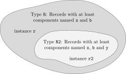

== Interface or Type Relationships
:id: interface-or-type-relationships

A class or component, e.g., denoted `A`, can in some cases be used at a location designed for another class or component, e.g., denoted `B`.
In Modelica this is the case for replaceable classes (see <<redeclaration>>) and for `inner`/`outer` elements (see <<inner-declarations-instance-hierarchy-name-lookup>>).
Replaceable classes are the primary mechanism to create very flexible models.
In this chapter, the precise rules are defined when `A` can be used at a location designed for `B`.
The restrictions are defined in terms of compatibility rules (<<interface-compatibility-or-subtyping>> and <<plug-compatibility-or-restricted-subtyping>>) between "interfaces" (<<the-concepts-of-type-interface-and-subtype>>); this can also be viewed as sub-typing (<<the-concepts-of-type-interface-and-subtype>>).

=== Interface Terminology
In this chapter, two kinds of terminology are used for identical concepts to get better understanding (e.g., by both engineers and computer scientists).
A short summary of the terms is given in the following table.
The details are defined in the rest of this chapter.

Defintion Type or interface::
The "essential" part of the public declaration sections of a class that is needed to decide whether `A` can be used instead of `B`.
+
[NOTE]
E.g., a declaration `Real x` is part of the type (also called _interface_), but `import A` is not.

Defintion Class type or inheritance interface::
The "essential" part of the public _and protected_ declaration sections of a class that is needed to decide whether `A` can be used instead of `B`.
The class type, also called inheritance interface, is needed when inheritance takes place, since then the protected declarations have to be taken into account.

Defintion Subtype or compatible interface::
`A` is a subtype of `B`, or equivalently, the interface of `A` is compatible to the interface of `B`, if the "essential" part of the public declaration sections of `B` is also available in `A`.
+
[NOTE]
E.g., if `B` has a declaration `Real x`, this declaration must also be present in `A`.
If `A` has a declaration `Real y`, this declaration may be present in `B`.
+
If `A` is a subtype of `B`, then `B` is said to be a _supertype_ of `A`.

Defintion Restricted subtype or plug compatible interface::
`A` is a restricted subtype of `B`, or equivalently, the interface of `A` is plug compatible to the interface of `B`, if `A` is a subtype of `B` and if connector components in `A` that are not in `B`, are default connectable.
+
[NOTE]
E.g., it is not allowed that these connectors have variables with the `input` prefix, because then they must be connected.
+
A model or block `A` cannot be used instead of `B`, if the particular situation does not allow to make a connection to these additional connectors.
In such a case the stricter _plug compatible_ is required for a redeclaration.

Defintion Function subtype or function compatible interface::
`A` is a function subtype of `B`, or equivalently, the interface of `A` is function compatible to the interface of `B`, if `A` is a subtype of `B` and if the additional arguments of function `A` that are not in function `B` are defined in such a way, that `A` can be called at places where `B` is called.
+
[NOTE]
E.g., an additional argument must have a default value.

=== The Concepts of Type, Interface and Subtype
A _type_ can conceptually be viewed as a _set of values_.
When we say that the variable `x` has the type `Real`, we mean that the value of `x` belongs to the set of values represented by the type `Real`, i.e., roughly the set of floating point numbers representable by `Real`, for the moment ignoring the fact that `Real` is also viewed as a class with certain attributes.
Analogously, the variable `b` having `Boolean` type means that the value of `b` belongs to the set of values {`false`, `true`}.
The built-in types `Real`, `Integer`, `String`, `Boolean` are considered to be distinct types.

The _subtype_ relation between types is analogous to the subset relation between sets.
A type `A1` being a subtype of type `A` means that the set of values corresponding to type `A1` is a subset of the set of values corresponding to type `A`.

The type `Integer` is not a subtype of `Real` in Modelica even though the set of primitive integer values is a subset of the primitive real values since there are some attributes of `Real` that are not part of `Integer` (see <<predefined-types-and-classes>>).

The concept of _interface_ as defined in <<interface-or-type>> and used in this document is equivalent to the notion of type based on sets in the following sense:

An element is characterized by its interface defined by some attributes (see <<interface-or-type>>).
The _type_ of the element is the set of values having the same interface, i.e., the same attributes.

A _subtype_ `A1` in relation to another type `A`, means that the elements of the set corresponding to `A1` is a subset of the set corresponding to `A`, characterized by the elements of that subset having additional properties.

[example]
====
Example: A record `R`: `record R Boolean b; Real x; end R;`

Another record called `R2`: `record R2 Boolean b; Real x; Real y; end R2;`

An instance `r`: `R r;`

An instance `r2`: `R2 r2;`

The type `R` of `r` can be viewed as the set of all record values having the attributes defined by the interface of `R`, e.g., the infinite set {`R(b=false, x=1.2)`, `R(b=false, x=3.4)`, `R(b=true, x=1.2)`, `R(b=true, x=1.2, y=2)`, `R(b=true, x=1.2, a=2)`, ...}.
The statement that `r` has the type (or interface) `R` means that the value of `r` belongs to this infinite set.

The type `R2` is a subtype of `R` since its instances fulfill the additional property of having the component `Real y;` in all its values.

.The type `R` can be defined as the set of record values containing `x` and `b`. The subtype `R2` is the subset of values that all contain `x`, `b`, and `y`.

====

=== Interface or Type

Based on a flattened class or component we can construct an interface for that flattened class or component.
The _interface_ or _type_ (the terms _interface_ and _type_ are equivalent and can be used interchangeably, and are different from _inheritance interface_ and _class type_) is defined as the following information about the flattened element itself:

* Whether it is replaceable or not.
* Whether the class itself or the class of the component is transitively non-replaceable (see <<transitively-non-replaceable>>), and if not, the reference to the replaceable class it refers to.
* Whether it is a component or a class.
* Additional information about the element:
** The `flow` or `stream` prefix.
** Declared variability (`constant`, `parameter`, `discrete`).
** The prefixes `input` and `output`.
** The prefixes `inner` and/or `outer`.
** Whether the declaration is `final`, and in that case its semantics contents.
** Array sizes (if any).
** Condition of conditional components (if any).
** Which kind of specialized class.
** For an enumeration type or component of enumeration type the names of the enumeration literals in order.
** Whether it is a built-in type and the built-in type (`RealType`, `IntegerType`, `StringType` or `BooleanType`).
* Only for an `operator record` class and classes derived from `ExternalObject`: the full name of the operator record base class (i.e., the one containing the operations), or the derived class.
See <<overloaded-operators>> and <<external-objects>>.
+
The following item does not apply for an `operator record` class or class derived from `ExternalObject`, since the type is already uniquely defined by the full name.
* For each named public element of the class or component (including both local and inherited named elements) a tuple comprised of:
** Name of the element.
** Interface or type of the element.
[NOTE]
This might have been modified by modifiers and is thus not necessarily identical to the interface of the original declaration.

The corresponding _constraining_ interface is constructed based on the _constraining_ type (see <<constraining-type>>) of the declaration (if replaceable -- otherwise same as actual type) and with the _constraining_ interface for the named elements.

In a class all references to elements of that class should be limited to their constraining interface.

[NOTE]
The _constraining interface_ consists of only the public elements, and if the declaration is replaceable the element is limited to the constraining interface.

[NOTE]
The public interface does not contain all of the information about the class or component.
When using a class as a base class we also need protected elements, and for internal type-checking we need, e.g., import-elements.
However, the information is sufficient for checking compatibility and for using the class to flatten components.

==== Transitively Non-Replaceable
[NOTE]
In several cases it is important that no new elements can be added to the interface of a class, especially considering short class definitions.
Such classes are defined as _transitively non-replaceable_.

A class reference is _transitively non-replaceable_ iff (i.e., if and only if) all parts of the name satisfy the following:

* If the class definition is long it is transitively non-replaceable if not declared replaceable.
* If the class definition is short (i.e., `class A = P.B`) it is transitively non-replaceable if it is non-replaceable and equal to class reference (`P.B`) that is transitively non-replaceable.

[NOTE]
According to <<require-transitively-non-replaceable>>, for a hierarchical name all parts of the name must be transitively non-replaceable, i.e., in `extends A.B.C` this implies that `A.B.C` must be transitively non-replaceable, as well as `A` and `A.B`, with the exception of the _class extends redeclaration mechanism_ see <<the-class-extends-redeclaration-mechanism>>.

==== Inheritance Interface or Class Type
For inheritance, the interface also must include protected elements; this is the only change compared to above.

Based on a flattened class we can construct an _inheritance interface_ or _class type_ for that flattened class.
The inheritance interface or class type is defined as the following information about the flattened element itself:

* Whether it is replaceable or not.
* Whether the class itself or the class of the component is transitively non-replaceable (see <<transitively-non-replaceable>>), and if not the reference to replaceable class it refers to.
* For each named element of the class (including both local and inherited named elements) a tuple comprised of:
** Name of the element.
** Whether the element is component or a class.
** For elements that are classes: Inheritance interface or class type of the element.
[NOTE]
This might have been modified by modifiers and is thus not necessarily identical to the interface of the original declaration.
** For elements that are components: interface or type of the element.
[NOTE]
This might have been modified by modifiers and is thus not necessarily identical to the interface of the original declaration.
* Additional information about the element:
** The `flow` or `stream` prefix.
** Declared variability (`constant`, `parameter`, `discrete`).
** The prefixes `input` and `output`.
** The prefixes `inner` and/or `outer`.
** Whether the declaration is `final`, and in that case its semantics contents.
** Array sizes (if any).
** Condition of conditional components (if any).
** Which kind of specialized class.
** For an enumeration type or component of enumeration type the names of the enumeration literals in order.
** Whether it is a built-in type and the built-in type (`RealType`, `IntegerType`, `StringType` or `BooleanType`).
** Visibility (`public` or `protected`).

=== Interface Compatibility or Subtyping
An interface of a class or component `A` is compatible with an interface of a class or component `B` (or the constraining interface of `B`), or equivalently that the type of `A` is a subtype of the type of `B`, iff:

* `A` is a class if and only if `B` is a class (and thus: `A` is a component if and only if `B` is a component).
* If `A` has an `operator record` base class then `B` must also have one and it must be the same.
  If `A` does not have an operator record base class then `B` shall not have one.
  See <<overloaded-operators>>.
* If `A` is derived from `ExternalObject`, then `B` must also be derived from `ExternalObject` and have the same full name.
  If `A` is not derived from `ExternalObject` then `B` shall not be derived from `ExternalObject`.
  See <<external-objects>>.
* If `B` is not replaceable then `A` shall not be replaceable.
* If `B` is transitively non-replaceable then `A` must be transitively non-replaceable (see <<transitively-non-replaceable>>).
  For all elements of the inheritance interface of `B` there must exist a compatible element with the same name and visibility in the inheritance interface of `A`.
  The interface of `A` shall not contain any other elements.
[NOTE]
We might even extend this to say that `A` and `B` should have the same contents, as in the additional restrictions below.
* If `B` is replaceable then for all elements of the component interface of `B` there must exist a plug-compatible element with the same name in the component interface of `A`.
* If `B` is neither transitively non-replaceable nor replaceable then `A` must be linked to the same class, and for all elements of the component interface of `B` there must thus exist a plug-compatible element with the same name in the component interface of `A`.
* Additional restrictions on the additional information.
  These elements should either match or have a natural total order:
** If `B` is a non-replaceable long class definition `A` must also be a long class definition.
** The `flow` or `stream` prefix should be matched for compatibility.
** Declared variability is ordered `constant` < `parameter` < `discrete` < continuous-time (`Real` without prefix), and `A` is only compatible with `B` if the declared variability in `A` is less than or equal the variability in `B`.
[NOTE]
For a redeclaration of an element the variability prefix is as default inherited by the redeclaration (i.e., no need to repeat `parameter` when redeclaring a parameter).
** The `input` and `output` prefixes must be matched.
  This ensures that the rules regarding inputs/outputs for matching connectors and (non-connector inputs) are preserved, as well as the restriction on blocks.
[NOTE]
For a redeclaration of an element the `input` or `output` prefix is inherited from the original declaration.
** The `inner` and/or `outer` prefixes should be matched.
[NOTE]
For a redeclaration of an element the `inner` and/or `outer` prefixes are inherited from the original declaration (since it is not possible to have `inner` and/or `outer` as part of a redeclare).
** If `B` is final `A` must also be final and have the same semantic contents.
** The number of array dimensions in `A` and `B` must be matched.
** Conditional components are only compatible with conditional components.
  The conditions must have equivalent contents (similar to array sizes, except there is no `:` for conditional components).
[NOTE]
For a redeclaration of an element the conditional part is inherited from the original.
** A `function` class is only compatible with a `function` class, a `package` class only compatible with a `package` class, a `connector` class only with a `connector` class, a `model` or `block` class only compatible with a `model` or `block` class, and a `type` or `record` class only compatible with a `type` or `record` class.
** If `B` is an enumeration type `A` must also be an enumeration type and vice versa.
  If `B` is an enumeration type not defined as `:` then `A` must have the same enumeration literals in the same order; if `B` is an enumeration type defined as `:` then there is no restriction on the enumeration type `A`.
** If `B` is a built-in type then `A` must also be of the same built-in type and vice versa.

[NOTE]
Intuitively, that the type `A` is a subtype of the type of `B` means that all important elements of `B` are present in `A`.

Plug-compatibility is a further restriction of compatibility (subtyping) defined in <<plug-compatibility-or-restricted-subtyping>>, and further restricted for functions, see <<function-compatibility-or-function-subtyping-for-functions>>.
For a replaceable declaration or modifier the default class must be compatible with the constraining class.

For a modifier the following must apply:

* The modified element should exist in the element being modified.
* The modifier should be compatible with the element being modified, and in most cases also plug-compatible, see <<plug-compatibility-or-restricted-subtyping>>.

[NOTE]
If the original constraining flat class is legal (no references to unknown elements and no illegal use of class/component), and modifiers legal as above, then the resulting flat class will be legal
(no references to unknown elements and no illegal use of class/component and compatible with original constraining class) and references refer to similar entities.

=== Plug-Compatibility or Restricted Subtyping
[NOTE]
If a sub-component is redeclared, see <<redeclaration>>, it is impossible to connect to any new connector.
A connector with `input` prefix must be connected to, and since one cannot connect across hierarchies, one should not be allowed to introduce such a connector at a level where a connection is not possible.
Therefore all public components present in the interface `A` that are not present in `B` must be connected by default.

Definition Plug-compatibility (= restricted subtyping)::
+
--
An interface `A` is plug-compatible with (a restricted subtype of) an interface `B` (or the constraining interface of `B`) iff:

* `A` is compatible with (subtype of) `B`.
* All public components present in `A` but not in `B` must be default-connectable (as defined below).
--

Definition Default connectable::
+
--
A component of an interface is default-connectable iff:

* All of its components are default connectable.
* A connector component must not be an `input`.
[NOTE]
Otherwise a connection to the input will be missing.
* A connector component must not be of an expandable connector class.
[NOTE]
The expandable connector does potentially have inputs.
* A parameter, constant, or non-connector input must either have a binding equation or all of its sub-components must have binding equations.
--

Based on the above definitions, there are the following restrictions:

* A redeclaration of an inherited top-level component must be _compatible_ _with_ (subtype of) the constraining interface of the element being redeclared.
* In all other cases redeclarations must be _plug-compatible_ with the constraining interface of the element being redeclared.

[NOTE]
The reason for the difference is that for an inherited top-level component it is possible to connect to the additional connectors, either in this class or in a derived class.

[example]
====
Example:

[source,modelica]
----
partial model TwoFlanges
  Modelica.Mechanics.Rotational.Interfaces.Flange_a flange_a;
  Modelica.Mechanics.Rotational.Interfaces.Flange_b flange_b;
end TwoFlanges;

partial model FrictionElement
  extends TwoFlanges;
  ...
end FrictionElement;

model Clutch "compatible - but not plug-compatible with FrictionElement"
  Modelica.Blocks.Interfaces.RealInput pressure;
  extends FrictionElement;
  ...
end Clutch;

model DriveLineBase
  extends TwoFlanges;
  Inertia J1;
  replaceable FrictionElement friction;
equation
  connect(flange_a, J1.flange_a);
  connect(J1.flange_b, friction.flange_a);
  connect(friction.flange_b, flange_b);
end DriveLineBase;

model DriveLine
  extends DriveLineBase(redeclare Clutch friction);
  Constant const;
equation
  connect(const.y, friction.pressure);
  // Legal connection to new input connector.
end DriveLine;

model UseDriveLine "illegal model"
  DriveLineBase base(redeclare Clutch friction);
  // Cannot connect to friction.pressure
end UseDriveLine;
----

If a subcomponent is redeclared, it is impossible to connect to any new connector.
Thus any new connectors must work without being connected, i.e., the default connection of flow variables.
That fails for inputs (and expandable connectors may contain inputs).
For parameters and non-connector inputs it would be possible to provide bindings in a derived class, but that would require hierarchical modifiers and it would be bad modeling practice that a hierarchical modifier must be used in order to make a model valid.
A replaceable class might be used as the class for a sub-component, therefore plug-compatibility is required not only for replaceable sub-components, but also for replaceable classes.
====

=== Function-Compatibility or Function-Subtyping for Functions

[NOTE]
Functions may be called with either named or positional arguments, and thus both the name and order is significant.
If a function is redeclared, see <<redeclaration>>, any new arguments must have defaults (and be at the end) in order to preserve the meaning of existing calls.

[[function-compatibility,Defintion Function-compatibility]]
Definition Function-compatibility or function-subtyping for functions::
A `function` class `A` is _function-compatible with or a function subtype of_ `function` class `B` iff (the terms _function-compatible_ and _function subtype_ of are synonyms and used interchangeably):
+
* `A` is compatible to (subtype of) `B`.
* All public input components of `B` have correspondingly named public input components of `A` in the same order and preceding any additional public input components of `A`.
* All public output components of `B` have correspondingly named public output components of `A` in the same order and preceding any additional public output components of `A`.
* A public input component of `A` must have a binding assignment if the corresponding named element has a binding assignment in `B`.
* A public input component of `A` not present in `B` must have a binding assignment.
* If `A` is impure, then `B` must also be impure, compare <<pure-modelica-functions>>.

Based on the above definition the following restriction holds:

* The interface of a redeclared function must be _function-compatible with or a function subtype of_ the constraining interface of the function being redeclared.

Note that variability of function calls, see <<function-variability>>, cannot be determined using just the interface of a function, as the variabilities of default argument expressions are not expressed by the interface.
Hence a function redeclaration being function-compatible does not ensure that function calls will fulfill variability requirements, and tools must therefore check variability requirements separately.

[example]
====
Example: Demonstrating a redeclaration using a function-compatible function

[source,modelica]
----
function GravityInterface
  input Modelica.Units.SI.Position position[3];
  output Modelica.Units.SI.Acceleration acceleration[3];
end GravityInterface;

function PointMassGravity
  extends GravityInterface;
  input Modelica.Units.SI.Mass m;
algorithm
  acceleration := -Modelica.Constants.G*m*position/(position*position)^1.5;
end PointMassGravity;

model Body
  Modelica.Mechanics.MultiBody.Interface.Frame_a frame_a;
  replaceable function gravity = GravityInterface;
  constant Real failed[:] = gravity({1, 0, 0}); // May fail
equation
  frame_a.f = gravity(frame_a.r0);
  // or gravity(position = frame_a.r0);
  frame_a.t = zeros(3);
end Body;

model PlanetSimulation
  parameter Modelica.Units.SI.Mass mSun = 2e30;
  function sunGravity = PointMassGravity(m = mSun);
  Body planet1(redeclare function gravity = sunGravity);
  Body planet2(redeclare function gravity = PointMassGravity(m = 2e30));
  ...
end PlanetSimulation;
----

Note: `PointMassGravity` is not function-compatible with `GravityInterface` (no default for `m`!), but `sunGravity` inside `PlanetSimulation` is function-compatible with `GravityInterface`.

The constant `failed` in `planet1`, will violate variability constraints, whereas it will work in `planet2`.
The call `gravity(frame_a.r0)` will work in both of them.
====

=== Type Compatible Expressions

Certain expressions consist of an operator applied to two or more subexpressions (`A` and `B`).
This includes:

* `if`-expressions, e.g., `if x then A else B`.
* Array expressions, e.g., `{A, B}`
* Binary operators if both operands are of simple types, e.g., `A + B`.
  Binary operators for other types are only defined for operator records, see <<overloaded-binary-operations>>, and do not necessarily require that the operands are type compatible with each other.

If the subexpressions satisfy the following restrictions they are called type compatible expressions.
Otherwise the expression is illegal.
The type of the full expression (e.g., `if x then A else B`) is also defined below.

* If `A` is a record expression, `B` must also be a record expression with the same named elements.
  In an expression that is not an array expression those elements must be type compatible.
  In an array expression the two records may contain elements with different sizes, but apart from that they must be type compatible.
  That generates a heterogenous array of records, see <<arrays>>.
  The type of the full expression is a record comprised of named elements that are type compatible with the corresponding named elements of both `A` and `B`.
* The rules for array expressions depend on the operation (the rules for binary operators are given in <<scalar-vector-matrix-and-array-operator-functions>>
and for array concatenation in <<concatenation>>).
  The rules for the remaining case of `if`-expressions and array-expressions are:
** If `A` is an array expression then `B` must also be an array expression, and `ndims(A)` = `ndims(B)`.
  The type of the full expression is an array expression with elements compatible with the elements of both `A` and `B`.
  If both `size(A)` and `size(B)` are known and `size(A)` = `size(B)` then this defines the size of the full expression, otherwise the size of the full expression is not known until the expression is about to be evaluated.
  In case of an `if`-expression the size of the full expression is defined based on the branch selected, and for other cases `size(A)` = `size(B)` must hold at this point.
** If `A` is a scalar expression of a simple type `B` must also be a scalar expression of a simple type.
* If `A` is a `Real` expression then `B` must be a `Real` or `Integer` expression.
  The type of the full expression is `Real`, compare <<standard-type-coercion>>, unless the operator is a relational operator (<<equality-relational-and-logical-operators>>) where the type of the full expression is `Boolean`.
* If `A` is an `Integer` expression then `B` must be a `Real` or `Integer` expression.
  For exponentiation and division the type of the full expression is `Real` (even if both `A` and `B` are `Integer`) see <<element-wise-exponentiation>> and <<division-by-numeric-scalars>>, for relational operators the type of the full expression is `Boolean`.
  In other cases the type of the full expression is `Real` or `Integer` (same as `B`), compare <<standard-type-coercion>>.
* If `A` is a `Boolean` expression then `B` must be a `Boolean` expression and the type of the full expression is `Boolean`.
* If `A` is a `String` expression then `B` must be a `String` expression and the type of the full expression is `String`, unless the operator is a relational operator (<<equality-relational-and-logical-operators>>) where the type of the full expression is `Boolean`.
* If `A` is an enumeration expression then `B` must be an enumeration expression and the type of the full expression is enumeration expression, unless the operator is a relational operator (<<equality-relational-and-logical-operators>>) where the type of the full expression is `Boolean`.
  The enumeration expressions must be defined in terms of an enumeration type with the same enumeration literals in the same order.
* For array and `if`-expressions, if `A` has an `operator record` base class then `B` must also have an `operator record` base class, and it must be the same, and otherwise neither `A` nor `B` may have an `operator record` base class.
  This is also the `operator record` base class for the full expression, e.g., for `if (cond) then A else B`.
* If `A` is derived from `ExternalObject` then `B` must also be derived from `ExternalObject` and they must have the same full name; and otherwise neither `A` nor `B` may be derived from `ExternalObject`.
  The common full name also defines the type of the full expression, e.g., for `if (cond) then A else B`.