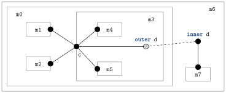
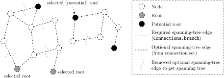

== Connectors and Connections
:id: connectors-and-connections

This chapter covers connectors, `connect`-equations, and connections.

Connectors and `connect`-equations are designed so that different components can be connected graphically with well-defined semantics.
However, the graphical part is optional and found in <<annotations>>.

=== Connect-Equations and Connectors

Connections between objects are introduced by `connect`-equations in the equation part of a class.
A `connect`-equation has the following syntax:

[source,grammar]
----
connect "(" component-reference "," component-reference ")" ";"
----

[NOTE]
A _connector_ is an instance of a `connector` class.

The `connect`-equation construct takes two references to connectors, each of which is either of the following forms:

* latexmath:[c_1.c_2.\ldots{}.c_n], where latexmath:[c_1] is a connector of the class, latexmath:[n \geq 1] and latexmath:[c_{i+1}] is a connector element of latexmath:[c_i] for latexmath:[i = 1,\, \ldots,\, (n - 1)].
* `m.c`, where `m` is a non-connector element in the class and `c` is a connector element of `m`.

There may optionally be array subscripts on any of the components; the array subscripts shall be evaluable expressions or the special operator `:`.
If the connect construct references arrays of connectors, the array dimensions must match, and each corresponding pair of elements from the arrays is connected as a pair of scalar connectors.

[example]
====
Example: Array usage:

[source,modelica]
----
connector InPort = input Real;
connector OutPort = output Real;
block MatrixGain
  input InPort u[size(A, 2)];
  output OutPort y[size(A, 1)];
  parameter Real A[:, :] = [1];
equation
  y = A * u;
end MatrixGain;

Modelica.Blocks.Sources.Sine sinSource[5];
MatrixGain gain (A = 5 * identity(5));
MatrixGain gain2(A = ones(2, 5));
OutPort x[2];
equation
  connect(sinSource.y, gain.u); // Legal
  connect(gain.y, gain2.u); // Legal
  connect(gain2.y, x); // Legal
----
====

The three main tasks are to:

* Elaborate expandable connectors.
* Build connection sets from `connect`-equations.
* Generate equations for the complete model (connection equations).

==== Connection Sets

A connection set is a set of variables connected by means of `connect`-equations.
A connection set shall contain either only flow variables or only non-flow variables.

==== Inside and Outside Connectors

In an element instance `M`, each connector element of `M` is called an _outside connector_ with respect to `M`.
Any other connector element that is hierarchically inside `M`, but not in one of the outside connectors of `M`, is called an _inside connector_ with respect to `M`.
This is done before resolving `outer` elements to corresponding `inner` ones.

[example]
====
Example:



The figure visualizes the following `connect`-equations to the `connector` `c` in the models `mi`.
Consider the following `connect`-equations found in the model for component `m0`:

[source,modelica]
----
// In model for component m0:
connect(m1.c, m3.c); // m1.c and m3.c are inside connectors
connect(m2.c, m3.c); // m2.c and m3.c are inside connectors
----

and in the model for component `m3` (`c.x` is a sub-connector inside `c`):

[source,modelica]
----
connect(c, m4.c);   // c is an outside connector, m4.c is an inside connector
connect(c.x, m5.c); // c.x is an outside connector, m5.c is an inside connector
connect(c, d);      // c is an outside connector, d is an outside connector
----

and in the model for component `m6`:

[source,modelica]
----
connect(d, m7.c);   // d is an outside connector, m7.c is an inside connector
----
====

==== Expandable Connectors

If the `expandable` qualifier is present on a connector definition, all instances of that connector are referred to as _expandable connectors_.
Instances of connectors that do not possess this qualifier are _non-expandable connectors_.

Before generating connection equations, non-parameter scalar variables and non-parameter array elements declared in expandable connectors are marked as only being potentially present.
A non-parameter array element may be declared with array dimensions `:` indicating that the size is unknown (note that the size of such a dimension cannot be determined using `size`, see <<dimension-and-size-functions>>).
This applies to both variables of simple types, and variables of structured types.

Then connections containing expandable connectors are elaborated:

. If a `connect`-equation references a potentially present component as part of the argument it will be marked as being present, which will allow a connection to an undeclared connector inside it.
The rule does not apply for the complete argument.

. After that at least one connector in the `connect`-equation must reference a declared component.

. If the other connector is undeclared it must be in a declared component and is handled as follows:

* The expandable connector instance is automatically augmented with a new component having the used name and corresponding type.

* If the undeclared component is subscripted, an array variable is created, and a connection to the specific array element is performed.
Introducing elements in an array gives an array with at least the specified elements, other elements are either not created or have a default value (i.e., as if they were only potentially present, and the same note regarding the use of size also applies here).

* If the variable on the other side of the `connect`-equation is `input` or `output` the new component will be either `input` or `output` to satisfy the restrictions in <<restrictions-of-connections-and-connectors>> for a non-expandable connector.
+
[NOTE]
The general rule ensures consistency for inside and outside connectors, and handles multiple connections to the new component.
In the simple case of no other connections involving these variables and the existing side referring to an inside connector (i.e., a connector of a component), the new variable will copy its causality (i.e., `input` if `input` and `output` if `output`) since the expandable connector must be an outside connector.
+
For an array the `input`/`output` property can be deduced separately for each array element.

Additionally:

* When two expandable connectors are connected, each is augmented with the variables that are only declared in the other expandable connector (the new variables are neither `input` nor `output`). This is repeated until all connected expandable connector instances have matching variables.
+
[NOTE]
I.e., each of the connector instances is expanded to be the union of all connector variables.

* The variables introduced in the elaboration follow additional rules for generating connection sets (given in <<generation-of-connection-equations>>).

* If a variable appears as an `input` in one expandable connector, it should appear as a non-`input` in at least one other expandable connector instance in the same augmentation set.
An augmentation set is defined as the set of connected expandable connector instances that through the elaboration will have matching variables.
+
[example]
====
Example:

[source,modelica]
----
expandable connector EngineBus
end EngineBus;

partial block Sensor
  RealOutput speed; // Output, i.e., non-input
end Sensor;
partial block Actuator
  RealInput speed; // Input
end Actuator;

model SensorWBus
  EngineBus bus;
  replaceable Sensor sensor;
equation
  connect(bus.speed, sensor.speed); // Provides 'speed'
end SensorWBus;
model ActuatorWBus
  EngineBus bus;
  replaceable Actuator actuator;
equation
  connect(bus.speed, actuator.speed); // Uses 'speed'
end ActuatorWBus;

model Engine
  ActuatorWBus actuator;
  SensorWBus sensor;
  EngineBus bus;
equation
  connect(bus, actuator.bus);
  connect(bus, sensor.bus);
end Engine;
----

This small example shows how expandable connectors are normally used:

* There are a number of bus-instances all connected together.
* There is one source of the signal: `sensor.sensor.speed`.
* There are zero or more uses of the signal:  `actuator.actuator.speed`.
====

* All components in an expandable connector are seen as connector instances even if they are not declared as such.
+
[NOTE]
I.e., it is possible to connect to, e.g., a `Real` variable.
+
[example]
====
Example:

[source,modelica]
----
expandable connector EngineBus // has predefined signals
  import Modelica.Units.SI;
  SI.AngularVelocity speed;
  SI.Temperature T;
end EngineBus;

partial block Sensor
  RealOutput speed;
end Sensor;

model Engine
  EngineBus bus;
  replaceable Sensor sensor;
equation
  connect(bus.speed, sensor.speed);
  // connection to non-connector speed is possible
  // in expandable connectors
end Engine;
----
====

* An expandable connector shall not contain a component declared with the prefix `flow`, but may contain non-expandable connector components with `flow` components.
+
[example]
====
Example:

[source,modelica]
----
import Interfaces=Modelica.Electrical.Analog.Interfaces;
expandable connector ElectricalBus
  Interfaces.PositivePin p12, n12; // OK
  flow Modelica.Units.SI.Current i; // Error
end ElectricalBus;

model Battery
  Interfaces.PositivePin p42, n42;
  ElectricalBus bus;
equation
  connect(p42, bus.p42); // Adds new electrical pin
  connect(n42, bus.n42); // Adds another pin
end Battery;
----
====

* Expandable connectors can only be connected to other expandable connectors.

If a `connect`-equation references a potentially present variable, or variable element, in an expandable connector the variable or variable element is marked as being present, and due to the paragraphs above it is possible to deduce whether the bus variable shall be treated as input, or shall be treated as output in the `connect`-equation.
That `input` or `output` prefix is added if no `input`/`output` prefix is present on the declaration.

[example]
====
Example:

[source,modelica]
----
expandable connector EmptyBus
end EmptyBus;

model Controller
  EmptyBus bus1;
  EmptyBus bus2;
  RealInput speed;
equation
  connect(speed, bus1.speed); // OK; only one undeclared and not subscripted.
  connect(bus1.pressure, bus2.pressure); // Error; both undeclared.
  connect(speed, bus2.speed[2]); // Introduces speed array (with element [2]).
end Controller;
----
====

An expandable connector array component for which `size` is not defined (see <<dimension-and-size-functions>>) is referred to as a _sizeless array component_.
Such a component shall not be used without subscripts, and the subscripts must slice the array so that the sizeless dimensions are removed.

[example]
====
Example: Valid and invalid uses of sizeless array components:

[source,modelica]
----
expandable connector EngineBus
end EngineBus;

partial block Sensor
  RealOutput speed;
end Sensor;

model Engine
  parameter Integer n = 1;
  EngineBus bus;
  replaceable Sensor sensor;
  RealOutput sensorSpeeds[:];
equation
  connect(bus.speed[n], sensor.speed) ; // OK; subscript to scalar component.
  connect(bus.speed, sensorSpeeds); // Error; missing subscripts.
public
  Real a[:] = bus.speed; // Error; missing subscripts.
  Real b[2] = bus.speed[{1, 3}]; // OK; subscript selects fixed size sub-array.
end Engine;
----
====

After this elaboration the expandable connectors are treated as normal connector instances, and the connections as normal connections, and all potentially present variables and array elements that are not actually present are undefined.
It is an error if there are expressions referring to potentially present variables or array elements that are not actually present or non-declared variables.
This elaboration implies that expandable connectors can be connected even if they do not contain the same components.

[NOTE]
A tool may remove undefined variables in an expandable connector, or set them to the default value, e.g., zero for `Real` variables.

[NOTE]
Expressions can only "read" variables from the bus that are actually declared and present in the connector, in order that the types of the variables can be determined in the local scope.

[NOTE]
--
Note that the introduction of variables, as described above, is conceptual and does not necessarily impact the flattening hierarchy in any way. Furthermore, it is important to note that these elaboration rules must consider:

. Expandable connectors nested hierarchically. This means that both outside and inside connectors must be included at every level of the hierarchy in this elaboration process.

. When processing an expandable connector that possesses the `inner` scope qualifier, all outer instances must also be taken into account during elaboration.
--

[example]
====

Example: Engine system with sensors, controllers, actuator and plant that exchange information via a bus (i.e., via expandable connectors):

[source,modelica]
----
import Modelica.Units.SI;
import Modelica.Blocks.Interfaces.RealInput;
// Plant Side
model SparkPlug
  RealInput spark_advance;
  ...
end SparkPlug;

expandable connector EngineBus
  // No minimal set
end EngineBus;

expandable connector CylinderBus
  Real spark_advance;
end CylinderBus;

model Cylinder
  CylinderBus cylinder_bus;
  SparkPlug spark_plug;
  ...
equation
  connect(spark_plug.spark_advance,
  cylinder_bus.spark_advance);
end Cylinder;

model I4
  EngineBus engine_bus;
  Modelica.Mechanics.Rotational.Sensors.SpeedSensor speed_sensor;
  Modelica.Thermal.HeatTransfer.Sensors.TemperatureSensor temp_sensor;
  parameter Integer nCylinder = 4 "Number of cylinders";
  Cylinder cylinder[nCylinder];
equation
  // adds engine_speed (as output)
  connect(speed_sensor.w, engine_bus.engine_speed);
  // adds engine_temp (as output)
  connect(temp_sensor.T, engine_bus.engine_temp);
  // adds cylinder_bus1 (a nested bus)
  for i in 1:nCylinder loop
    connect(cylinder[i].cylinder_bus,
    engine_bus.cylinder_bus[i]);
  end for;
end I4;
----

Due to the above connection, conceptually a connector consisting of the union of all connectors is introduced.

The `engine_bus` contains the following variable declarations:
[source,modelica]
----
RealOutput engine_speed;
RealOutput engine_temp;
CylinderBus cylinder_bus[1];
CylinderBus cylinder_bus[2];
CylinderBus cylinder_bus[3];
CylinderBus cylinder_bus[4];
----
====

=== Generation of Connection Equations

When generating _connection equations_, `outer` elements are resolved to the corresponding `inner` elements in the instance hierarchy (see instance hierarchy name lookup <<inner-declarations-instance-hierarchy-name-lookup>>).
The arguments to each `connect`-equation are resolved to two connector elements.

For every use of the `connect`-equation
[source,modelica]
----
connect(a, b);
----
a connection set is generated for each pair of corresponding primitive components of `a` and `b` together with an indication of whether they are from an inside or an outside connector.

[[primitive-elements]]
Defintion Primitive elements::
The primitive elements are of simple types or of types defined as `operator record` (i.e., a component of an `operator record` type is not split into sub-components).

The elements of the connection sets are tuples of primitive variables together with an indication of inside or outside; if the same tuple belongs to two connection sets those two sets are merged, until every tuple is only present in one set.
Composite connector types are broken down into primitive components.
The `outer` components are handled by mapping the objects to the corresponding `inner` components, and the inside indication is not influenced.
The outer connectors are handled by mapping the objects to the corresponding inner connectors, and they are always treated as outside connectors.

[NOTE]
Rationale: The inside/outside as part of the connection sets ensure that connections from different hierarchical levels are treated separately.
Connection sets are formed from the primitive elements and not from the connectors; this handles connections to parts of hierarchical connectors and also makes it easier to generate equations directly from the connection sets. All variables in one connection set will either be flow variables or non-flow variables due to restriction on `connect`-equations.
The mapping from an `outer` to an `inner` element must occur before merging the sets in order to get one zero-sum equation, and ensures that the equations for the `outer` elements are all given for one side of the connector, and the `inner` element can define the other side.

The following connection sets with just one member are also present (and merged):

* Each primitive flow variable as inside connector.

* Each flow variable added during augmentation of expandable connectors, both as inside and as outside.
+
[NOTE]
Note that the flow variable is not directly in the expandable connector, but in a connector inside the expandable connector.

[NOTE]
Rationale: If these variables are not connected they will generate a set comprised only of this element, and thus they will be implicitly set to zero (see below).
If connected, this set will be merged and adding this at the start has no impact.

Each connection set is used to generate equations for potential and flow (zero-sum) variables of the form

* latexmath:[a_{1} = a_{2} = \ldots = a_{n}] (neither flow nor stream variables)

* latexmath:[z_{1} + z_{2} + (-z_{3}) + \ldots + z_{n} = \mathbf{0}] (flow variables)

The bold-face latexmath:[\mathbf{0}] represents an array or scalar zero of appropriate dimensions (i.e., the same size as latexmath:[z]).

For an `operator record` type this uses the operator `'0'` -- which must be defined in the operator record -- and all of the flow variables for the `operator record` must be of the same `operator record` type.
This implies that in order to have flow variables of an `operator record` type the `operator record` must define addition, negation, and `'0'`; and these operations should define an additive group.

In order to generate equations for flow variables (using the `flow` prefix), the sign used for the connector variable latexmath:[z_{i}] above is +1 for inside connectors and -1 for outside connectors (latexmath:[z_{3}] in the example above).

[example]
====
Example: Simple example:

[source,modelica]
----
model Circuit
  Ground ground;
  Load load;
  Resistor resistor;
equation
  connect(load.p , ground.p);
  connect(resistor.p, ground.p);
end Circuit;

model Load
  extends TwoPin;
  Resistor resistor;
equation
  connect(p, resistor.p);
  connect(resistor.n, n);
end Load;
----

The connection sets are before merging (note that one part of the load and resistor is not connected):

```
{<load.p.i, inside>}
{<load.n.i, inside>}
{<ground.p.i, inside>}
{<load.resistor.p.i, inside>}
{<load.resistor.n.i, inside>}
{<resistor.p.i, inside>}
{<resistor.n.i, inside>}
{<resistor.p.i, inside>, <ground.p.i, inside>}
{<resistor.p.v, inside>, <ground.p.v, inside>}
{<load.p.i, inside>, <ground.p.i, inside>}
{<load.p.v, inside>, <ground.p.v, inside>}
{<load.p.i, outside>, <load.resistor.p.i, inside>}
{<load.p.v, outside>, <load.resistor.p.v, inside>}
{<load.n.i, outside>, <load.resistor.n.i, inside>}
{<load.n.v, outside>, <load.resistor.n.v, inside>}
```

After merging this gives:

```
{<load.p.i, outside>, <load.resistor.p.i, inside>}
{<load.p.v, outside>, <load.resistor.p.v, inside>}
{<load.n.i, outside>, <load.resistor.n.i, inside>}
{<load.n.v, outside>, <load.resistor.n.v, inside>}
{<load.p.i, inside>, <ground.p.i, inside>, <resistor.p.i, inside>}
{<load.p.v, inside>, <ground.p.v, inside>, <resistor.p.v, inside>}
{<load.n.i, inside>}
{<resistor.n.i, inside>}
```

And thus the equations:
[source,modelica]
----
load.p.v = load.resistor.p.v;
load.n.v = load.resistor.n.v;
load.p.v = ground.p.v;
load.p.v = resistor.p.v;
0 = (-load.p.i) + load.resistor.p.i;
0 = (-load.n.i) + load.resistor.n.i;
0 = load.p.i + ground.p.i + resistor.p.i;
0 = load.n.i;
0 = resistor.n.i;
----
====

[example]
====
Example: Outer component example:

[source,modelica]
----
model Circuit
  Ground ground;
  Load load;
  inner Resistor resistor;
equation
  connect(load.p, ground.p);
end Circuit;

model Load
  extends TwoPin;
  outer Resistor resistor;
equation
  connect(p, resistor.p);
  connect(resistor.n, n);
end Load;
----

The connection sets are before merging:

```
{<load.p.i, inside>}
{<load.n.i, inside>}
{<ground.p.i, inside>}
{<resistor.p.i, inside>}
{<resistor.n.i, inside>}
{<load.p.i, inside>, <ground.p.i, inside>}
{<load.p.v, inside>, <ground.p.v, inside>}
{<load.p.i, outside>, <resistor.p.i, inside>}
{<load.p.v, outside>, <resistor.p.v, inside>}
{<load.n.i, outside>, <resistor.n.i, inside>}
{<load.n.v, outside>, <resistor.n.v, inside>}
```

After merging this gives:

```
{<load.p.i, outside>, <resistor.p.i, inside>}
{<load.p.v, outside>, <resistor.p.v, inside>}
{<load.n.i, outside>, <resistor.n.i, inside>}
{<load.n.v, outside>, <resistor.n.v, inside>}
{<load.p.i, inside>, <ground.p.i, inside>}
{<load.p.v, inside>, <ground.p.v, inside>}
{<load.n.i, inside>}
```

And thus the equations:
[source,modelica]
----
load.p.v = resistor.p.v;
load.n.v = resistor.n.v;
load.p.v = ground.p.v;
0 = (-load.p.i) + resistor.p.i;
0 = (-load.n.i) + resistor.n.i;
0 = load.p.i + ground.p.i;
0 = load.n.i;
----

This corresponds to a direct connection of the resistor.
====

=== Restrictions of Connections and Connectors

* The `connect`-equations (and some special functions for overdetermined connectors) can only be used in normal equations and in some `if`-equations and `for`-equations.
  See <<connect-equations>> for details.
+
[NOTE]
====
The `for`-equations always have evaluable expressions for the array expression.
====

* A connector component shall not be declared with the prefix `parameter` or `constant`.
  In the `connect`-equation the primitive components may only connect parameter variables to parameter variables and constant variables to constant variables.

* The `connect`-equation construct only accepts forms of connector references as specified in <<connect-equations-and-connectors>>.

* In a `connect`-equation the two connectors must have the same named component elements with the same dimensions; recursively down to the primitive components.
  The primitive components with the same name are matched and belong to the same connection set.

* The matched primitive components of the two connectors must have the same primitive types, and flow variables may only connect to other flow variables, stream variables only to other stream variables, and causal variables (`input`/`output`) only to causal variables (`input`/`output`).

* A connection set of causal variables (`input`/`output`) may at most contain variables from one inside `output` connector (for state-machines extended as specified in <<merging-connections-to-outputs>>) or one public outside `input` connector.
+
[NOTE]
====
I.e., a connection set may at most contain one source of a signal.
====

* At least one of the following must hold for a connection set containing causal variables generated for a non-partial model or block:
+
. the connection set includes variables from an outside public expandable connector,
. the set contains variables from protected outside connectors,
. it contains variables from one inside `output` connector, or
. from one public outside `input` connector, or
. the  set is comprised solely of one variable from one inside `input` connector that is not part of an expandable connector.
+
[NOTE]
====
I.e., a connection set must -- unless the model or block is partial -- contain one source of a signal (item 5 covers the case where a connector of a component is left unconnected and the source given textually).
====

* Variables from a protected outside connector must be part of a connection set containing at least one inside connector or one declared public outside connector (i.e., it shall not be an implicitly defined part of an expandable connector).
+
[NOTE]
====
Otherwise it would not be possible to deduce the causality for the expandable connector element.
====

* [[connect-set-quantity-rule]]In a connection set, all variables having non-empty `quantity`-attribute must have the same `quantity`-attribute.
+
[NOTE]
====
Note that variables with different quantities may be unit-compatible, as seen in the example of work and torque.
It is also possible to include medium-information in the quantity to detect connections between different liquids.
====

* A `connect`-equation shall not (directly or indirectly) connect two connectors of `outer` elements.
+
[NOTE]
====
Indirectly is similar to them being part of the same connection set.
However, connections to `outer` elements are "moved up" before forming connection sets.
Otherwise the connection sets could contain redundant information breaking the equation count for locally balanced models and blocks.
====

* Subscripts in a connector reference shall be evaluable expressions or the special operator `:`.

* Constants or parameters in connected components yield the appropriate `assert`-statements to check that they have the same value; connections are not generated.

* For conditional connectors, see <<conditional-component-declaration>>.

==== Balancing Restriction and Size of Connectors

For each non-partial non-simple non-expandable connector class the number of flow variables shall be equal to the number of variables that are neither `parameter`, `constant`, `input`, `output`, `stream` nor `flow`.
The _number of variables_ is the number of all elements in the connector class after expanding all records and arrays to a set of scalars of primitive types.
The number of variables of an overdetermined type or record class (see <<connection-graphs-and-their-operators>>) is the size of the output argument of the corresponding `equalityConstraint`() function.
A simple connector class is not expandable, has some time-varying variables, and has neither `input`, `output`, `stream` nor `flow` variables.

[NOTE]
====
Expandable connector classes are excluded from this, since their component declarations are only a form of constraint.
====

A component of a simple connector class must be declared as `input`, `output`, or `protected`.

[NOTE]
====
A simple connector class is thus always unbalanced, but since it is used with causality or not visible to the outside it does not unbalance the model.
====

[example]
====
Example:

[source,modelica]
----
connector Pin // A physical connector of Modelica.Electrical.Analog
  Real v;
  flow Real i;
end Pin;

connector Plug // A hierarchical connector of Modelica.Electrical.MultiPhase
  parameter Integer m = 3;
  Pin p[m];
end Plug;

connector InputReal = input Real; // A causal input connector
connector OutputReal = output Real; // A causal output connector

connector Frame_Illegal
  Modelica.Units.SI.Position r0[3] "Position vector of frame origin";
  Real S[3, 3] "Rotation matrix of frame";
  Modelica.Units.SI.Velocity v[3] "Abs. velocity of frame origin";
  Modelica.Units.SI.AngularVelocity w[3] "Abs. angular velocity of frame";
  Modelica.Units.SI.Acceleration a[3] "Abs. acc. of frame origin";
  Modelica.Units.SI.AngularAcceleration z[3] "Abs. angular acc. of frame";
  flow Modelica.Units.SI.Force f[3] "Cut force";
  flow Modelica.Units.SI.Torque t[3] "Cut torque";
end Frame_Illegal;
----

The `Frame_Illegal` connector (intended to be used in a simple multi-body package without over-determined connectors) is illegal since the number of flow and non-flow variables do not match.
The solution is to create two connector classes, where two 3-vectors (e.g., `a` and `z`) are acausal `Real` and the other variables are matching pairs of `input` and `output`.
This ensures that the models can only be connected in a tree-structure or require a "loop-breaker" joint for every closed kinematic loop:

[source,modelica]
----
connector Frame_a "correct connector"
  input Modelica.Units.SI.Position r0[3];
  input Real S[3, 3];
  input Modelica.Units.SI.Velocity v[3];
  input Modelica.Units.SI.AngularVelocity w[3];
  Modelica.Units.SI.Acceleration a[3];
  Modelica.Units.SI.AngularAcceleration z[3];
  flow Modelica.Units.SI.Force f[3];
  flow Modelica.Units.SI.Torque t[3];
end Frame_a;

connector Frame_b "correct connector"
  output Modelica.Units.SI.Position r0[3];
  output Real S[3, 3];
  output Modelica.Units.SI.Velocity v[3];
  output Modelica.Units.SI.AngularVelocity w[3];
  Modelica.Units.SI.Acceleration a[3];
  Modelica.Units.SI.AngularAcceleration z[3];
  flow Modelica.Units.SI.Force f[3];
  flow Modelica.Units.SI.Torque t[3];
end Frame_b;
----

The subsequent connectors `Plug_Expanded` and `PlugExpanded2` are correct, but `Plug_Expanded_Illegal` is illegal since the number of non-flow and flow variables is different if `n` and `m` are different.
It is not clear how a tool can detect in general that connectors such as `Plug_Expanded_Illegal` are illegal.
However, it is always possible to detect this defect after actual values of parameters and constants are provided in the simulation model.

[source,modelica]
----
connector Plug_Expanded "correct connector"
  parameter Integer m=3;
  Real v[m];
  flow Real i[m];
end Plug_Expanded;

connector Plug_Expanded2 "correct connector"
  parameter Integer m=3;
  final parameter Integer n=m;
  Real v[m];
  flow Real i[n];
end Plug_Expanded2;

connector Plug_Expanded_Illegal "connector is illegal"
  parameter Integer m=3;
  parameter Integer n=m;
  Real v[m];
  flow Real i[n];
end Plug_Expanded_Illegal;
----
====

=== Overconstrained Connections

There is a special problem regarding equation systems resulting from _loops_ in connection graphs where the connectors contain _non-flow_ (i.e., potential) variables _dependent_ on each other.
When a loop structure occurs in such a graph, the resulting equation system will be _overconstrained_, i.e., have more equations than variables, since there are implicit constraints between certain non-flow variables in the connector in addition to the connection equations around the loop.
At the current state-of-the-art, it is not possible to automatically eliminate the unneeded equations from the resulting equation system without additional information from the model designer.

This section describes a set of equation operators for such overconstrained connection-based equation systems, that makes it possible for the model designer to specify enough information in the model to allow a Modelica environment to automatically remove the superfluous equations.

[NOTE]
--
Connectors may contain redundant variables.
For example, the orientation between two coordinate systems in latexmath:[3] dimensions can be described by latexmath:[3] independent variables.
However, every description of orientation with latexmath:[3] variables has at least one singularity in the region where the variables are defined.
It is therefore not possible to declare only latexmath:[3] variables in a connector.
Instead latexmath:[n] variables (latexmath:[n > 3]) have to be used.
These variables are no longer independent from each other and there are latexmath:[n - 3] constraint equations that have to be fulfilled.
A proper description of a redundant set of variables with constraint equations does no longer have a singularity.
A model that has loops in the connection structure formed by components and connectors with redundant variables, may lead to a differential algebraic equation system that has more equations than unknown variables.
The superfluous equations are usually consistent with the rest of the equations, i.e., a unique mathematical solution exists.
Such models cannot be treated with the currently known symbolic transformation methods.
To overcome this situation, operators are defined in order that a Modelica translator can remove the superfluous equations.
This is performed by replacing the equality equations of non-flow variables from connection sets by a reduced number of equations in certain situations.

This section handles a certain class of overdetermined systems due to connectors that have a redundant set of variables.
There are other causes of overdetermined systems, e.g., explicit zero-sum equations for flow variables, that are not handled by the method described below.
--

==== Connection Graphs and Their Operators

A type or record declaration may have an optional definition of function `equalityConstraint` that shall have the following prototype:

[source,modelica]
----
type Type // overdetermined type
  extends <base type>;
  function equalityConstraint // non-redundant equality
    input Type T1;
    input Type T2;
    output Real residue[n];
  algorithm
    residue := ...;
  end equalityConstraint;
end Type;

record Record
  <declaration of record fields>;
  function equalityConstraint // non-redundant equality
    input Record R1;
    input Record R2;
    output Real residue[n];
  algorithm
    residue := ...;
  end equalityConstraint;
end Record;
----

The array dimension latexmath:[n] of `residue` shall be a constant `Integer` expression that can be evaluated during translation, with latexmath:[n \ge 0].
The `equalityConstraint` expresses the equality between the two type instances `T1` and `T2` or the record instances `R1` and `R2`, respectively, as the latexmath:[n] non-redundant equation residuals returned in `residue`.
That is, the set of latexmath:[n] non-redundant equations stating that `R1 = R2` is given by the equation (`0` represents a vector of zeros of appropriate size):

[source,modelica]
----
  Record R1, R2;
equation
  0 = Record.equalityConstraint(R1, R2);
----

[NOTE]
If the elements of a record `Record` are not independent from each other, the equation `R1 = R2` contains redundant equations.

A type class with an `equalityConstraint` function declaration is called _overdetermined type_.
A record class with an `equalityConstraint` function definition is called _overdetermined record_.
A connector that contains instances of overdetermined type and/or record classes is called _overdetermined connector_.
An overdetermined type or record may neither have flow components nor may be used as a type of flow components.
If an array is used as argument to any of the `Connections.*` functions it is treated as one unit -- unlike `connect`, there is no special treatment of this case, compare <<connect-equations-and-connectors>>.

Every instance of an overdetermined type or record in an overdetermined connector is a node in a virtual connection graph that is used to determine when the standard equation `R1 = R2` or when the equation `0 = equalityConstraint(R1, R2)` has to be used for the generation of `connect`-equations.
The edges of the virtual connection graph are implicitly defined by `connect` and explicitly by `Connections.branch`, see table below.
`Connections` is a built-in package in global scope containing built-in operators.
Additionally, corresponding nodes of the virtual connection graph have to be defined as roots or as potential roots with functions `Connections.root` and `Connections.potentialRoot`, respectively.

The overconstrained equation operators for connection graphs are listed below.
Here, `a` and `b` are connector instances that may be hierarchically structured, e.g., `a` may be an abbreviation for `enginePort.frame_a`.

[cols="1,1,1"]
|===
|Expression |Description |Details

|`connect(a, b)`
|Optional spanning-tree edge
|<<operator:connect>>

|`Connections.branch(a.R, b.R)`
|Required spanning-tree edge
|<<operator:Connections.branch>>

|`Connections.root(a.R)`
|Definite root node
|<<operator:Connections.root>>

|`Connections.potentialRoot(a.R, ...)`
|Potential root node
|<<operator:Connections.potentialRoot>>

|`Connections.isRoot(a.R)`
|Predicate for being selected as root
|<<operator:Connections.isRoot>>

|`Connections.rooted(a.R)`
|Predicate for being closer to root
|<<operator:Connections.rooted>>
|===

[[operator:connect,Operator connect]]
Operator connect::
+
[source,modelica]
----
connect(a, b)
----
+
Except for redundant connections it defines an _optional spanning-tree edge_ from the overdetermined type or record instances in connector `a` to the corresponding overdetermined type or record instances in connector `b` for a virtual connection graph.
E.g., from `a.R` to `b.R`.
The full explanation will be given in <<generation-of-connection-graph-equations>>.
The types of the corresponding overdetermined type or record instances shall be the same.


[[operator:Connections.branch,Operator Connections.branch]]
Operator Connections.branch::
+
[source,modelica]
----
Connections.branch(a.R, b.R)
----
+
Defines a _required spanning-tree edge_ from the overdetermined type or record instance `R` in connector instance `a` to the corresponding overdetermined type or record instance `R` in connector instance `b` for a virtual connection graph.
This function can be used at all places where a `connect`-equation is allowed.
+
[NOTE]
E.g., it is not allowed to use this function in a `when`-clause.
This definition shall be used if in a model with connectors `a` and `b` the overdetermined records `a.R` and `b.R` are algebraically coupled in the model, e.g., due to `b.R = f(a.R, <other unknowns>)`.

[[operator:Connections.root,Operator Connections.root]]
Operator Connections.root::
+
[source,modelica]
----
Connections.root(a.R)
----
+
The overdetermined type or record instance `R` in connector instance `a` is a _(definite) root node_ in a virtual connection graph.
+
[NOTE]
This definition shall be used if in a model with connector `a` the overdetermined record `a.R` is (consistently) assigned, e.g., from a parameter expressions.

[[operator:Connections.potentialRoot,Operator Connections.potentialRoot]]
Operator Connections.potentialRoot::
+
[source,modelica]
----
Connections.potentialRoot(a.R)
Connections.potentialRoot(a.R, priority=p)
----
+
The overdetermined type or record instance `R` in connector instance `a` is a _potential root node_ in a virtual connection graph with priority `p` (_p_ ≥ 0).
If no second argument is provided, the priority is zero.
`p` shall be an evaluable expression of type `Integer`.
In a virtual connection subgraph without a `Connections.root` definition, one of the potential roots with the lowest priority number is selected as root.
+
[NOTE]
This definition may be used if in a model with connector `a` the overdetermined record `a.R` appears differentiated -- `der(a.R)` -- together with the _constraint equations_ of `a.R`, i.e., a non-redundant subset of `a.R` maybe used as states.

[[operator:Connections.isRoot,Operator Connections.isRoot]]
Operator Connections.isRoot::
+
[source,modelica]
----
Connections.isRoot(a.R)
----
+
Returns true, if the overdetermined type or record instance `R` in connector instance `a` is selected as a root in the virtual connection graph.

[[operator:Connections.rooted,Operator Connections.rooted]]
Operator Connections.rooted::
+
[source,modelica]
----
Connections.rooted(a.R)
rooted(a.R) // deprecated!
----
+
If the operator `Connections.rooted(a.R)` is used, or the equivalent but deprecated operator `rooted(a.R)`, then there must be exactly one `Connections.branch(a.R, b.R)` involving `a.R` (the argument of `Connections.rooted` must be the first argument of `Connections.branch`).
In that case `Connections.rooted(a.R)` returns true, if `a.R` is closer to the root of the spanning tree than `b.R`; otherwise false is returned.
+
[NOTE]
This operator can be used to avoid equation systems by providing analytic inverses, see `Modelica.Mechanics.MultiBody.Parts.FixedRotation`.

[NOTE]
Note, that `Connections.branch`, `Connections.root`, `Connections.potentialRoot` do not generate equations.
They only generate nodes and edges in the virtual graph for analysis purposes.

==== Generation of Connection Graph Equations

When generating connection graph equations, only the overdetermined components of a connector are considered.
The connection graph equations replace the equality-equations for variables that are neither flow nor stream in <<generation-of-connection-equations>>.

===== Handle Connect-Equation Redundancy

In order to eliminate any redundant `connect`-equation the following preparation is needed.

[NOTE]
====
In the common case where there is no `connect`-equation redundancy, a consequence of this preparation is that a `connect`-equation between connectors with _one_ overdetermined component may be directly turned into _one_ optional spanning-tree edge.
====

. The connection sets are built similarly to the normal way, but keeping the overdetermined components as primitives.
. Instead of generating the equality-equation for an overdetermined component, an optional spanning-tree edge in the virtual connection graph is constructed.

[NOTE]
====
If a connection set contains _n_ overdetermined components, and was built from _m_ `connect`-equations, then the connection set has a `connect`-equation redundancy of _m_ - (_n_ - 1) ≥ 0.
If there is no `connect`-equation redundancy (i.e., if _m_=_n_-1), the optional spanning-tree edges can be chosen to correspond to the `connect`-equations for overdetermined connectors.
If there is a non-zero `connect`-equation redundancy, there will always exist `connect`-equations without a corresponding optional spanning-tree edge.

It is called _redundancy_ since this number of `connect`-equations could be removed without changing the connection set or the generated equations.
Situations with non-zero `connect`-equation redundancy include connectors connected directly to themselves, duplicated connections, and having all three pair-wise connections between the connectors `a`, `b` and `c`.
The latter case can be used to consistently handle conditional components (so that disabling `b` does not break the connection between `a` and `c`).
====

The selected optional spanning tree edges, together with all required spanning tree edges generated from `Connections.branch`, and nodes corresponding to definite and potential roots form the virtual connection graph.

===== Spanning Trees

Before connection equations are generated, the virtual connection graph is transformed into a set of spanning trees by removing optional spanning tree edges from the graph.
This is performed in the following way:

. Root nodes are selected as follows:
.. Every definite root node defined via the `Connections.root`-equation is a root of one spanning tree.
   It is an error if two (or more) definite root nodes are connected through required spanning tree edges.
.. The virtual connection graph may consist of sets of subgraphs that are not connected together.
   Every subgraph in this set shall have at least one definite root node or one potential root node in a simulation model.
   If a graph of this set does not contain any definite root node, then one potential root node in this subgraph that has the lowest priority number is selected to be the root of that subgraph.
   The selection can be inquired in a class with function `Connections.isRoot`, see table above.

. If there is a cycle among required spanning-tree-edges it is an error, as it is not possible to construct a spanning tree.

. For a subgraph with _n_ selected roots, optional spanning-tree edges are removed such that the result is a set of _n_ spanning trees with the selected root nodes as roots.

===== Equations

After this analysis, the _connection graph equations_ are generated in the following way:

. For every remaining optional spanning-tree edge in any of the spanning trees, the connection equations are generated according to <<generation-of-connection-equations>>.
  For `connect(a, b)` with overdetermined connector `R`, this corresponds to the optional spanning-tree edge between `a.R` and `b.R` generating the equation `a.R = b.R`.

. For every remaining optional spanning-tree edge not in any of the spanning trees, the connection equations are generated according to <<generation-of-connection-equations>>, except for overdetermined type or record instances `R`.
  Here the equations `0 = R.equalityConstraint(a.R, b.R)` are generated instead of `a.R = b.R`.

==== Examples

.Example of a virtual connection graph.
[example]
====
Example:


====

===== A Power Systems Overdetermined Connector

[NOTE]
====
An overdetermined connector for power systems based on the transformation theory of Park may be defined as:

[source,modelica]
----
type AC_Angle "Angle of source, e.g., rotor of generator"
  extends Modelica.Units.SI.Angle; // AC_Angle is a Real number
  // with unit = "rad"
  function equalityConstraint
    input AC_Angle theta1;
    input AC_Angle theta2;
    output Real residue[0] "No constraints";
  algorithm
    /* make sure that theta1 and theta2 from joining edges are identical */
    assert(abs(theta1 - theta2) < 1.e-10, "Consistent angles");
  end equalityConstraint;
end AC_Angle;

connector AC_Plug "3-phase alternating current connector"
  import Modelica.Units.SI;
  AC_Angle theta;
  SI.Voltage v[3] "Voltages resolved in AC_Angle frame";
  flow SI.Current i[3] "Currents resolved in AC_Angle frame";
end AC_Plug;
----

The currents and voltages in the connector are defined relatively to the harmonic, high-frequency signal of a power source that is essentially described by angle theta of the rotor of the source.
This allows much faster simulations, since the basic high frequency signal of the power source is not part of the differential equations.
For example, when the source and the rest of the line operates with constant frequency (= nominal case), then `AC_Plug.v` and `AC_Plug.i` are constant.
In this case a variable step integrator can select large time steps.
An element, such as a 3-phase inductor, may be implemented as:

[source,modelica]
----
model AC_Inductor
  parameter Real X[3,3], Y[3,3]; // component constants
  AC_Plug p;
  AC_Plug n;
  Real omega;
equation
  Connections.branch(p.theta,n.theta); //edge in virtual graph
  // since n.theta = p.theta
  n.theta = p.theta; // pass angle theta between plugs
  omega = der(p.theta); // frequency of source
  zeros(3) = p.i + n.i;
  X*der(p.i) + omega*Y*p.i = p.v - n.v;
end AC_Inductor
----

At the place where the source frequency, i.e., essentially variable theta, is defined, a `Connections.root` must be present:

[source,modelica]
----
  AC_Plug p;
equation
  Connections.root(p.theta);
  p.theta = 2*Modelica.Constants.pi*50*time; // 50 Hz
----

The graph analysis performed with the virtual connection graph identifies the connectors, where the `AC_Angle` needs not to be passed between components, in order to avoid redundant equations.

Note that the different sources do not integrate the frequency, as that increases the risk of numerical errors.
====

===== A 3-Dimensional Mechanical Systems Overdetermined Connector

[NOTE]
====
An overdetermined connector for 3-dimensional mechanical systems may be defined as:

[source,modelica]
----
type TransformationMatrix = Real[3,3];
type Orientation "Orientation from frame 1 to frame 2"
  extends TransformationMatrix;
  function equalityConstraint
    input Orientation R1 "Rotation from inertial frame to frame 1";
    input Orientation R2 "Rotation from inertial frame to frame 2";
    output Real residue[3];
    protected
    Orientation R_rel "Relative Rotation from frame 1 to frame 2";
  algorithm
    R_rel := R2*transpose(R1);
    /*
      If frame_1 and frame_2 are identical, R_rel must be
      the unit matrix. If they are close together, R_rel can be
      linearized yielding:
        R_rel = [ 1, phi3, -phi2;
        -phi3, 1, phi1;
        phi2, -phi1, 1 ];
      where phi1, phi2, phi3 are the small rotation angles around
      axis x, y, z of frame 1 to rotate frame 1 into frame 2.
      The atan2 is used to handle large rotation angles, but does not
      modify the result for small angles.
    */
    residue := { Modelica.Math.atan2(R_rel[2, 3], R_rel[1, 1]),
    Modelica.Math.atan2(R_rel[3, 1], R_rel[2, 2]),
    Modelica.Math.atan2(R_rel[1, 2], R_rel[3, 3])};
  end equalityConstraint;
end Orientation;

connector Frame "3-dimensional mechanical connector"
  import Modelica.Units.SI;
  SI.Position r[3] "Vector from inertial frame to Frame";
  Orientation R "Orientation from inertial frame to Frame";
  flow SI.Force f[3] "Cut-force resolved in Frame";
  flow SI.Torque t[3] "Cut-torque resolved in Frame";
end Frame;
----

A fixed translation from a frame `a` to a frame `b` may be defined as:

[source,modelica]
----
model FixedTranslation
  parameter Modelica.Units.SI.Position r[3];
  Frame frame_a, frame_b;
equation
  Connections.branch(frame_a.R, frame_b.R);
  frame_b.r = frame_a.r + transpose(frame_a.R)*r;
  frame_b.R = frame_a.R;
  zeros(3) = frame_a.f + frame_b.f;
  zeros(3) = frame_a.t + frame_b.t + cross(r, frame_b.f);
end FixedTranslation;
----

Since the transformation matrix `frame_a.R` is algebraically coupled with `frame_b.R`, an edge in the virtual connection graph has to be defined.
At the inertial system, the orientation is consistently initialized and therefore the orientation in the inertial system connector has to be defined as root:

[source,modelica]
----
model InertialSystem
  Frame frame_b;
equation
  Connections.root(frame_b.R);
  frame_b.r = zeros(3);
  frame_b.R = identity(3);
end InertialSystem;
----
====