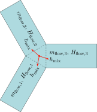
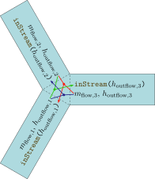

[appendix]
== Derivation of Stream Equations
:id: derivation-of-stream-equations

This appendix contains a derivation of the equation for stream connectors from <<stream-connectors>>.

=== Mixing Enthalpy
:id: mixing-enthalpy

Consider a connection set with _n_ connectors, and denote the mass flow rates `m_flow` by latexmath:[\tilde{m}].
The mixing enthalpy is defined by the mass balance (the general mass-balance for a component has latexmath:[\dot{m}=\sum\tilde{m}] which simplifies for the mixing enthalpy where latexmath:[m=0] and thus latexmath:[\dot{m}=0]):

[latexmath]
++++
0 = \sum_{j=1}^n \tilde{m}_j
++++

and similarly the energy balance:

[latexmath]
++++
0 = \sum_{j=1}^n \tilde{H}_j
++++

with

[latexmath]
++++
\tilde{H}_j = \tilde{m}_j
\begin{cases}
h_{\mathrm{mix}} & \text{if } \tilde{m}_j > 0 \\
h_{\mathrm{outflow},j} & \text{if } \tilde{m}_j \leq 0
\end{cases}
++++

Herein, mass flow rates are positive when entering models (exiting the connection set).
The specific enthalpy represents the specific enthalpy inside the component, close to the connector, for the case of outflow.
Expressed with variables used in the balance equations we arrive at:

[latexmath]
++++
h_{\mathrm{outflow},j} =
\begin{cases}
\frac{\tilde{H}_j}{\tilde{m}_j} & \text{if } \tilde{m}_j < 0 \\
\textrm{arbitrary} & \text{if } \tilde{m}_j \geq 0
\end{cases}
++++

While these equations are suitable for device-oriented modeling, the straightforward usage of this definition leads to models with discontinuous residual equations, which violates the prerequisites of several solvers for nonlinear equation systems.
This is the reason why the actual mixing enthalpy is not modelled directly in the model equations.
The stream connectors provide a suitable alternative.

.Exemplary connection set with three connected components and a common mixing enthalpy.

=== Rationale for inStream
:id: rationale-for-instream

For simplicity, the derivation of `inStream` is shown for 3 model components that are connected together.
The case for _N_ connections follows correspondingly.

[[eq:D1,C.1]]
The energy and mass balance equations for the connection set for 3 components are (see above):

[[eq:D1a,C.1a]]
.C.1a
[latexmath]
++++
\begin{equation}
\begin{split}
0 = & \tilde{m}_1 \cdot
\begin{cases}
h_{\mathrm{mix}} & \text{if } \tilde{m}_1 > 0 \\
h_{\mathrm{outflow},1} & \text{if } \tilde{m}_1 \leq 0
\end{cases} \\
+ & \tilde{m}_2 \cdot
\begin{cases}
h_{\mathrm{mix}} & \text{if } \tilde{m}_2 > 0 \\
h_{\mathrm{outflow},2} & \text{if } \tilde{m}_2 \leq 0
\end{cases} \\
+ & \tilde{m}_3 \cdot
\begin{cases}
h_{\mathrm{mix}} & \text{if } \tilde{m}_3 > 0 \\
h_{\mathrm{outflow},3} & \text{if } \tilde{m}_3 \leq 0
\end{cases}
\end{split}
\end{equation}
++++

[[eq:D1b,C.1b]]
.C.1b
[latexmath]
++++
\begin{equation}
0 = \tilde{m}_1 + \tilde{m}_2 + \tilde{m}_3
\end{equation}
++++

[[eq:D2,C.2]]
The balance equations are implemented using a latexmath:[\operatorname{max}] operator in place of the piecewise expressions, taking care of the different flow directions:

[[eq:D2a,C.2a]]
.C.2a
[latexmath]
++++
\begin{equation}
\begin{split}
0 = & \operatorname{max}(\tilde{m}_1,0) h_{\mathrm{mix}} - \operatorname{max}(-\tilde{m}_1,0) h_{\mathrm{outflow},1} \\
+ & \operatorname{max}(\tilde{m}_2,0) h_{\mathrm{mix}} - \operatorname{max}(-\tilde{m}_2,0) h_{\mathrm{outflow},2} \\
+ & \operatorname{max}(\tilde{m}_3,0) h_{\mathrm{mix}} - \operatorname{max}(-\tilde{m}_3,0) h_{\mathrm{outflow},3}
\end{split}
\end{equation}
++++

[[eq:D2b,C.2b]]
.C.2b
[latexmath]
++++
\begin{equation}
\begin{split}
0 = & \operatorname{max}(\tilde{m}_1,0) - \operatorname{max}(-\tilde{m}_1,0) \\
+ & \operatorname{max}(\tilde{m}_2,0) - \operatorname{max}(-\tilde{m}_2,0) \\
+ & \operatorname{max}(\tilde{m}_3,0) - \operatorname{max}(-\tilde{m}_3,0)
\end{split}
\end{equation}
++++

Equation (<<eq:D2a>>) is solved for latexmath:[h_{\mathrm{mix}}]:

[latexmath]
++++
h_{\mathrm{mix}} = \frac{
  \operatorname{max}(-\tilde{m}_1,0) h_{\mathrm{outflow},1}
+ \operatorname{max}(-\tilde{m}_2,0) h_{\mathrm{outflow},2}
+ \operatorname{max}(-\tilde{m}_3,0) h_{\mathrm{outflow},3}
}{
  \operatorname{max}(\tilde{m}_1,0)
+ \operatorname{max}(\tilde{m}_2,0)
+ \operatorname{max}(\tilde{m}_3,0)
}
++++

Using (<<eq:D2b>>), the denominator can be changed to:

[latexmath]
++++
h_{\mathrm{mix}} = \frac{
  \operatorname{max}(-\tilde{m}_1,0) h_{\mathrm{outflow},1}
+ \operatorname{max}(-\tilde{m}_2,0) h_{\mathrm{outflow},2}
+ \operatorname{max}(-\tilde{m}_3,0) h_{\mathrm{outflow},3}
}{
  \operatorname{max}(-\tilde{m}_1,0)
+ \operatorname{max}(-\tilde{m}_2,0)
+ \operatorname{max}(-\tilde{m}_3,0)
}
++++

Above it was shown that an equation of this type does not yield properly formulated model equations.
In the streams concept we therefore decide to split the energy balance, which consists of different branches depending on the mass flow direction.
Consequently, separate energy balances are the result; each valid for specific flow directions.

In a model, governing equations have to establish the specific enthalpy of fluid leaving the model based on the specific enthalpy of fluid flowing into it.
Whenever the mixing enthalpy is _used_ in a model it is therefore the mixing enthalpy under the assumption of fluid flowing into said model.

We establish this quantity using a dedicated operator `inStream(h_outflow,i) = h_mix` assuming that latexmath:[\tilde{m}_i \geq 0].
This leads to different incarnations of latexmath:[h_{\mathrm{mix}}], three in this case and latexmath:[n] in the general case.
This is illustrated in the figure below.
For the present example of three components in a connection set, this means the following:

[latexmath]
++++
\begin{align*}
\text{inStream}(h_{\mathrm{outflow},1}) &= \frac{\operatorname{max}(-\tilde{m}_2,0) h_{\mathrm{outflow},2} + \operatorname{max}(-\tilde{m}_3,0) h_{\mathrm{outflow},3}}{\operatorname{max}(-\tilde{m}_2,0) + \operatorname{max}(-\tilde{m}_3,0)} \\
\text{inStream}(h_{\mathrm{outflow},2}) &= \frac{\operatorname{max}(-\tilde{m}_1,0) h_{\mathrm{outflow},1} + \operatorname{max}(-\tilde{m}_3,0) h_{\mathrm{outflow},3}}{\operatorname{max}(-\tilde{m}_1,0) + \operatorname{max}(-\tilde{m}_3,0)} \\
\text{inStream}(h_{\mathrm{outflow},3}) &= \frac{\operatorname{max}(-\tilde{m}_1,0) h_{\mathrm{outflow},1} + \operatorname{max}(-\tilde{m}_2,0) h_{\mathrm{outflow},2}}{\operatorname{max}(-\tilde{m}_1,0) + \operatorname{max}(-\tilde{m}_2,0)}
\end{align*}
++++

.Exemplary connection set with three connected components.

In the general case of a connection set with _n_ components, similar considerations lead to the following:

[latexmath]
++++
\text{inStream}(h_{\mathrm{outflow},i}) = \frac{\sum_{j=1,\dotsc,n; j \neq i} \operatorname{max}(-\tilde{m}_j,0) h_{\mathrm{outflow},j}}{\sum_{j=1,\dotsc,n; j \neq i} \operatorname{max}(-\tilde{m}_j,0)}
++++

=== Special Cases Covered by inStream Definition
:id: special-cases-covered-by-the-instream-operator-definition

==== Unconnected Stream Connector -- 1 Stream Connector
:id: unconnected-stream-connector-1-stream-connector

For this case, the return value of `inStream` is arbitrary.
Therefore, it is set to the outflow value.

==== One to One Connections -- Connection of 2 Stream Connectors
:id: one-to-one-connections-connection-of-2-stream-connectors

[latexmath]
++++
\begin{align*}
\text{inStream}(h_{\mathrm{outflow},1}) &= \frac{\operatorname{max}(-\tilde{m}_2,0) h_{\mathrm{outflow},2}}{\operatorname{max}(-\tilde{m}_2,0)} = h_{\mathrm{outflow},2} \\
\text{inStream}(h_{\mathrm{outflow},2}) &= \frac{\operatorname{max}(-\tilde{m}_1,0) h_{\mathrm{outflow},1}}{\operatorname{max}(-\tilde{m}_1,0)} = h_{\mathrm{outflow},1}
\end{align*}
++++

In this case, `inStream` is continuous (contrary to latexmath:[h_{\mathrm{mix}}]) and does not depend on flow rates.
The latter result means that this transformation may remove nonlinear systems of equations, which requires that either simplifications of the form latexmath:[a * b / a = b] must be provided, or that this case is treated directly.

==== Zero Mass Flow Rate -- Connection of 3 Stream Connectors
:id: zero-mass-flow-rate-connection-of-3-stream-connectors

The case where latexmath:[N=3] and latexmath:[\tilde{m}_3=0] occurs when a one-port sensor (like a temperature sensor) is connected to two other components.
For the sensor, the `min` attribute of the mass flow rate should be set to zero (no fluid exiting the component via this connector).
This simplification (and similar ones) can also be used if a tool determines that a mass flow rate is zero or non-negative.
It is also possible to generalize this to the case where more than one sensor is connected.
The suggested implementation results in the following equations, and as indicated the last formula can be simplified further by using latexmath:[\tilde{m}_3=0]:

[latexmath]
++++
\begin{align*}
\text{inStream}(h_{\mathrm{outflow},1}) &= h_{\mathrm{outflow},2} \\
\text{inStream}(h_{\mathrm{outflow},2}) &= h_{\mathrm{outflow},1} \\
\text{inStream}(h_{\mathrm{outflow},3}) &= \frac{\operatorname{max}(-\tilde{m}_1,0) h_{\mathrm{outflow},1} + \operatorname{max}(-\tilde{m}_2,0) h_{\mathrm{outflow},2}}{\operatorname{max}(-\tilde{m}_1,0) + \operatorname{max}(-\tilde{m}_2,0)} \\
&=
\begin{cases}
h_{\mathrm{outflow},2} & \text{if } \tilde{m}_1 \geq 0 \\
h_{\mathrm{outflow},1} & \text{if } \tilde{m}_1 < 0 \text{ and } \tilde{m}_3 = 0
\end{cases}
\end{align*}
++++

.Example series connection of multiple models with stream connectors.
image::media/fluidmix4.svg[]

For the two components with finite mass flow rates (not the sensor), the properties discussed for two connected components still hold.
The connection set equations reflect that the sensor does not have any influence by discarding the flow rate of the latter.
In several cases a non-linear equation system is removed by this transformation.
However, `inStream` results in a discontinuous equation for the sensor, which is consistent with modeling the convective phenomena only.
The discontinuous equation is uncritical, if the sensor variable is not used in a feedback loop with direct feedthrough, since the discontinuous equation is then not part of an algebraic loop.
Otherwise, it is advisable to regularize or filter the sensor signal.

==== Ideal Splitting Junction for Uni-Directional Flow - Connection of 3 Stream Connectors where Two Mass Flow Rates are Positive
:id: ideal-splitting-junction-for-uni-directional-flow-connection-of-3-stream-connectors-where-two-mass-flow-rates-are-positive

If uni-directional flow is present and an ideal splitter is modelled, the required flow direction should be defined in the connector instance with the `min` attribute (the `max` attribute could be also defined, however it does not lead to simplifications):

[source,modelica]
----
model m2
  Fluidport c(m_flow(min=0));
  ...
end m2;
----

Consider the case of latexmath:[\tilde{m}_{1} < 0] and all other mass flow rates positive (with the `min` attribute set accordingly).
Connecting `m1.c` with `m2.c` and `m3.c`, such that

[source,modelica]
----
m2.c.m_flow.min = 0; // max(-m2.c.m_flow,0) = 0
m3.c.m_flow.min = 0; // max(-m3.c.m_flow,0) = 0
----

results in the following equation:

[latexmath]
++++
\text{inStream}(h_{\mathrm{outflow},1}) = \frac{\operatorname{max}(-\tilde{m}_2,0) h_{\mathrm{outflow},2} + \operatorname{max}(-\tilde{m}_3,0) h_{\mathrm{outflow},3}}{\operatorname{max}(-\tilde{m}_2,0) + \operatorname{max}(-\tilde{m}_3,0)} = \frac{0}{0}
++++

`inStream` cannot be evaluated for a connector, on which the mass flow rate has to be negative by definition.
This is not a problem since there is no requirement on the result of `inStream` in this case, and the following result is selected instead of the illegal division:

[latexmath]
++++
\text{inStream}(h_{\mathrm{outflow},1}) := h_{\mathrm{outflow},1}
++++

For the remaining connectors, `inStream` reduces to a simple result.

[latexmath]
++++
\begin{align*}
\text{inStream}(h_{\mathrm{outflow},2}) &= \frac{\operatorname{max}(-\tilde{m}_1,0) h_{\mathrm{outflow},1} + \operatorname{max}(-\tilde{m}_3,0) h_{\mathrm{outflow},3}}{\operatorname{max}(-\tilde{m}_1,0) + \operatorname{max}(-\tilde{m}_3,0)}
  = h_{\mathrm{outflow},1} \\
\text{inStream}(h_{\mathrm{outflow},3}) &= \frac{\operatorname{max}(-\tilde{m}_1,0) h_{\mathrm{outflow},1} + \operatorname{max}(-\tilde{m}_2,0) h_{\mathrm{outflow},2}}{\operatorname{max}(-\tilde{m}_1,0) + \operatorname{max}(-\tilde{m}_2,0)}
  = h_{\mathrm{outflow},1}
\end{align*}
++++

Again, the previous non-linear algebraic system of equations is removed.
This means that utilizing the information about uni-directional flow is very important.

To summarize, if all mass flow rates are zero, the balance equations for stream variables (<<eq:D1>>) and for flows (<<eq:D2>>) are identically fulfilled.
In such a case, any value of latexmath:[h_{\mathrm{mix}}] fulfills (<<eq:D1>>), i.e., a unique mathematical solution does not exist.
This specification only requires that a solution fulfills the balance equations.
Additionally, a recommendation is given to compute all unknowns in a unique way, by providing an explicit formula for `inStream`.
Due to the definition, that only flows where the corresponding `min`-attribute is neither zero nor positive enter this formula, a meaningful physical result is always obtained, even in case of zero mass flow rate.
As a side effect, non-linear equation systems are automatically removed in special cases, like sensors or uni-directional flow, without any symbolic transformations (no need to analyze any equation; only the `min`-attributes of the corresponding flow variables).